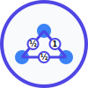

# Spin Network Visualization and Diffusion App

An interactive web application for constructing, visualizing, and simulating diffusion processes on spin networks.



## Features

- Create and edit spin networks with various symmetries (lattice, circular, random)
- Configure and run diffusion simulations with adjustable parameters
- Visualize diffusion processes and energy conservation through interactive UI
- Customizable workspace with resizable panels
- Interactive network manipulation with intuitive controls

## Getting Started

### Prerequisites

- Node.js (v16 or newer recommended)
- pnpm (v8 or newer recommended)

### Installation

1. Clone this repository
2. Install dependencies:

```bash
pnpm install
```

3. Start the development server:

```bash
pnpm dev
```

4. Open your browser and navigate to [http://localhost:5173](http://localhost:5173)

## User Interface

The application features a flexible, customizable interface:

- **Left Panel**: Network creation tools, templates, and file operations
- **Main Area**: Interactive network visualization with zoom/pan controls and mode selection
- **Right Panel**: Properties editor and simulation controls
- **Bottom Panel**: Energy plots and simulation metrics

Key features:
- All panels are resizable to accommodate different workflows and preferences
- Panels can be hidden/shown to maximize workspace
- Undo/redo functionality with keyboard shortcuts (Ctrl+Z, Ctrl+Y)
- Multiple interaction modes (select, pan, add node, add edge, delete)
- Network saving and loading with timestamp versioning
- Recent networks quick access menu

## Development

### Project Structure

```
spin_network_app/
├── memory-bank/          # Project documentation and context
├── public/               # Static assets
├── resources/            # Technical documentation
│   ├── architecture.md
│   ├── data_structures.md
│   ├── documentation.md
│   └── spin-net-telegraph.md
├── src/                  # Source code
│   ├── components/       # React components
│   │   ├── common/       # Shared components like ResizablePanel
│   │   ├── layouts/      # Layout components
│   │   ├── panels/       # Panel components
│   │   ├── simulation/   # Simulation components
│   │   ├── tools/        # Tool components
│   │   ├── visualization/# Visualization components
│   │   └── workspace/    # Workspace components
│   ├── styles/           # CSS styles
│   ├── App.tsx           # Main application component
│   └── main.tsx          # Application entry point
├── index.html            # HTML entry point
├── package.json          # Project dependencies
├── pnpm-lock.yaml        # PNPM lockfile
├── tsconfig.json         # TypeScript configuration
└── vite.config.ts        # Vite configuration
```

### Scripts

- `pnpm dev` - Start development server
- `pnpm build` - Build for production
- `pnpm preview` - Preview production build locally
- `pnpm lint` - Run ESLint
- `pnpm format` - Format code with Prettier
- `pnpm clean` - Clean build artifacts and dependencies

### Technical Documentation

For more detailed technical information, see the files in the `resources/` directory:

- `architecture.md` - System architecture and components
- `data_structures.md` - Core data structures and algorithms
- `documentation.md` - User-oriented documentation
- `spin-net-telegraph.md` - Mathematical background

## Technologies Used

- **React 18** - UI library
- **TypeScript** - Type-safe JavaScript
- **Cytoscape.js** - Network visualization
- **D3.js** - Data visualization for metrics and plots
- **Redux Toolkit** - State management
- **Redux Persist** - State persistence with IndexedDB
- **Tailwind CSS** - Utility-first CSS framework
- **Vite** - Build tool
- **pnpm** - Fast, disk space efficient package manager

## Current Status

The project is in active development. The current version features:
- Comprehensive network data model with TypeScript interfaces
- Multiple network generation options (lattice, circular, random)
- Interactive network visualization with Cytoscape.js
- Full undo/redo support for all network operations
- State persistence to preserve work between sessions
- Save/load functionality with recent networks tracking
- Support for dangling edges with placeholder nodes
- Hideable panels to maximize workspace
- Customizable workspace with resizable panels
- Property editing for network elements

See the [CHANGELOG.md](CHANGELOG.md) for recent updates and the current development status.

## License

This project is for educational and research purposes.

## Acknowledgments

- The spin network and diffusion mathematics are based on concepts from loop quantum gravity and graph theory.
