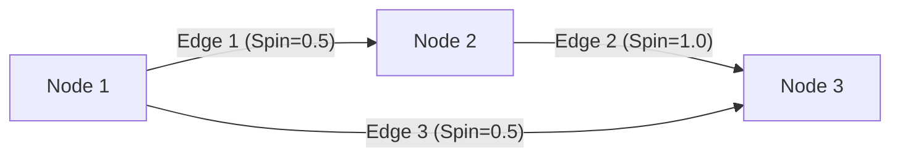

# Chapter 1: Spin Network Data Model

Welcome to the `spin_network_app` tutorial! We're excited to guide you through how this application works, starting from the very beginning.

Imagine you want to build something with Lego bricks. Before you start clicking pieces together, you need the bricks themselves and maybe a plan or blueprint, right? Our Spin Network Data Model is exactly that: it's the blueprint and the definition of the fundamental pieces (our "digital bricks") that make up a spin network in our application.

**What Problem Does This Solve?**

We need a consistent way to represent a spin network inside the computer's memory. How do we store information about where the connection points are, what values they hold, how they are connected, and what values those connections have? The data model provides a clear, organized structure (like a standard set of Lego brick shapes) for all this information. This ensures that different parts of the application can understand and work with the spin network data reliably.

Our main goal is to represent and eventually visualize networks like this:



This chapter explains the fundamental data structures we use to store the information needed to create such diagrams and perform calculations on them.

## Key Concepts: The Building Blocks

A spin network, in our application's view, is made up of a few key pieces:

1.  **Nodes (`NetworkNode`):** Think of these as the junctions or connection points in the network. In the physics context, they often represent "intertwiners".
2.  **Edges (`NetworkEdge`):** These are the lines connecting the nodes. They represent the "spins" or links between intertwiners.
3.  **The Network (`SpinNetwork`):** This is the overall container that holds all the nodes and edges together, plus some general information about the network itself.

Let's look at each one.

### 1. Nodes (`NetworkNode`)

A node is like a specific location or object in our network. To define a node, we need to know:

*   `id`: A unique name or identifier for this specific node (like a name tag, e.g., "node-123").
*   `position`: Where the node is located on our 2D canvas (its x and y coordinates).
*   `intertwiner`: A numerical value associated with the node, representing a physical quantity.
*   `label` (Optional): A friendly name to display on the screen (e.g., "Start Node").
*   `type` (Optional): A category for the node, which helps in styling or special behaviors (more on this in [Chapter 4: Type System (Node/Edge Styling)](04_type_system__node_edge_styling_.md)).
*   `properties` (Optional): A place to store any other custom data about the node.

Here's how we define the *structure* of a node in our code (from `src/models/types.ts`):

```typescript
/**
 * Represents a node (intertwiner) in the spin network
 */
export interface NetworkNode {
  id: string; // Unique identifier
  position: { // Where it is on the screen
    x: number;
    y: number;
  };
  intertwiner: number; // Physics value
  label?: string; // Optional display text
  type?: string; // Category (for styling, etc.)
  properties?: Record<string, any>; // Extra data
}
```

This `interface` is like a template or checklist ensuring every `NetworkNode` object has at least an `id`, `position`, and `intertwiner`.

### 2. Edges (`NetworkEdge`)

An edge is the connection *between* nodes. To define an edge, we need:

*   `id`: A unique name for this specific edge (e.g., "edge-abc").
*   `source`: The `id` of the node where the edge starts.
*   `target`: The `id` of the node where the edge ends.
*   `spin`: A numerical value associated with the edge, representing another physical quantity.
*   `label` (Optional): A friendly name for the edge (e.g., "Connection A->B").
*   `type` (Optional): A category for the edge (like for nodes).
*   `sourcePosition` / `targetPosition` (Optional): Sometimes an edge might only be connected at one end (a "dangling" edge). If the `source` or `target` is not a real node (`null`), these fields store the position of the unconnected end.
*   `properties` (Optional): Extra custom data.

Here's the structure definition for an edge (from `src/models/types.ts`):

```typescript
/**
 * Represents an edge (spin) in the spin network
 */
export interface NetworkEdge {
  id: string; // Unique identifier
  source: string | null; // ID of start node, or null if dangling
  target: string | null; // ID of end node, or null if dangling
  spin: number; // Physics value
  label?: string; // Optional display text
  type?: string; // Category
  sourcePosition?: { x: number, y: number }; // Position if source is null
  targetPosition?: { x: number, y: number }; // Position if target is null
  properties?: Record<string, any>; // Extra data
}
```

Notice that `source` and `target` can be `string` (the ID of a `NetworkNode`) or `null`. This allows us to represent edges that aren't fully connected yet.

### 3. The Network Container (`SpinNetwork`)

This is the main object that holds everything together. It's quite simple:

*   `nodes`: A list (or array) containing all the `NetworkNode` objects in the network.
*   `edges`: A list containing all the `NetworkEdge` objects.
*   `metadata`: Extra information *about* the network itself.

Here's the structure (from `src/models/types.ts`):

```typescript
/**
 * Represents the complete spin network
 */
export interface SpinNetwork {
  nodes: NetworkNode[]; // A list of all nodes
  edges: NetworkEdge[]; // A list of all edges
  metadata: NetworkMetadata; // Info about the network
}
```

### 4. Metadata (`NetworkMetadata`)

Metadata is "data about data". For our `SpinNetwork`, it includes things like:

*   `name`: The name you give your network (e.g., "My First Experiment").
*   `created`: When the network was first created (a timestamp).
*   `modified`: When it was last changed (a timestamp).
*   `type`: What kind of network it is (e.g., 'empty', 'lattice', 'custom').
*   `description` (Optional): A longer description.
*   `properties` (Optional): Any other general info about the network.

Here's the structure (from `src/models/types.ts`):

```typescript
/**
 * Metadata for the spin network
 */
export interface NetworkMetadata {
  id?: string; // Optional unique ID for the network itself
  name: string; // Network name (required)
  description?: string; // Optional notes
  created: number; // Creation timestamp
  modified: number; // Last modification timestamp
  type?: 'empty' | 'lattice' | /* ...other types... */ 'custom';
  properties?: Record<string, any>; // Extra data
}
```

## Use Case: Representing a Simple Network

Let's go back to our simple example: two nodes connected by one edge.

```mermaid
graph LR
    N1[Node 1 (id=n1)] -- E1 (id=e1, spin=0.5) --> N2[Node 2 (id=n2)];
```

How would we represent this using our data model?

1.  **Create Node 1:**
    *   `id`: "n1"
    *   `position`: `{ x: 50, y: 100 }` (arbitrary coordinates)
    *   `intertwiner`: 1.0
2.  **Create Node 2:**
    *   `id`: "n2"
    *   `position`: `{ x: 200, y: 100 }`
    *   `intertwiner`: 1.0
3.  **Create the Edge:**
    *   `id`: "e1"
    *   `source`: "n1" (the ID of Node 1)
    *   `target`: "n2" (the ID of Node 2)
    *   `spin`: 0.5
4.  **Create the Metadata:**
    *   `name`: "Simple Two Node Network"
    *   `created`: (Current timestamp)
    *   `modified`: (Current timestamp)
    *   `type`: "custom"
5.  **Bundle into a `SpinNetwork`:**
    *   `nodes`: [ (Node 1 object), (Node 2 object) ]
    *   `edges`: [ (Edge 1 object) ]
    *   `metadata`: (Metadata object)

This `SpinNetwork` object now contains all the necessary information to describe our simple network. Other parts of the application, like the visualizer ([Chapter 2: Cytoscape Visualization Manager](02_cytoscape_visualization_manager.md)) or the simulation engine ([Chapter 6: Simulation Engine & Core Logic](06_simulation_engine___core_logic.md)), can read this object and understand the network's structure and properties.

## Working with the Model in Code

Our application provides functions to help create and manage these `SpinNetwork` objects. These functions are mostly found in `src/models/networkModel.ts`.

**Creating an Empty Network**

Often, you'll start with a blank slate. The `createEmptyNetwork` function gives you a basic `SpinNetwork` object with no nodes or edges, just some default metadata.

```typescript
// --- File: src/models/networkModel.ts ---
import { SpinNetwork, NetworkMetadata } from './types';

/**
 * Creates a new empty spin network with basic metadata
 */
export function createEmptyNetwork(name: string = 'New Network'): SpinNetwork {
  const timestamp = Date.now(); // Get current time

  return {
    nodes: [], // Start with an empty list of nodes
    edges: [], // Start with an empty list of edges
    metadata: { // Basic info
      name,
      created: timestamp,
      modified: timestamp,
      type: 'empty',
    }
  };
}
```

This function is simple: it returns a `SpinNetwork` object with empty `nodes` and `edges` arrays and fills in the metadata with the provided name and current timestamps.

**Adding Nodes and Edges**

To build up your network, you'll use functions like `addNode` and `addEdge`. These functions take the *current* network and the new node/edge you want to add, and they return a *new* `SpinNetwork` object that includes the addition.

```typescript
// --- Simplified concept from src/models/networkModel.ts ---
import { SpinNetwork, NetworkNode, NetworkEdge } from './types';

/**
 * Adds a node to the network (Simplified Example)
 */
export function addNode(network: SpinNetwork, node: NetworkNode): SpinNetwork {
  // Basic check to avoid duplicate IDs might happen here...
  // ... (details omitted for simplicity)

  // Create a new network object
  return {
    ...network, // Copy existing network properties (metadata, edges)
    nodes: [...network.nodes, node], // Create a NEW list with the old nodes PLUS the new one
    metadata: { // Update the 'modified' timestamp
      ...network.metadata,
      modified: Date.now()
    }
  };
}
```

This function doesn't change the original `network` object you pass in. Instead, it creates a *copy* and adds the new node to the copy's `nodes` list. This is important for predictable state management, which we'll touch upon in [Chapter 8: Redux State Management](08_redux_state_management.md). `addEdge` works similarly for edges.

Other functions like `updateNode`, `removeNode`, `updateEdge`, and `removeEdge` also follow this pattern: they take a network and some information, and return a *new*, modified network object.

**Generating Pre-defined Networks**

Manually adding every node and edge can be tedious for larger networks. We have helper functions in `src/utils/networkGenerators.ts` to create common patterns like grids (lattices) or circles.

```typescript
// --- Example Signature from src/utils/networkGenerators.ts ---
import { SpinNetwork, LatticeNetworkParams } from '../models/types';

/**
 * Creates a lattice (grid) network
 */
export function createLatticeNetwork(params: LatticeNetworkParams): SpinNetwork {
  // ... code to generate all nodes and edges for a grid ...
  // ... based on params like rows, columns, default values ...
  return /* the generated SpinNetwork object */;
}
```

These generator functions use `addNode` and `addEdge` internally (or construct the lists directly) to build the `SpinNetwork` object according to the specified parameters (like number of rows/columns for a lattice).

## Under the Hood: The Structure

Conceptually, the `SpinNetwork` object is just a container holding lists (arrays) of nodes and edges, along with the metadata.

```mermaid
graph TD
    subgraph SpinNetwork Object
        Metadata([NetworkMetadata])
        NodesList[Nodes (List / Array)]
        EdgesList[Edges (List / Array)]
    end

    NodesList -- contains --> Node1(id: "n1", pos: {x,y}, val: 1.0, ...)
    NodesList -- contains --> Node2(id: "n2", pos: {x,y}, val: 1.0, ...)
    NodesList -- contains --> NodeN(...)

    EdgesList -- contains --> Edge1(id: "e1", src: "n1", tgt: "n2", spin: 0.5, ...)
    EdgesList -- contains --> Edge2(id: "e2", src: "n2", tgt: "n3", spin: 1.0, ...)
    EdgesList -- contains --> EdgeM(...)

    Metadata -- has --> Name("name: Simple Network")
    Metadata -- has --> Created("created: 167...")
    Metadata -- has --> Modified("modified: 167...")
```

When you call a function like `addNode(myNetwork, newNode)`, the steps are roughly:

1.  **Receive:** The function gets the current `SpinNetwork` object (`myNetwork`) and the `NetworkNode` object (`newNode`).
2.  **Copy Data:** It creates a new, empty `SpinNetwork` object in memory.
3.  **Copy Existing Nodes:** It copies all the node objects from `myNetwork.nodes` into the new object's node list.
4.  **Add New Node:** It adds `newNode` to the end of the new object's node list.
5.  **Copy Edges & Metadata:** It copies the `edges` list and the `metadata` object from `myNetwork` to the new object (updating the `modified` timestamp in the metadata).
6.  **Return:** The function returns the *new* `SpinNetwork` object, leaving the original `myNetwork` unchanged.

This approach of creating new objects instead of modifying existing ones ("immutability") makes the application's data flow much easier to track and debug.

## Conclusion

In this chapter, we learned about the fundamental data structures that define a spin network within the `spin_network_app`:

*   `NetworkNode`: Represents intertwiners with positions and values.
*   `NetworkEdge`: Represents spins connecting nodes (or dangling).
*   `SpinNetwork`: The container holding lists of nodes and edges, plus metadata.
*   `NetworkMetadata`: Information *about* the network.

This data model acts as the blueprint for our core data. It provides a consistent way for different parts of the application to understand and manipulate the spin network. We saw how functions in `networkModel.ts` allow us to create, add to, and modify these network structures.

Now that we understand how a spin network is represented *as data*, how do we actually *see* it on the screen? The next chapter dives into exactly that!

**Next Up:** [Chapter 2: Cytoscape Visualization Manager](02_cytoscape_visualization_manager.md)

---

Generated by [AI Codebase Knowledge Builder](https://github.com/The-Pocket/Tutorial-Codebase-Knowledge)