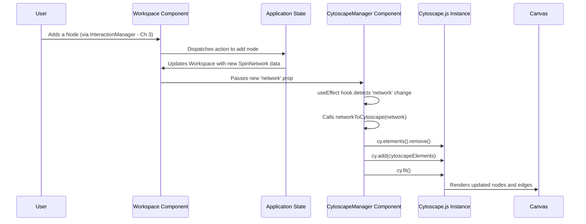

# Chapter 2: Cytoscape Visualization Manager

Welcome back! In [Chapter 1: Spin Network Data Model](01_spin_network_data_model.md), we learned how our `spin_network_app` stores the blueprint of a spin network – the nodes, edges, and their properties – in a structured format called `SpinNetwork`. That's like having the architectural plans and the list of building materials.

But how do we go from that plan to actually *seeing* the building? How do we take the `SpinNetwork` data and draw it on the screen so you can interact with it?

**What Problem Does This Solve?**

We need a way to translate the abstract data (`SpinNetwork`) into pixels on your computer screen. Imagine you have a list of cities and roads connecting them stored in a spreadsheet. The Cytoscape Visualization Manager is like a mapping software (e.g., Google Maps) that reads this list and draws the actual map you can see, zoom into, and pan around. It's the **rendering engine** for our spin network.

Our main goal here is to take the data we defined in Chapter 1:

```typescript
// From Chapter 1: A simplified SpinNetwork object
const mySimpleNetwork: SpinNetwork = {
  nodes: [
    { id: "n1", position: { x: 50, y: 100 }, intertwiner: 1.0, label: "Node 1" },
    { id: "n2", position: { x: 200, y: 100 }, intertwiner: 1.0, label: "Node 2" },
  ],
  edges: [
    { id: "e1", source: "n1", target: "n2", spin: 0.5, label: "Link" }
  ],
  metadata: { /* ... */ }
};
```

And turn it into a visual representation like this:

```mermaid
graph LR
    N1[Node 1 (id=n1)] -- Link (id=e1) --> N2[Node 2 (id=n2)];
```

This chapter explains how the `CytoscapeManager` component acts as this rendering engine.

## Key Concepts: From Data to Drawing

1.  **The Artist: Cytoscape.js:** We don't draw everything from scratch. We use a powerful open-source JavaScript library called **Cytoscape.js**, which is specifically designed for drawing and interacting with graphs (networks of nodes and edges). Think of it as a specialized toolkit for graph visualization.
2.  **The Translator: Data Conversion:** Cytoscape.js needs data in its *own* specific format. Our `SpinNetwork` format is slightly different. So, a key job is to translate our `NetworkNode` and `NetworkEdge` objects into the format Cytoscape.js understands.
3.  **The Stylist: Applying Looks:** Just drawing nodes and edges isn't enough. We want them to look good and convey information. The manager applies styles (colors, shapes, sizes, labels) to the elements, making the network clear and informative. We'll dive deeper into styling in [Chapter 4: Type System (Node/Edge Styling)](04_type_system__node_edge_styling_.md).
4.  **The Director: Managing the Canvas:** It sets up the drawing area (the canvas) and enables basic interactions like zooming in/out and panning (moving the view around).
5.  **The Updater: Reflecting Changes:** When the simulation runs ([Chapter 6: Simulation Engine & Core Logic](06_simulation_engine___core_logic.md)) and node values change, the Visualization Manager updates the appearance of the nodes (e.g., changing their color or size) to reflect these new results ([Chapter 7: Simulation Results & Analysis](07_simulation_results___analysis.md)).

## The Core Component: `CytoscapeManager`

The main piece of code responsible for this is a React component called `CytoscapeManager` (found in `src/components/workspace/CytoscapeManager/CytoscapeManager.tsx`). Think of this component as the controller for our visualization.

It takes several important inputs (props):

*   `network`: The actual `SpinNetwork` data object from Chapter 1. This is the blueprint it needs to draw.
*   `styles`: A list of rules that define how nodes and edges should look (their color, size, shape, etc.).
*   `mode`: Tells the manager about the current user interaction mode (e.g., 'select', 'pan'). We'll explore this more in [Chapter 3: Network Interaction Manager](03_network_interaction_manager.md).

Its main job is to:
1.  Initialize a Cytoscape.js instance within a specific area of the webpage.
2.  Translate the incoming `network` data into Cytoscape's format.
3.  Load this translated data and the `styles` into the Cytoscape instance.
4.  Keep the visual representation synchronized with the `network` data.

## Translating Our Data for Cytoscape.js

Cytoscape.js expects graph elements (nodes and edges) as a list of simple JavaScript objects. Each object needs a `group` field (`'nodes'` or `'edges'`) and a `data` field containing properties like `id`, `source`, `target`. For nodes, it also uses a `position` field.

We have a helper function, `networkToCytoscape` (defined in `src/models/networkModel.ts` but used by the manager), that performs this translation.

```typescript
// Simplified concept of networkToCytoscape
import { SpinNetwork, NetworkNode, NetworkEdge } from '../../../models/types';

function networkToCytoscape(network: SpinNetwork): cytoscape.ElementDefinition[] {
  const elements: cytoscape.ElementDefinition[] = [];

  // Translate nodes
  network.nodes.forEach((node: NetworkNode) => {
    elements.push({
      group: 'nodes', // Tell Cytoscape this is a node
      data: { // Node properties
        id: node.id,
        label: node.label || node.id, // Use label or ID
        intertwiner: node.intertwiner,
        type: node.type || 'default', // Default type if none specified
        // ... other node data ...
      },
      position: { x: node.position.x, y: node.position.y } // Where to draw it
    });
  });

  // Translate edges
  network.edges.forEach((edge: NetworkEdge) => {
    // Only add edges connected to actual nodes for now
    if (edge.source && edge.target) {
      elements.push({
        group: 'edges', // Tell Cytoscape this is an edge
        data: { // Edge properties
          id: edge.id,
          source: edge.source, // ID of the source node
          target: edge.target, // ID of the target node
          label: edge.label || `(${edge.spin})`, // Use label or spin value
          spin: edge.spin,
          type: edge.type || 'default', // Default type if none specified
          // ... other edge data ...
        }
        // Edges don't have a 'position' field
      });
    }
    // Handling for "dangling" edges (connected at only one end) is more complex
    // and omitted here for simplicity.
  });

  return elements; // A list Cytoscape understands
}
```

This function takes our `SpinNetwork` object and loops through its `nodes` and `edges`. For each one, it creates a new object in the format Cytoscape requires, copying over relevant data like `id`, `label`, `position`, `source`, `target`, and our custom physics properties (`intertwiner`, `spin`).

## Updating the Visualization

How does the `CytoscapeManager` know when to redraw the network? For example, if you add a new node, the `SpinNetwork` data changes. The manager needs to react to this.

In React, this is often done using the `useEffect` hook. The `CytoscapeManager` has a `useEffect` that "watches" the `network` prop. When the `network` prop changes, the effect runs again.

```typescript
// --- Simplified from src/components/workspace/CytoscapeManager/CytoscapeManager.tsx ---
import { useEffect, useRef } from 'react';
import cytoscape from 'cytoscape';
import { networkToCytoscape } from '../../../models/networkModel';
// ... other imports

const CytoscapeManager: React.FC<CytoscapeManagerProps> = ({
  network, // The SpinNetwork data
  styles,  // The visual style rules
  // ... other props
}) => {
  const cyRef = useRef<cytoscape.Core | null>(null); // Holds the Cytoscape instance

  // This effect runs when 'network' or 'cyRef.current' changes
  useEffect(() => {
    const cy = cyRef.current; // Get the Cytoscape instance
    if (!cy || !network) return; // Do nothing if Cytoscape isn't ready or no network data

    try {
      // 1. Translate our data to Cytoscape's format
      const elements = networkToCytoscape(network);

      // 2. Update the Cytoscape instance
      cy.batch(() => { // Batch updates for performance
        cy.elements().remove(); // Remove all existing elements
        if (elements.length > 0) {
          cy.add(elements); // Add the new elements
        }
      });

      // 3. Adjust the view (zoom/pan) to fit the new network
      // Use a short delay to ensure elements are rendered before fitting
      setTimeout(() => {
         if (cy && cy.elements().length > 0) {
           cy.fit(cy.elements(), 50); // Fit view with 50px padding
           // Limit max zoom to avoid things getting too big
           if (cy.zoom() > 1.5) cy.zoom(1.5);
         }
      }, 100);

    } catch (error) {
      console.error('Error updating network visualization:', error);
    }

  }, [network, cyRef.current]); // Dependencies: run when network or cy changes

  // ... rest of the component (rendering the container div, etc.)
};
```

This code snippet shows the core logic:
1.  It waits until both the Cytoscape instance (`cy`) and the `network` data are available.
2.  It calls `networkToCytoscape` to get the data in the right format.
3.  It tells Cytoscape to `remove()` the old drawing and `add()` the new `elements`. These are done inside `cy.batch()` which makes the update faster, especially for large networks.
4.  Finally, it calls `cy.fit()` to automatically adjust the zoom and pan so the entire network is nicely visible on the screen. The `setTimeout` gives Cytoscape a moment to process the new elements before trying to fit them.

## Styling the Network

Just drawing nodes as dots and edges as lines can be boring and uninformative. Cytoscape allows defining stylesheets, similar to CSS for web pages, to control the appearance.

The `CytoscapeManager` receives these styles as the `styles` prop. These styles are generated by a special hook called `useTypeBasedStyles` (found in `src/hooks/useTypeBasedStyles.ts`).

```typescript
// --- Simplified Usage in src/components/workspace/Workspace.tsx ---
import CytoscapeManager from './CytoscapeManager';
import { useAppSelector } from '../../store/hooks';
import { selectNetwork } from '../../store/selectors';
import { useTypeBasedStyles } from '../../hooks/useTypeBasedStyles'; // Hook to get styles

const Workspace: React.FC = () => {
  const network = useAppSelector(selectNetwork);
  // Get the current styles based on defined types and view settings
  const networkStyles = useTypeBasedStyles();

  // ... other setup ...

  return (
    // ... other components ...
    <CytoscapeManager
      network={network}
      styles={networkStyles} // Pass the generated styles here
      mode={/* current mode */}
      // ... other props ...
    />
    // ...
  );
};
```

This `useTypeBasedStyles` hook looks at all the defined node and edge *types* (which we'll cover in detail in [Chapter 4: Type System (Node/Edge Styling)](04_type_system__node_edge_styling_.md)) and generates the necessary Cytoscape style rules. For example, it might create a rule saying "all nodes of type 'intertwiner-special' should be red squares". These rules are then passed to the `CytoscapeManager`.

## Handling Basic Interactions: Pan and Zoom

Cytoscape.js comes with built-in support for basic navigation:
*   **Panning:** Clicking and dragging on the background to move the view.
*   **Zooming:** Using the mouse wheel or pinch gestures to zoom in and out.

These are enabled by default when the Cytoscape instance is created inside the `useCytoscapeInstance` hook (`src/components/workspace/CytoscapeManager/hooks/useCytoscapeInstance.ts`), which `CytoscapeManager` uses internally. We'll see how more complex interactions like adding or deleting nodes/edges are handled in the next chapter, [Chapter 3: Network Interaction Manager](03_network_interaction_manager.md).

## Showing Simulation Results

One exciting feature is visualizing simulation results directly on the network. For example, nodes might change color or size based on calculated values.

The `CytoscapeManager` doesn't handle this directly. Instead, another component, `SimulationVisualizationManager`, works alongside it. It uses a helper class called `CytoscapeAdapter` (`src/simulation/visualization/cytoscapeAdapter.ts`) to translate simulation state into visual changes (like specific node colors or sizes) and applies them directly to the Cytoscape instance managed by `CytoscapeManager`.

```typescript
// --- Conceptual idea from src/simulation/visualization/cytoscapeAdapter.ts ---

class CytoscapeAdapter {
  // ... other methods ...

  applyCytoscapeVisualization(cy: cytoscape.Core, visualizationData: any) {
    // visualizationData contains node IDs and their corresponding values,
    // plus rules for color/size mapping

    cy.batch(() => { // Update efficiently
      for (const nodeId in visualizationData.nodeValues) {
        const node = cy.getElementById(nodeId);
        const value = visualizationData.nodeValues[nodeId];

        if (!node.empty()) {
          // Calculate color based on value and color scale
          const color = calculateColor(value, visualizationData.options.colorScale);
          node.style('background-color', color);

          // Calculate size based on value and size scale
          const size = calculateSize(value, visualizationData.options.sizeScale);
          node.style('width', size);
          node.style('height', size);

          // Update label to show the value
          node.style('label', value.toFixed(3));
        }
      }
    });
    cy.style().update(); // Ensure styles are applied
  }
}
```

This adapter essentially takes the raw numbers from the simulation and directly tells Cytoscape, "Make node 'n1' this color and this size, make node 'n2' that color and that size," and so on. We'll explore this process more in [Chapter 7: Simulation Results & Analysis](07_simulation_results___analysis.md).

## Under the Hood: The Visualization Flow

Let's visualize the process when the `SpinNetwork` data changes (e.g., a node is added):



**Step-by-Step:**

1.  Something changes the `SpinNetwork` data stored in our application's state ([Chapter 8: Redux State Management](08_redux_state_management.md)).
2.  The main `Workspace` component gets the updated `SpinNetwork` object.
3.  The `Workspace` passes this new `network` object down to the `CytoscapeManager` component as a prop.
4.  The `CytoscapeManager`'s `useEffect` hook notices that the `network` prop has changed.
5.  Inside the effect, it calls `networkToCytoscape` to translate the `SpinNetwork` data into the format Cytoscape.js understands.
6.  It then tells the Cytoscape.js instance (`cy`) to remove the old elements (`cy.elements().remove()`) and add the newly translated elements (`cy.add(elements)`).
7.  It calls `cy.fit()` to adjust the view.
8.  Cytoscape.js handles the actual drawing process, updating the pixels on the HTML canvas element it controls.

## Conclusion

The `Cytoscape Visualization Manager` is the crucial bridge between our abstract `SpinNetwork` data model and the visual representation you see and interact with on the screen. It leverages the power of the Cytoscape.js library to handle the complexities of graph rendering.

We learned that it:
*   Takes `SpinNetwork` data as input.
*   Uses Cytoscape.js as its drawing engine.
*   Translates our data format to Cytoscape's format using `networkToCytoscape`.
*   Applies visual styles defined elsewhere ([Chapter 4: Type System (Node/Edge Styling)](04_type_system__node_edge_styling_.md)).
*   Handles basic panning and zooming.
*   Updates the visuals when the underlying network data changes.
*   Allows other parts of the app (like simulation visualization) to modify the appearance of nodes and edges.

Now that we can *see* the network, how do we *interact* with it? How do we add nodes, connect them with edges, or delete elements using our mouse? That's the job of the Network Interaction Manager, which we'll explore next!

**Next Up:** [Chapter 3: Network Interaction Manager](03_network_interaction_manager.md)

---

Generated by [AI Codebase Knowledge Builder](https://github.com/The-Pocket/Tutorial-Codebase-Knowledge)