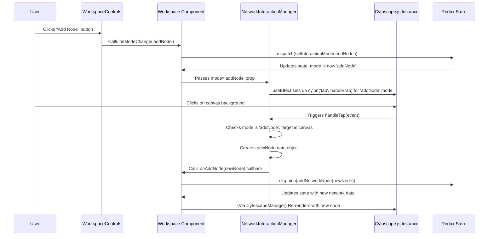

# Chapter 3: Network Interaction Manager

Welcome back! In [Chapter 2: Cytoscape Visualization Manager](02_cytoscape_visualization_manager.md), we saw how our `spin_network_app` takes the `SpinNetwork` data (the blueprint) and uses Cytoscape.js to draw it on the screen (the visual map). We can now *see* our network!

But what if we want to *change* the network using our mouse? How do we add new connection points (nodes), draw lines between them (edges), or remove things we don't want? How does the application know what we intend to do when we click or drag on the drawing?

**What Problem Does This Solve?**

Imagine you have a digital whiteboard. You can draw shapes, connect them, and erase them. But the whiteboard needs to understand your actions. Is that click meant to start drawing a circle, select an existing shape, or erase something?

The **Network Interaction Manager** acts like the "smart" part of the whiteboard. It watches your mouse clicks and drags on the network canvas. Based on a tool or "mode" you've selected (like 'Add Node', 'Delete', or 'Select'), it interprets your actions and tells other parts of the application what changes to make to the underlying network data.

**Use Case:** Let's say you want to add a new node to your network simply by clicking on an empty spot on the canvas. How does the application translate that click into a new `NetworkNode` being added to our `SpinNetwork` data from [Chapter 1: Spin Network Data Model](01_spin_network_data_model.md)? This chapter explains how the Network Interaction Manager makes this happen.

## Key Concepts: Understanding Your Clicks

1.  **Interaction Modes:** The application has different "modes" that change what happens when you interact with the canvas. Think of these like selecting different tools in a drawing program:
    *   `select`: Click to select nodes or edges, drag to select multiple.
    *   `addNode`: Click on an empty space to create a new node there.
    *   `addEdge`: Click on one node, then another, to create an edge between them.
    *   `delete`: Click on a node or edge to remove it.
    *   `pan`: Click and drag the background to move the whole view (like in Chapter 2, often handled directly by Cytoscape).
    The current mode is usually controlled by toolbar buttons (like the ones in `src/components/workspace/WorkspaceControls/WorkspaceControls.tsx`).
2.  **Event Handling:** The Interaction Manager constantly listens for mouse events (like `click`, `tap`, `drag`) happening *on* the Cytoscape canvas.
3.  **Action Triggering:** When an event occurs, the Interaction Manager checks the current `mode`. If the event and mode match a defined action (e.g., a `tap` event happens while in `addNode` mode), it triggers the corresponding action.
4.  **Connecting to Data:** Triggering an action usually means calling a specific function (passed in as a callback) that will ultimately update the `SpinNetwork` data stored in our application's state ([Chapter 8: Redux State Management](08_redux_state_management.md)). For example, adding a node involves calling a function like `onAddNode` with the details of the new node.

## The Core Component: `NetworkInteractionManager`

The magic happens within a special, non-visual React component: `NetworkInteractionManager` (found in `src/components/workspace/NetworkInteractionManager/NetworkInteractionManager.tsx`). It doesn't draw anything itself, but it attaches listeners to the Cytoscape instance created by the `CytoscapeManager`.

It takes several important inputs (props), including:

*   `cy`: The active Cytoscape.js instance (so it knows *what* to listen to).
*   `network`: The current `SpinNetwork` data (sometimes needed for context).
*   `mode`: The currently selected interaction mode ('select', 'addNode', etc.).
*   `onAddNode`, `onAddEdge`, `onDeleteNode`, `onDeleteEdge`: Functions (callbacks) provided by its parent component (`Workspace.tsx`) that should be called when a node/edge needs to be added or deleted. These functions are responsible for actually changing the application's data.

```typescript
// Simplified props definition for NetworkInteractionManager
export interface NetworkInteractionManagerProps {
  cy: cytoscape.Core | null; // The Cytoscape instance
  mode: 'select' | 'pan' | 'addNode' | 'addEdge' | 'delete'; // Current tool
  // Callbacks to trigger actual data changes:
  onAddNode?: (node: NetworkNode) => void;
  onAddEdge?: (edge: NetworkEdge) => void;
  onDeleteNode?: (nodeId: string) => void;
  onDeleteEdge?: (edgeId: string) => void;
  // ... other callbacks for selection, etc.
}
```

This component's main job is to listen for Cytoscape events and, based on the `mode`, call the appropriate callback function with the necessary information.

## Example: Adding a Node

Let's walk through our use case: adding a node by clicking.

1.  **Select Mode:** The user clicks the "Add Node" button in the toolbar (`WorkspaceControls`). This updates the application state, setting the `mode` to `'addNode'`.
2.  **Pass Mode Down:** The `Workspace` component re-renders and passes the new `mode='addNode'` prop to the `NetworkInteractionManager`.
3.  **Listen for Clicks:** The `NetworkInteractionManager` uses a React `useEffect` hook to set up event listeners on the Cytoscape instance (`cy`). Since the mode is now `'addNode'`, it specifically sets up a listener for 'tap' events *on the canvas background*.

    ```typescript
    // Simplified effect from NetworkInteractionManager.tsx
    useEffect(() => {
      if (!cy) return; // Need Cytoscape instance

      // Define what happens on a tap/click
      const handleTap = (event: cytoscape.EventObject) => {
        // Check if the click was on the background
        if (event.target === cy) {
          // Check the CURRENT mode when the click happens
          if (mode === 'addNode' && onAddNode) {
            // Get click position
            const position = event.position;
            // Create the new node data structure
            const newNode = createNode(position); // Simplified helper
            // Call the callback passed from Workspace
            onAddNode(newNode);
          }
          // ... handle other modes like 'select' or 'addEdge' on background click
        } else {
          // Click was on a node or edge, handle differently
          // ... (e.g., for 'delete' mode or 'addEdge' source/target)
        }
      };

      // Attach the listener to Cytoscape
      // (@ts-ignore often needed due to Cytoscape type quirks)
      cy.on('tap', handleTap);

      // Cleanup: remove the listener when mode changes or component unmounts
      return () => {
        cy.off('tap', handleTap);
      };
    }, [cy, mode, onAddNode /* ... other dependencies ... */]);
    ```

    This `useEffect` hook is the heart of the interaction logic. It runs whenever `cy`, `mode`, or the callback functions change. It sets up the correct event listeners for the *current* mode. The `return` function is crucial for cleanup, ensuring old listeners are removed when the mode changes.

4.  **User Clicks:** The user clicks on an empty area of the Cytoscape canvas.
5.  **Event Fires:** Cytoscape detects this and triggers the `handleTap` function we registered.
6.  **Check Mode & Target:** Inside `handleTap`, the code checks:
    *   Was the click on the background (`event.target === cy`)? Yes.
    *   Is the current `mode` `'addNode'`? Yes.
    *   Is the `onAddNode` callback available? Yes.
7.  **Prepare Data:** It gets the click coordinates (`event.position`). It might call a helper function (`createNode`) to generate a unique ID and default properties for the new `NetworkNode` object based on these coordinates.

    ```typescript
    // Simplified helper from handlers/nodeHandlers.ts
    import { NetworkNode } from '../../models/types';

    export const createNode = (
      position: { x: number, y: number }
    ): NetworkNode => {
      const newNodeId = `node-${Date.now()}`; // Simple unique ID
      return {
        id: newNodeId,
        position,
        intertwiner: 1.0, // Default value
        label: `Node (${Math.round(position.x)}, ${Math.round(position.y)})`,
        type: 'regular' // Default type
      };
    };
    ```

8.  **Call Callback:** The `handleTap` function calls `onAddNode(newNode)`, passing the newly created node data structure.
9.  **Update State:** The `onAddNode` function (which was passed down from `Workspace.tsx`) dispatches an action to the Redux store ([Chapter 8: Redux State Management](08_redux_state_management.md)).

    ```typescript
    // Simplified handler in Workspace.tsx
    import { addNetworkNode } from '../../store/slices/networkSlice';

    const handleAddNode = useCallback((node: NetworkNode) => {
      // Dispatch action to Redux to add the node to the central state
      dispatch(addNetworkNode(node));
      // Optionally, briefly select the new node, then clear selection
      // ...
    }, [dispatch]);

    // ... later in the JSX ...
    <NetworkInteractionManager
      // ... other props
      onAddNode={handleAddNode}
      // ...
    />
    ```

10. **Re-render:** Redux updates the `SpinNetwork` data. The `Workspace` component receives the updated network, passes it to `CytoscapeManager` ([Chapter 2: Cytoscape Visualization Manager](02_cytoscape_visualization_manager.md)), which then redraws the canvas with the new node visible!

This same pattern applies to other modes:
*   **Delete Mode:** The listener checks for taps *on nodes or edges*. If found, it calls `onDeleteNode(nodeId)` or `onDeleteEdge(edgeId)`.
*   **Add Edge Mode:** This is slightly more complex. It usually involves:
    *   Clicking the first node (source): Store its ID internally (`edgeSourceId`) and maybe highlight it.
    *   Clicking the second node (target): Call `onAddEdge({ source: edgeSourceId, target: targetId, ... })`.
    *   Clicking the background after selecting a source: Maybe create a "dangling" edge (more advanced).

## Under the Hood: The Interaction Flow

Let's visualize the sequence for adding a node:



**Step-by-Step:**

1.  The user selects the 'Add Node' tool via the UI.
2.  The `Workspace` component updates the `mode` state via Redux.
3.  The `Workspace` passes the new `mode` to `NetworkInteractionManager`.
4.  `NetworkInteractionManager` adjusts its Cytoscape event listeners based on the new mode. Now it's listening for taps on the background to trigger node creation.
5.  The user clicks the background.
6.  Cytoscape triggers the 'tap' event handler inside `NetworkInteractionManager`.
7.  The handler verifies the mode is correct ('addNode') and the click was on the background.
8.  It calculates the position and creates the data for the new node.
9.  It calls the `onAddNode` function that `Workspace` provided.
10. `Workspace`'s `onAddNode` function dispatches an action to Redux.
11. Redux updates the global `SpinNetwork` state.
12. React detects the state change, causing `Workspace` and `CytoscapeManager` to re-render, showing the new node.

The key takeaway is that `NetworkInteractionManager` acts as a **translator** between raw user interface events (clicks, drags on the canvas) and meaningful actions (`addNode`, `deleteEdge`) that modify the application's core data model. It uses the concept of **modes** to determine how to interpret these events.

## Conclusion

In this chapter, we learned about the `NetworkInteractionManager`, the crucial component that makes our network visualization interactive.

*   It listens to user input (clicks, drags) on the Cytoscape canvas.
*   It interprets these inputs based on the current `interactionMode` ('select', 'addNode', 'addEdge', 'delete').
*   It calls specific functions (callbacks like `onAddNode`, `onDeleteNode`) provided by its parent (`Workspace`).
*   These callbacks trigger updates to the underlying `SpinNetwork` data in our Redux store, causing the visualization to refresh.

Essentially, it bridges the gap between clicking on the screen and changing the network's data blueprint.

Now that we can create and modify the *structure* of our network (nodes and edges), how do we control their *appearance*? How can we make certain nodes look different from others, or style edges based on their properties? That's where the Type System comes in.

**Next Up:** [Chapter 4: Type System (Node/Edge Styling)](04_type_system__node_edge_styling_.md)

---

Generated by [AI Codebase Knowledge Builder](https://github.com/The-Pocket/Tutorial-Codebase-Knowledge)