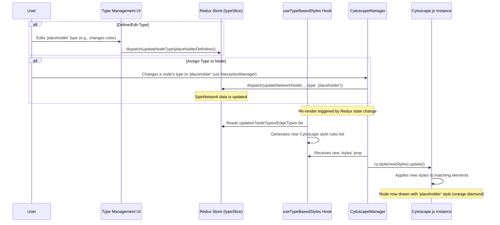

# Chapter 4: Type System (Node/Edge Styling)

Welcome back! In the previous chapter, [Chapter 3: Network Interaction Manager](03_network_interaction_manager.md), we learned how to add, remove, and connect nodes and edges using our mouse. We can now build the *structure* of our spin network.

But what if we want different kinds of nodes and edges to *look* different? Maybe we want "important" nodes to be large and red, while "temporary" nodes are small and dashed? How can we visually distinguish between different categories of elements in our network?

**What Problem Does This Solve?**

Imagine you have a map. You want cities to look like dots, capitals to look like stars, and roads to look like lines. Maybe major highways should be thicker lines than small roads. Having different visual styles helps you understand the map at a glance.

Similarly, in our spin network, we might have different types of nodes or edges representing different physical concepts or states. The **Type System** allows us to define categories (like "regular node", "special edge", "placeholder node") and assign specific visual styles (color, size, shape, line style) to each category. This makes the visualization much richer, more customizable, and easier to understand. It's like having a built-in style editor for your network elements.

**Use Case:** Let's say we want to mark certain nodes as "placeholders" – maybe they represent points where an edge isn't properly connected yet. We want these placeholder nodes to look distinct, perhaps like small, orange, dashed diamonds, so we can easily spot them. How do we set this up? This chapter explains the Type System that lets us do exactly that.

## Key Concepts: Dressing Up Your Network

1.  **Types (Categories):** The core idea is to group nodes and edges into different "types" or categories. Each node or edge in our `SpinNetwork` data model (from [Chapter 1: Spin Network Data Model](01_spin_network_data_model.md)) has an optional `type` field (e.g., `type: 'regular'`, `type: 'placeholder'`). This field assigns the element to a specific category.
2.  **Style Definitions:** For each *type*, we define a set of visual style rules. Think of this like defining a CSS class for a web element. We specify properties like:
    *   **Nodes:** `color` (fill), `borderColor`, `borderWidth`, `borderStyle`, `shape` (circle, square, diamond...), `size`.
    *   **Edges:** `color` (line), `thickness`, `lineStyle` (solid, dashed, dotted), `arrow` (type of arrowhead).
3.  **Type Management:** We need a place to create, view, edit, and delete these type definitions. Our application provides a user interface (UI) for managing these styles, often found in a settings panel or modal.
4.  **Applying the Styles:** The visualization engine ([Chapter 2: Cytoscape Visualization Manager](02_cytoscape_visualization_manager.md)) automatically reads the `type` of each node and edge and applies the corresponding style definition when drawing the network.

## How It Works: Styling a Placeholder Node

Let's follow our use case of creating a distinct style for "placeholder" nodes.

**1. Defining the 'Placeholder' Node Type:**

First, we need to define what a "placeholder" node should look like. We use the **Type Management UI** (found in components like `src/components/settings/types/TypeManagementModal.tsx` or the panel `src/components/panels/TypeManagementPanel.tsx`). This UI provides forms to configure the styles.

Imagine a form like this (conceptually based on `src/components/settings/types/NodeTypeForm.tsx`):

```jsx
// --- Simplified Concept of NodeTypeForm ---

// User inputs:
const typeName = "Placeholder";
const description = "Temporary node for dangling edges";
const fillColor = "#f97316"; // Orange
const borderColor = "#fb923c";
const borderWidth = 2;
const borderStyle = "dashed";
const shape = "diamond";
const size = 32; // Small

// When user clicks "Save" or "Create":
// This data is packaged into a NodeType object:
const placeholderType: NodeType = {
  id: 'placeholder', // Unique ID for this type
  name: typeName,
  description: description,
  color: fillColor,
  borderColor: borderColor,
  borderWidth: borderWidth,
  borderStyle: borderStyle,
  shape: shape,
  size: size,
  labelPosition: 'center', // How text is aligned
  isSystem: true // This is a built-in type
};

// ... and dispatched to Redux to be saved (more later)
```

This definition creates a style rule: "Any node assigned the type `placeholder` should be a small, orange, dashed diamond with an orange border."

**2. Storing Type Definitions:**

These definitions (like `placeholderType` above) need to be stored somewhere so the application can access them. They are managed within our application's central state using Redux ([Chapter 8: Redux State Management](08_redux_state_management.md)). Specifically, the `typeSlice.ts` file handles storing and updating lists of `NodeType` and `EdgeType` definitions.

The structure for a `NodeType` is defined in `src/models/typeModels.ts`:

```typescript
// --- Simplified from src/models/typeModels.ts ---
/**
 * Represents a node type and its visual styling
 */
export interface NodeType {
  id: string;         // Unique identifier (e.g., 'regular', 'placeholder')
  name: string;       // User-friendly name (e.g., "Regular Node")
  description: string;
  color: string;      // Fill color (e.g., '#4f46e5')
  borderColor: string;
  borderWidth: number;
  borderStyle: 'solid' | 'dashed' | 'dotted';
  shape: 'ellipse' | 'rectangle' | 'triangle' | 'diamond' | 'hexagon';
  size: number;       // Diameter/width in pixels
  labelPosition: 'center' | 'top' | 'bottom';
  isSystem?: boolean; // Is it a default, non-deletable type?
}
```

Similarly, `EdgeType` defines styles for edges (thickness, line style, arrows, etc.).

When you save a new type in the UI, an action is dispatched to Redux, which calls a reducer function (like `addNodeType` in `typeSlice.ts`) to add the new type definition to the list in the state.

```typescript
// --- Simplified from src/store/slices/typeSlice.ts ---
import { NodeType, EdgeType } from '../../models/typeModels';

// ... other imports, state definition ...

const typeSlice = createSlice({
  name: 'types',
  initialState: { nodeTypes: [], edgeTypes: [] /* ... */ },
  reducers: {
    // Action to add a new node type definition
    addNodeType: (state, action: PayloadAction<NodeType>) => {
      // Add the new type definition from the form (action.payload)
      // to the list of node types (state.nodeTypes)
      // (Simplified - actual code handles duplicates, etc.)
      state.nodeTypes.push(action.payload);
    },
    // ... other reducers for update, remove, edge types ...
  }
});
```

**3. Assigning the Type to a Node:**

Now that the 'placeholder' type *exists*, we need to tell a specific node to *use* it. Remember our `NetworkNode` structure from [Chapter 1: Spin Network Data Model](01_spin_network_data_model.md)? It has an optional `type` field.

```typescript
// Example NetworkNode using the 'placeholder' type
const myPlaceholderNode: NetworkNode = {
  id: "node-temp-1",
  position: { x: 300, y: 150 },
  intertwiner: 0, // Doesn't matter for placeholder
  label: "Dangling End",
  type: "placeholder" // <-- Assigning the type ID here!
};
```

When this node is part of the `SpinNetwork` data, the visualization system will know it needs to apply the 'placeholder' style rules. How?

**4. Generating Cytoscape Styles:**

The `CytoscapeManager` ([Chapter 2: Cytoscape Visualization Manager](02_cytoscape_visualization_manager.md)) needs style rules in Cytoscape.js's specific format. It doesn't read our `NodeType` definitions directly. Instead, we use a helper hook called `useTypeBasedStyles` (in `src/hooks/useTypeBasedStyles.ts`).

This hook does the following:
*   Reads all the currently defined `NodeType` and `EdgeType` objects from the Redux store.
*   Reads any general view settings (like whether to show labels).
*   For *each* defined type, it generates a corresponding Cytoscape style rule.
*   It combines these type-specific rules with some base styles (like default node appearance, selection highlighting).
*   It returns a complete list of Cytoscape style objects.

```typescript
// --- Simplified from src/hooks/useTypeBasedStyles.ts ---
import { useAppSelector } from '../store/hooks';
import { selectAllNodeTypes } from '../store/selectors/typeSelectors';
import { NodeType } from '../models/typeModels';

export const useTypeBasedStyles = () => {
  // 1. Get all defined node types from Redux state
  const nodeTypes = useAppSelector(selectAllNodeTypes);
  // ... (get edge types and view settings too) ...

  // 2. Generate Cytoscape style for each node type
  const nodeTypeStyles = nodeTypes.map((nodeType: NodeType) => ({
    // Cytoscape Selector: Apply to nodes WHERE data('type') == nodeType.id
    selector: `node[type = "${nodeType.id}"]`,
    // Cytoscape Style: Map our properties to Cytoscape properties
    style: {
      'background-color': nodeType.color,
      'border-color': nodeType.borderColor,
      'border-width': nodeType.borderWidth,
      'border-style': nodeType.borderStyle,
      'width': nodeType.size, // Directly use defined size
      'height': nodeType.size,
      'shape': nodeType.shape,
      // ... other style mappings ...
    }
  }));

  // ... (generate edge type styles similarly) ...

  // 3. Define base styles (defaults, selection, etc.)
  const baseStyles = [ /* ... */ ];

  // 4. Return the combined list of styles
  return [...baseStyles, ...nodeTypeStyles /*, ...edgeTypeStyles */ ];
};
```

This hook acts as the translator between our application's type definition format (`NodeType`, `EdgeType`) and the format Cytoscape needs.

**5. Applying Styles in CytoscapeManager:**

Finally, the list of styles generated by `useTypeBasedStyles` is passed as the `styles` prop to the `CytoscapeManager`.

```typescript
// --- Simplified Usage in src/components/workspace/Workspace.tsx ---
import CytoscapeManager from './CytoscapeManager';
import { useTypeBasedStyles } from '../../hooks/useTypeBasedStyles';

const Workspace: React.FC = () => {
  const network = /* ... get network data from Redux ... */ ;
  // Get the current styles based on defined types and view settings
  const networkStyles = useTypeBasedStyles(); // Calls our hook

  return (
    <CytoscapeManager
      network={network}
      styles={networkStyles} // Pass the generated styles here!
      // ... other props ...
    />
    // ...
  );
};
```

Inside `CytoscapeManager`, these styles are loaded into the Cytoscape.js instance. When Cytoscape draws the network, it checks the `type` data field of each node (e.g., `data('type')`). If it finds a matching selector in the stylesheet (like `node[type = "placeholder"]`), it applies the corresponding style rules.

So, our `myPlaceholderNode` (with `type: "placeholder"`) will automatically be drawn as a small, orange, dashed diamond because:
*   A `NodeType` definition for 'placeholder' exists.
*   The node's `type` field is set to 'placeholder'.
*   `useTypeBasedStyles` created a Cytoscape rule for `node[type = "placeholder"]`.
*   `CytoscapeManager` loaded this rule into Cytoscape.js.

## Under the Hood: The Styling Flow

Let's trace the process when a node's type is changed or a new type definition is applied:



**Step-by-Step:**

1.  **Type Definition:** The user defines or modifies a `NodeType` or `EdgeType` using the UI (e.g., `TypeManagementPanel`, `NodeTypeForm`).
2.  **Redux Update (Types):** An action is dispatched to the `typeSlice` in Redux, updating the list of available type definitions.
3.  **Assign Type (Optional):** The user might assign a `type` (e.g., 'placeholder') to a specific `NetworkNode` or `NetworkEdge` object within the `SpinNetwork` data. This also updates the Redux state via the `networkSlice`.
4.  **React Re-render:** Changes in the Redux state (either type definitions or network data) cause relevant components like `Workspace` and `CytoscapeManager` to re-render.
5.  **Generate Styles:** The `useTypeBasedStyles` hook runs again because its dependencies (the types from Redux) have changed. It reads the latest type definitions and generates a fresh list of Cytoscape style rules.
6.  **Pass Styles:** The `Workspace` component passes this new list of `styles` down to the `CytoscapeManager`.
7.  **Apply Styles:** The `CytoscapeManager` detects the change in the `styles` prop and tells the Cytoscape.js instance to update its stylesheet.
8.  **Visual Update:** Cytoscape.js reapplies the styles. Any node with `type: 'placeholder'` now gets the visual appearance defined by the 'placeholder' `NodeType`.

## Conclusion

The Type System is like a wardrobe for your network elements. It allows you to:

*   Define different **categories** (types) for nodes and edges.
*   Specify distinct visual **styles** (color, shape, size, line style, etc.) for each type using a dedicated UI (`TypeManagementPanel`, `NodeTypeForm`, `EdgeTypeForm`).
*   Store these style definitions centrally using Redux (`typeSlice.ts`, `typeModels.ts`).
*   Assign types to nodes/edges via their `type` property in the data model.
*   Automatically translate these definitions into Cytoscape-compatible styles using the `useTypeBasedStyles` hook.
*   See the styles applied visually by the `CytoscapeManager`.

This makes your network diagrams much more informative and customizable, allowing you to visually encode meaning directly into the network's appearance.

Now that we know how to represent the network data, visualize it, interact with it, and style it, let's look at how the overall user interface is structured – the different panels and controls that make up the application window.

**Next Up:** [Chapter 5: UI Layout & Panels](05_ui_layout___panels.md)

---

Generated by [AI Codebase Knowledge Builder](https://github.com/The-Pocket/Tutorial-Codebase-Knowledge)