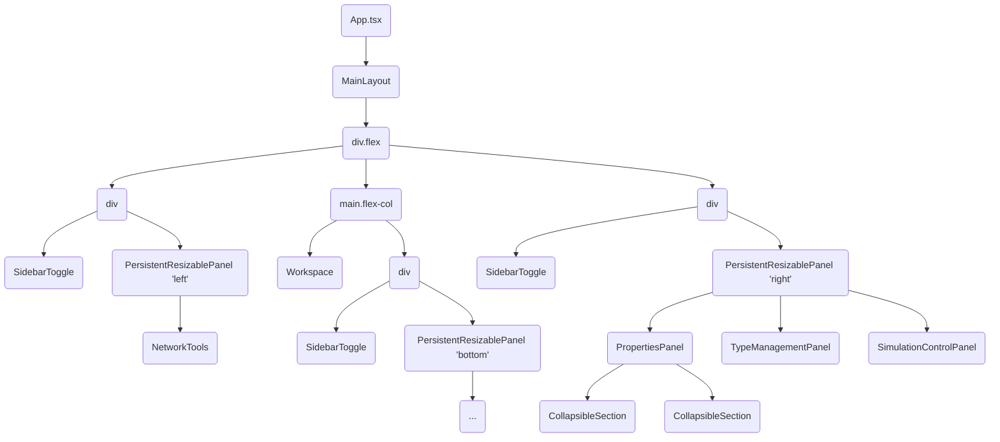
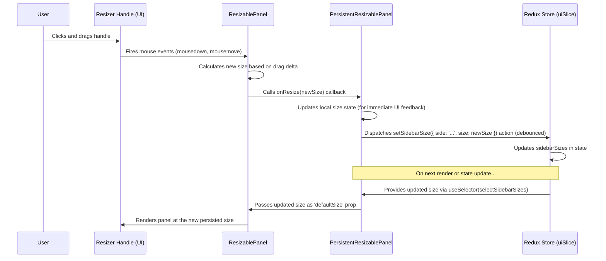

# Chapter 5: UI Layout & Panels

Welcome to Chapter 5! In [Chapter 4: Type System (Node/Edge Styling)](04_type_system__node_edge_styling_.md), we learned how to make our network elements look distinct by assigning them types and styles. We can now create visually rich and informative network diagrams.

But where do all these things – the network visualization, the tools to build it, the panels to adjust properties and styles, and the controls to run simulations – actually *live* on the screen? How is the application window organized so we can access everything easily?

**What Problem Does This Solve?**

Imagine trying to work on a cluttered desk with papers, tools, and projects all jumbled together. It's hard to find what you need and focus on your task. A well-organized workspace makes everything much easier.

Similarly, our application has many different parts: the main network view, toolbars, property editors, simulation controls, results displays, log viewers, and more. We need a clear and consistent structure to arrange all these elements within the application window.

The **UI Layout & Panels** system provides this structure. It defines the main regions of the application – like the central area for the network, sidebars for tools and settings, and a bottom area for results – and uses smart, reusable building blocks to create a flexible and user-friendly interface.

**Use Case:** Think about the main application window. You see the network graph in the middle, some tools on the left, properties and simulation controls on the right, and maybe simulation results at the bottom. How does the application arrange these sections? How can you resize the sidebars or hide them if you need more space? This chapter explains the "architectural plan" for the app's visual structure.

## Key Concepts: Building the Application Window

1.  **The Blueprint (`MainLayout`):** At the highest level, we have a main layout component, often called `MainLayout`. This component sets up the overall structure, like adding a header or footer that's always visible. Think of it as the outer frame of our application window. (See `src/components/layouts/MainLayout.tsx`).
2.  **Main Content Area:** Inside the `MainLayout`, there's the primary content area where the dynamic parts of the UI live. In our app, this area is further divided.
3.  **Central Workspace (`Workspace`):** This is the largest and most important area, typically in the center. It's where the network visualization ([Chapter 2: Cytoscape Visualization Manager](02_cytoscape_visualization_manager.md)) and interaction ([Chapter 3: Network Interaction Manager](03_network_interaction_manager.md)) happen. (See `src/components/workspace/Workspace.tsx`).
4.  **Sidebars (Left & Right Panels):** These are vertical areas docked to the sides of the central workspace.
    *   **Left Sidebar:** Usually contains tools for creating and modifying the network (e.g., `NetworkTools`).
    *   **Right Sidebar:** Often holds panels for viewing/editing properties of selected nodes/edges (`PropertiesPanel`), managing types (`TypeManagementPanel`), and controlling simulations (`SimulationControlPanel`).
5.  **Bottom Panel:** A horizontal area docked below the central workspace, typically used for displaying simulation results (`SimulationResultsPanel`), logs (`SimulationLogsPanel`), or debugging information (`SimulationDebugPanel`).
6.  **Flexibility with Reusable Components:** To make this layout flexible and maintainable, we use special reusable components:
    *   **`ResizablePanel` / `PersistentResizablePanel`:** These components wrap the sidebars and bottom panel, allowing you to click and drag their edges to resize them. The `Persistent` version even remembers the size you set between sessions! (See `src/components/common/ResizablePanel.tsx` and `src/components/common/PersistentResizablePanel.tsx`).
    *   **`SidebarToggle`:** Small buttons that let you completely hide or show the sidebars and bottom panel, giving you more space for the central workspace when needed. (See `src/components/common/SidebarToggle.tsx`).
    *   **`CollapsibleSection`:** Within panels (like the right sidebar), this component creates sections with titles that you can click to expand or collapse, keeping complex panels organized. (See `src/components/common/CollapsibleSection.tsx`).

## How It Works: Arranging the Pieces

Let's look at how these concepts come together in the main application component, `App.tsx`.

**1. The Overall Structure (`App.tsx` & `MainLayout.tsx`)**

The `App.tsx` file acts as the main assembler. It uses the `MainLayout` component to provide the overall frame (like the header) and then defines the core layout using standard HTML `div` elements and CSS flexbox to arrange the sidebars and the central content area.

```typescript
// --- Simplified from src/App.tsx ---
import MainLayout from './components/layouts/MainLayout';
import Workspace from './components/workspace/Workspace';
import NetworkTools from './components/tools/NetworkTools';
// Import panels and layout components...
import PersistentResizablePanel from './components/common/PersistentResizablePanel';
import SidebarToggle from './components/common/SidebarToggle';
// ... other imports like PropertiesPanel, SimulationControlPanel etc.

function App() {
  // Get visibility state for sidebars from Redux (see Chapter 8)
  const leftSidebarVisible = /* ... useSelector(...) ... */;
  const rightSidebarVisible = /* ... useSelector(...) ... */;
  const bottomSidebarVisible = /* ... useSelector(...) ... */;

  return (
    // MainLayout provides header/footer frame
    <MainLayout>
      {/* Main content area: uses flexbox to arrange horizontally */}
      <div className="flex h-full">

        {/* --- Left Sidebar Area --- */}
        {!leftSidebarVisible && <SidebarToggle side="left" ... />}
        {leftSidebarVisible && (
          <div className="relative"> {/* Container for panel + toggle */}
            <PersistentResizablePanel direction="horizontal" sidebarKey="left" ...>
              <NetworkTools /> {/* Content of the left panel */}
            </PersistentResizablePanel>
            <SidebarToggle side="left" ... /> {/* Toggle button */}
          </div>
        )}

        {/* --- Center Content Area (Workspace + Bottom Panel) --- */}
        <main className="flex-1 flex flex-col overflow-hidden relative">
          {/* Workspace takes up most space */}
          <div className="flex-1 p-4 overflow-auto">
            <Workspace /> {/* The main network view */}
          </div>

          {/* Bottom Panel Area */}
          {!bottomSidebarVisible && <SidebarToggle side="bottom" ... />}
          {bottomSidebarVisible && (
             <div className="relative">
                <PersistentResizablePanel direction="vertical" sidebarKey="bottom" ...>
                  {/* Content with Tabs: Results, Logs, Debug */}
                  {/* <SimulationResultsPanel />, <SimulationLogsPanel />, etc. */}
                </PersistentResizablePanel>
                <SidebarToggle side="bottom" ... />
             </div>
          )}
        </main>

        {/* --- Right Sidebar Area --- */}
        {!rightSidebarVisible && <SidebarToggle side="right" ... />}
        {rightSidebarVisible && (
          <div className="relative">
            <PersistentResizablePanel direction="horizontal" sidebarKey="right" ...>
              {/* Multiple panels stacked vertically */}
              <PropertiesPanel />
              <TypeManagementPanel />
              <SimulationControlPanel />
            </PersistentResizablePanel>
            <SidebarToggle side="right" ... />
          </div>
        )}

      </div> {/* End of main flex container */}
    </MainLayout>
  );
}
```

*   **`MainLayout`:** Wraps everything, providing the overall application frame.
*   **`div className="flex h-full"`:** The main container uses CSS Flexbox to arrange its children (left sidebar, main content, right sidebar) horizontally. `h-full` makes it take up the full height.
*   **Conditional Rendering (`{leftSidebarVisible && ...}`):** The sidebars and bottom panel are only rendered if their visibility flag (controlled by Redux, see [Chapter 8: Redux State Management](08_redux_state_management.md)) is true.
*   **`SidebarToggle`:** Placed both inside (when visible) and outside (when hidden) the panel container to allow showing/hiding.
*   **`PersistentResizablePanel`:** Wraps the actual content of each sidebar/panel (`NetworkTools`, `PropertiesPanel`, etc.). This makes the panel resizable.
*   **`main className="flex-1 flex flex-col"`:** The central area takes up the remaining horizontal space (`flex-1`) and arranges its children (Workspace, Bottom Panel) vertically (`flex-col`).

**2. Making Panels Resizable (`PersistentResizablePanel`)**

This component is key to the flexible layout. It takes care of adding the drag handle and listening for mouse drags to resize the panel. Crucially, it saves the size chosen by the user (using Redux state management) so it's remembered the next time the app is opened.

```typescript
// --- Simplified from src/components/common/PersistentResizablePanel.tsx ---
import React, { useEffect, useState } from 'react';
import { useAppDispatch, useAppSelector } from '../../store/hooks';
import { setSidebarSize } from '../../store/slices/uiSlice'; // Redux action
import { selectSidebarSizes } from '../../store/selectors'; // Redux selector
import ResizablePanel from './ResizablePanel'; // The basic resize logic

const PersistentResizablePanel: React.FC<PersistentResizablePanelProps> = ({
  children, // The actual content of the panel (e.g., <NetworkTools />)
  sidebarKey, // 'left', 'right', or 'bottom' - used as key in Redux
  // ... other props like direction, min/max size ...
}) => {
  const dispatch = useAppDispatch();
  // 1. Get the stored size for this panel from Redux
  const storedSize = useAppSelector(selectSidebarSizes)[sidebarKey];
  const [currentSize, setCurrentSize] = useState(storedSize);

  // Keep local size in sync if Redux state changes externally
  useEffect(() => {
    setCurrentSize(storedSize);
  }, [storedSize]);

  // 2. Function called when the user drags the handle
  const handleResize = (newSize: number) => {
    setCurrentSize(newSize); // Update UI immediately

    // 3. Save the new size to Redux (debounced to avoid too many updates)
    const timeoutId = setTimeout(() => {
      dispatch(setSidebarSize({ side: sidebarKey, size: newSize }));
    }, 100);
    return () => clearTimeout(timeoutId); // Cleanup timeout
  };

  // 4. Render the basic ResizablePanel, passing the size and resize handler
  return (
    <ResizablePanel
      defaultSize={currentSize}
      onResize={handleResize}
      // ... pass other props down ...
    >
      {children} {/* Render the panel's content inside */}
    </ResizablePanel>
  );
};
```

This component acts as a "smart" wrapper. It reads the last known size from the central application state (Redux), tells the basic `ResizablePanel` how big to be initially, and when the user resizes it, it saves the *new* size back to the central state.

**3. Organizing Content within Panels (`CollapsibleSection`)**

Panels like the right sidebar often contain a lot of information (properties, type settings, simulation controls). To keep things tidy, we use `CollapsibleSection`.

```typescript
// --- Simplified from src/components/common/CollapsibleSection.tsx ---
import React, { useState, useEffect } from 'react';
import { FaChevronDown, FaChevronRight } from 'react-icons/fa';
// Simplified state management (can also use Redux as in the original code)

const CollapsibleSection: React.FC<CollapsibleSectionProps> = ({
  title,          // Text displayed in the header
  children,       // Content to show/hide
  defaultExpanded = true, // Should it be open initially?
  // ... other props for styling ...
}) => {
  // Use local state to track if collapsed (original uses Redux)
  const [isCollapsed, setIsCollapsed] = useState(!defaultExpanded);

  const toggleExpand = () => {
    setIsCollapsed(!isCollapsed); // Flip the state
  };

  return (
    <div className="mb-4 border rounded-md"> {/* Outer container */}
      {/* Clickable Header */}
      <button
        className="w-full flex items-center justify-between py-2 px-4 bg-gray-50 ..."
        onClick={toggleExpand}
      >
        <span className="font-medium">{title}</span>
        {/* Show different arrow based on state */}
        <span>
          {!isCollapsed ? <FaChevronDown /> : <FaChevronRight />}
        </span>
      </button>

      {/* Conditionally render the content */}
      {!isCollapsed && (
        <div className="p-4">
          {children} {/* The content passed into the component */}
        </div>
      )}
    </div>
  );
};
```

This component is quite simple:
*   It displays a `title` in a clickable header.
*   It uses a state variable (`isCollapsed`) to track whether the content should be visible.
*   Clicking the header toggles this state.
*   The actual `children` (the content of the section) are only rendered when `isCollapsed` is `false`.
*   The original implementation cleverly uses Redux to remember the collapsed state for each section across sessions, similar to how `PersistentResizablePanel` remembers size.

Panels like `PropertiesPanel.tsx` or `SimulationControlPanel.tsx` simply wrap different parts of their UI in these `CollapsibleSection` components.

```typescript
// --- Simplified Example from PropertiesPanel.tsx ---
import CollapsibleSection from '../common/CollapsibleSection';

const PropertiesPanel: React.FC = () => {
  // ... logic to get selected element data ...
  return (
    <div> {/* Main panel container */}
      <CollapsibleSection title="Basic Information" defaultExpanded={true}>
        {/* Form fields for ID, Label */}
      </CollapsibleSection>

      <CollapsibleSection title="Type" defaultExpanded={true}>
        {/* Dropdown for selecting Node/Edge Type */}
      </CollapsibleSection>

      {/* Only show Node Properties section if a node is selected */}
      {selectedElement.type === 'node' && (
        <CollapsibleSection title="Node Properties" defaultExpanded={true}>
          {/* Fields for Intertwiner value, Position */}
        </CollapsibleSection>
      )}

      {/* Only show Edge Properties section if an edge is selected */}
      {selectedElement.type === 'edge' && (
         <CollapsibleSection title="Edge Properties" defaultExpanded={true}>
            {/* Fields for Spin value */}
         </CollapsibleSection>
      )}
      {/* ... other sections ... */}
    </div>
  );
};
```

## Under the Hood: Component Hierarchy and State Flow

Let's visualize how resizing a panel connects the components and the application state (Redux).

**1. Component Structure (Simplified):**



**2. Resizing Flow (Simplified Sequence Diagram):**



**Step-by-Step:**

1.  The user drags the handle between panels.
2.  The basic `ResizablePanel` detects the drag and calculates the desired new size.
3.  It calls the `onResize` function provided by `PersistentResizablePanel`, passing the new size.
4.  `PersistentResizablePanel` updates its internal `currentSize` state immediately so the panel visually resizes smoothly during the drag.
5.  It then dispatches an action (`setSidebarSize`) to the Redux store to save the new size persistently. This is often "debounced" (delayed slightly) so it doesn't fire hundreds of times during a single drag.
6.  Redux updates the central state.
7.  When the component re-renders (or the next time the app loads), `PersistentResizablePanel` reads the size *from Redux* and passes it down to `ResizablePanel`, ensuring the layout reflects the saved state.

A similar flow happens with `CollapsibleSection` (using Redux actions like `toggleSectionCollapsed`) and `SidebarToggle` (using `toggleSidebar`). They interact with the central Redux state to ensure UI settings like panel visibility and section collapsed states are remembered.

## Conclusion

In this chapter, we explored the structure of the `spin_network_app`'s user interface. We learned that:

*   The application window is organized into a **central workspace**, **left/right sidebars**, and a **bottom panel**.
*   `MainLayout` provides the overall application frame.
*   CSS Flexbox is used within `App.tsx` to arrange these main areas.
*   Reusable components are crucial for flexibility:
    *   `PersistentResizablePanel` allows resizing panels and remembers the size.
    *   `SidebarToggle` allows hiding and showing panels.
    *   `CollapsibleSection` helps organize content within complex panels.
*   Redux ([Chapter 8: Redux State Management](08_redux_state_management.md)) plays a key role in managing and persisting the state of the UI layout (panel sizes, visibility, collapsed sections).

This structured layout, built with reusable components, provides a clean, organized, and adaptable workspace for interacting with spin networks and simulations.

Now that we have a solid understanding of the application's structure, data, visualization, interaction, styling, and UI layout, we can finally dive into the core computational part: the simulation engine itself!

**Next Up:** [Chapter 6: Simulation Engine & Core Logic](06_simulation_engine___core_logic.md)

---

Generated by [AI Codebase Knowledge Builder](https://github.com/The-Pocket/Tutorial-Codebase-Knowledge)