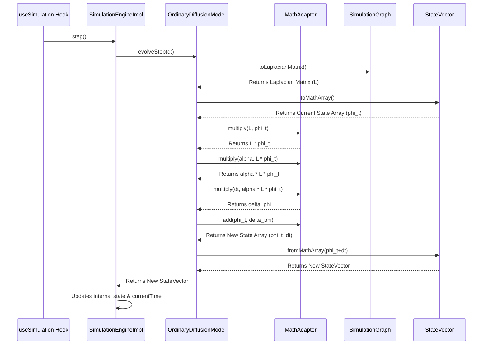

# Chapter 6: Simulation Engine & Core Logic

Welcome to Chapter 6! In the previous chapter, [Chapter 5: UI Layout & Panels](05_ui_layout___panels.md), we explored how the different parts of our `spin_network_app` – the visualization, tools, and control panels – are arranged on the screen. We have a nice workspace now!

But what happens when we actually click the "Start Simulation" button? How does the application take the network we've built and actually *run* the physics simulation on it?

**What Problem Does This Solve?**

Imagine you have a network of pipes with water flowing through them, or a metal plate where heat is spreading out. You know the starting conditions (where the water/heat is initially), and you know the rules of physics (how water flows or heat diffuses). How do you calculate where the water/heat will be after a certain amount of time?

The **Simulation Engine & Core Logic** is the computational "brain" of our application that does exactly this. It takes:
1.  The structure of our spin network ([Chapter 1: Spin Network Data Model](01_spin_network_data_model.md)).
2.  The simulation settings we choose (like what kind of physics process to simulate – e.g., diffusion – and how fast time should move).
3.  An initial "state" (like where the "heat" or "probability" starts).

It then uses mathematical models and calculation methods to figure out how this state changes over time, step-by-step. It's the heart of the "physics" part of the application.

**Use Case:** Let's say we have a simple network of three connected nodes. We start by putting all the "value" (let's call it probability) onto Node A. We want to simulate a diffusion process where this value spreads out to Nodes B and C over time. How does the application calculate the probability value on nodes A, B, and C after 1 second, 2 seconds, etc.? This chapter explains the engine that performs these calculations.

## Key Concepts: The Engine's Parts

To understand how the simulation works, let's break down the engine into its main conceptual parts:

1.  **The Engine Controller (`SimulationEngine`):** This is the main manager. It receives commands like "start", "pause", "step", or "reset". It holds the current simulation time and orchestrates the overall process. (Represented by `SpinNetworkSimulationEngineImpl` in our code).
2.  **The Simulation Graph (`SimulationGraph`):** The engine doesn't directly use the `SpinNetwork` data we saw in Chapter 1. It uses a slightly different representation optimized for calculations. This includes information about nodes, edges, and importantly, how they are connected (adjacency). (See `src/simulation/core/graph.ts`).
3.  **The State Vector (`StateVector`):** This represents the "value" (like probability, heat, etc.) at *each* node in the network at a *specific* moment in time. It's essentially a list of numbers, where each number corresponds to a node. (See `src/simulation/core/stateVector.ts`).
4.  **Simulation Parameters:** These are the settings provided by the user through the UI (like the `SimulationControlPanel` from [Chapter 5: UI Layout & Panels](05_ui_layout___panels.md)). They include:
    *   `timeStep`: How big are the jumps in time for each calculation step (e.g., 0.01 seconds).
    *   `diffusionType`: What kind of physics model to use ('ordinary' diffusion, 'telegraph' wave-like diffusion).
    *   `initialStateType`: How the simulation starts ('delta' - all value on one node, 'uniform' - value spread evenly, 'gaussian' - value concentrated around a node).
    *   Other model-specific parameters (like `alpha`, `beta`).
5.  **The Physics Model (`DiffusionModel`):** This component contains the actual mathematical equations that describe *how* the state changes from one moment to the next based on the `diffusionType` chosen. For example, the ordinary diffusion model uses an equation similar to the heat equation. (See `src/simulation/models/diffusionModels.ts`).
6.  **The Numerical Solver (`NumericalSolver`):** The physics equations often can't be solved perfectly in one go. The solver implements a method (like the simple Euler method or the more complex Runge-Kutta 4 method) to approximate the next state based on the current state and the physics model's equations over a small `timeStep`. (See `src/simulation/models/solvers.ts`).
7.  **The Math Helper (`MathAdapter`):** Performing these calculations often involves matrix mathematics (like using the graph's Laplacian matrix). This adapter uses a library called `math.js` to handle these complex math operations efficiently. (See `src/simulation/core/mathAdapter.ts`).

## How It Works: Running a Simulation

Let's trace our use case: diffusing value from Node A.

1.  **Setup:** When the application loads, or when we load a network, the `useSimulation` hook (and its Redux-connected counterpart `useReduxSimulation`) gets ready. It creates an instance of the `SpinNetworkSimulationEngineImpl`.
    *   **Input (Graph):** The engine takes the current `SpinNetwork` data (from the Redux store) and converts it into its internal `SimulationGraph` format.
    *   **Input (Parameters):** It reads the initial simulation parameters (like `timeStep`, `diffusionType='ordinary'`, `initialStateType='delta'`, `initialStateParams={nodeId: 'A'}`) from the Redux state (which are set via UI panels).
    *   **Input (Initial State):** Based on the `initialStateType` ('delta' on node 'A'), the engine creates the starting `StateVector`. This vector would have a value of 1.0 for Node A and 0.0 for Nodes B and C.

2.  **User Action:** The user clicks the "Start" button in the `SimulationControlPanel`.

3.  **Triggering the Engine:** This button click triggers a function (likely via the `useReduxSimulation` hook) that calls `engine.startSimulation()` (or `resume()`).

4.  **The Simulation Loop:** The engine now enters its main loop (often managed using `requestAnimationFrame` for smooth browser performance):
    *   **Get Ready:** It checks if it's in the "running" state.
    *   **Calculate Step:** It calls its internal `step()` method.
    *   **Inside `step()`:**
        *   It asks the current `DiffusionModel` (e.g., `OrdinaryDiffusionModel`) to calculate the next state by calling `diffusionModel.evolveStep(dt)`, passing the `timeStep` (`dt`).
        *   **Inside `evolveStep()`:**
            *   The model might use the `NumericalSolver` (e.g., `EulerSolver`).
            *   The solver needs the rate of change, which the model calculates using the physics equation (e.g., `α * L * currentState`, where `L` is the Laplacian matrix obtained via `MathAdapter` from the `SimulationGraph`, and `currentState` is the current `StateVector`).
            *   The solver uses this rate of change to calculate the *new* `StateVector` after `dt`.
        *   The engine receives the new `StateVector` from the model.
        *   It updates its internal `currentTime` by adding `dt`.
        *   It might store the new state in its history if configured to do so.
    *   **Repeat:** The loop continues, calculating state after state for each time step.

5.  **Getting Output:** While the loop runs, other parts of the application (managed by the `useReduxSimulation` hook) periodically ask the engine for its current state and time: `engine.getCurrentState()` and `engine.getCurrentTime()`.

6.  **Updating UI:** This information (current time and state vector) is pushed into the Redux store. Components responsible for displaying results ([Chapter 7: Simulation Results & Analysis](07_simulation_results___analysis.md)) and visualizing the state on the graph ([Chapter 2: Cytoscape Visualization Manager](02_cytoscape_visualization_manager.md) via helpers) react to these Redux updates and show the diffusion process happening.

7.  **Pause/Reset:** Clicking "Pause" calls `engine.pause()`, stopping the loop. Clicking "Reset" calls `engine.reset()`, which sets the state back to the initial `StateVector` and `currentTime` to 0.

## Code Example: Connecting UI to Engine

We don't usually interact with the `SpinNetworkSimulationEngineImpl` directly in UI components. We use hooks like `useSimulation` or `useReduxSimulation` that wrap the engine.

```typescript
// --- Simplified from src/hooks/useSimulation.ts ---
import { SpinNetworkSimulationEngineImpl } from '../simulation/core/engineImplementation';
// ... other imports

export const useSimulation = () => {
  // ... state for isRunning, currentTime, parameters ...
  const engineRef = useRef<SpinNetworkSimulationEngineImpl | null>(null);
  // ... refs for graph, animation frame ...

  // Initialize engine on first render
  useEffect(() => {
    engineRef.current = new SpinNetworkSimulationEngineImpl();
    // ... cleanup ...
  }, []);

  // Initialize engine when network or parameters change
  useEffect(() => {
    if (network && engineRef.current) {
      // 1. Create internal graph representation
      const graph = createSimulationGraph(network);
      // 2. Initialize the engine
      engineRef.current.initialize(graph, parameters);
      // 3. Reset time and history state
      setCurrentTime(0);
      // ...
    }
  }, [network, parameters]);

  // Function called by the animation loop
  const animationLoop = useCallback(() => {
    if (engineRef.current && isRunning) {
      try {
        // === Core simulation step ===
        engineRef.current.step(); // Ask the engine to calculate the next step

        // === Get results ===
        const newTime = engineRef.current.getCurrentTime();
        setCurrentTime(newTime); // Update React state for UI

        // ... (potentially get state, log data, etc.) ...

        // Continue the loop
        requestAnimationFrame(animationLoop);
      } catch (error) {
        // ... handle errors ...
      }
    }
  }, [isRunning, parameters /* ... */]);

  // Function called when "Start" button is clicked
  const startSimulation = useCallback(() => {
    if (engineRef.current /* ... and graph exists ... */) {
      try {
        engineRef.current.resume(); // Tell the engine to start/resume
        setIsRunning(true); // Update React state
        requestAnimationFrame(animationLoop); // Start the animation loop
      } catch (error) {
        // ... handle errors ...
      }
    }
  }, [parameters, network, animationLoop]);

  // Function called when "Pause" button is clicked
  const pauseSimulation = useCallback(() => {
    if (engineRef.current) {
      engineRef.current.pause(); // Tell the engine to pause
      setIsRunning(false); // Update React state
      // Animation loop will stop automatically because isRunning is false
    }
  }, []);

  // ... functions for reset, step, jumpToTime, updateParameters ...

  // Return controls and state to the UI component
  return {
    isRunning,
    currentTime,
    // ... other state values ...
    startSimulation,
    pauseSimulation,
    // ... other control functions ...
    getCurrentState: () => engineRef.current?.getCurrentState(), // Allow getting state
    // ...
  };
};
```

This hook manages the `SimulationEngine` instance (`engineRef`). It initializes the engine when needed, provides functions (`startSimulation`, `pauseSimulation`) that call the engine's methods, and runs the animation loop that repeatedly calls `engine.step()`. The `useReduxSimulation` hook builds on this, adding logic to synchronize the engine's state with the central Redux store.

## Under the Hood: The Simulation Step

Let's visualize what happens internally during a single `engine.step()` call for ordinary diffusion using the Euler solver.

**1. Conceptual Flow Diagram:**



**2. Step-by-Step Code (Simplified):**

*   **Engine (`SpinNetworkSimulationEngineImpl.step`)**
    Receives the call. Gets the `timeStep` (`dt`) from parameters. Asks the diffusion model to evolve.

    ```typescript
    // --- Simplified from src/simulation/core/engineImplementation.ts ---
    step(): void {
      if (!this.diffusionModel || !this.state || !this.parameters) return;
      const dt = this.parameters.timeStep;

      // Ask the model to calculate the next state
      this.state = this.diffusionModel.evolveStep(dt); // <--- Call Model

      this.currentTime += dt; // Update time
      this.stepCounter++;

      // Store state in history if needed
      if (this.parameters.recordHistory /* ... and interval matches ... */) {
        this.history.addState(this.currentTime, this.state);
      }
      // ... fire event ...
    }
    ```

*   **Model (`OrdinaryDiffusionModel.evolveStep`)**
    Implements the physics `∂ϕ/∂t = α * L * ϕ`. Uses Euler: `ϕ(t+dt) = ϕ(t) + dt * (α * L * ϕ(t))`.

    ```typescript
    // --- Simplified from src/simulation/models/diffusionModels.ts ---
    evolveStep(dt: number): StateVector {
      if (!this.graph || !this.state || !this.parameters || !this.weightFunction) {
         return this.state!; // Should not happen if initialized
      }
      // 1. Get Laplacian matrix (L) using the defined weight function
      const laplacian = this.graph.toLaplacianMatrix(this.weightFunction);
      // 2. Get current state vector as a math array (phi_t)
      const stateArray = this.state.toMathArray();
      // 3. Calculate the change term: alpha * L * phi_t
      const alpha = this.parameters.alpha || 1.0;
      const diffusionTerm = this.mathAdapter.multiply(laplacian, stateArray);
      const alphaDiffusion = this.mathAdapter.multiply(diffusionTerm, alpha);
      // 4. Calculate the change over the time step: dt * (alpha * L * phi_t)
      const deltaState = this.mathAdapter.multiply(alphaDiffusion, dt); // <--- This is the change calculated by Euler
      // 5. Add the change to the current state: phi_t + delta_phi
      const newStateArray = this.mathAdapter.add(stateArray, deltaState);
      // 6. Convert back to StateVector object
      const newState = this.state.fromMathArray(newStateArray as any, this.state.nodeIds);
      // 7. Update internal state and time
      this.currentTime += dt;
      this.state = newState;
      return this.state;
    }
    ```
    *Note: The actual implementation might use a separate `NumericalSolver` class instead of calculating the Euler step directly inside the model, but the principle is the same.*

*   **Math Adapter (`MathAdapter`)**
    Uses `math.js` to perform the matrix operations (`toLaplacianMatrix`, `multiply`, `add`).

    ```typescript
    // --- Simplified concept from src/simulation/core/mathAdapter.ts ---
    import * as math from 'mathjs';

    // Inside OrdinaryDiffusionModel.evolveStep:
    // ...
    const laplacian = MathAdapter.createLaplacianMatrix(this.graph, this.weightFunction);
    const stateArray = this.state.toMathArray();
    const alpha = this.parameters.alpha;

    // Performs math.multiply(laplacian, stateArray)
    const diffusionTerm = math.multiply(laplacian, stateArray);
    // Performs math.multiply(alpha, diffusionTerm)
    const alphaDiffusion = math.multiply(alpha, diffusionTerm);
    // Performs math.multiply(dt, alphaDiffusion)
    const deltaState = math.multiply(dt, alphaDiffusion);
    // Performs math.add(stateArray, deltaState)
    const newStateArray = math.add(stateArray, deltaState);
    // ...
    ```

This step-by-step process, involving the engine controller, the graph representation, the state vector, the physics model, the solver logic, and the math library, is repeated for every time step, driving the simulation forward.

## Conclusion

In this chapter, we dove into the computational core of the `spin_network_app`: the **Simulation Engine**. We learned that:

*   It's responsible for calculating how the state (e.g., probability) on the network nodes evolves over time.
*   It uses the network structure (`SimulationGraph`), simulation parameters (time step, diffusion type), and an initial state (`StateVector`) as input.
*   It employs mathematical physics models (`DiffusionModel`) and numerical calculation methods (`NumericalSolver`) to compute the changes.
*   Libraries like `math.js` (via `MathAdapter`) are used for efficient matrix calculations.
*   Hooks like `useSimulation` and `useReduxSimulation` provide a convenient way for the UI to interact with the engine (start, pause, reset, get results).
*   The engine calculates the state step-by-step, allowing us to observe processes like diffusion unfold on the network.

Now that we understand how the simulation *runs* and calculates the results (as `StateVector` objects over time), how do we actually *display* these results and analyze them?

**Next Up:** [Chapter 7: Simulation Results & Analysis](07_simulation_results___analysis.md)

---

Generated by [AI Codebase Knowledge Builder](https://github.com/The-Pocket/Tutorial-Codebase-Knowledge)