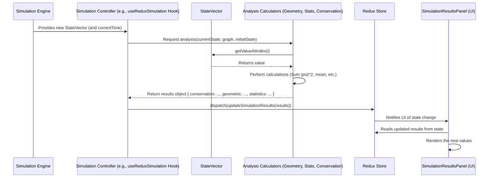

# Chapter 7: Simulation Results & Analysis

Welcome to Chapter 7! In [Chapter 6: Simulation Engine & Core Logic](06_simulation_engine___core_logic.md), we explored the "brain" of our application – the engine that runs the physics simulation on our spin network. We learned how it takes the network structure and parameters, and calculates how the state (like probability) on each node changes over time, producing a series of `StateVector` objects.

But raw state vectors are just lists of numbers! How do we turn these numbers into something meaningful? How do we know if our simulation respects physical laws, or what the overall geometric shape of our quantum state looks like?

**What Problem Does This Solve?**

Imagine you've run a weather simulation. The raw output might be millions of numbers representing temperature, pressure, and wind speed at different locations. This raw data isn't very useful on its own. You need an analysis layer to calculate things like the average temperature, the path of a storm, or whether the total energy is conserved.

The **Simulation Results & Analysis** module in `spin_network_app` does exactly this for our spin network simulations. It takes the raw `StateVector` data produced by the engine and processes it to:

1.  **Verify Physical Laws:** Check if fundamental principles like the conservation of total probability are being upheld (within some tolerance).
2.  **Calculate Geometric Properties:** Compute values inspired by quantum gravity theories, such as the total "volume" or "area" associated with the quantum state, or its "effective dimension".
3.  **Compute Statistics:** Calculate standard statistical measures like the mean (average) value on the nodes, the variance (how spread out the values are), and the minimum/maximum values.
4.  **Display Insights:** Present these calculated values clearly in the user interface, typically in the "Simulation Results" panel ([Chapter 5: UI Layout & Panels](05_ui_layout___panels.md)).

This layer translates the abstract numerical output of the simulation into understandable physical and statistical insights.

**Use Case:** After running a simulation of probability diffusing across a network, we want to check:
*   Is the total probability still close to 1.0 (as it should be)?
*   What is the calculated "quantum volume" of the state?
*   What is the average probability value across all nodes right now?

This chapter explains how the analysis components calculate these values and make them available for display.

## Key Concepts: From Raw Data to Insights

1.  **Input: Simulation State (`StateVector` & `SimulationGraph`):** The analysis functions primarily work with the `StateVector` object, which holds the numerical value (e.g., probability amplitude or density) for each node at a specific time. Sometimes, they also need the `SimulationGraph` (from Chapter 6) to access information about the network's structure (like edge spins for area calculations).
2.  **Calculators (`SimulationAnalyzer`, `SpinNetworkGeometryCalculator`, Conservation Checkers):** These are specialized classes or functions designed to compute specific types of results:
    *   `SimulationAnalyzer` (in `src/simulation/analysis/statistics.ts`): Calculates standard statistical properties (mean, variance, min, max).
    *   `SpinNetworkGeometryCalculator` (in `src/simulation/analysis/geometricProps.ts`): Calculates quantum gravity-inspired geometric properties (volume, area, dimension, entropy).
    *   Conservation Checkers (e.g., `ProbabilityConservation` in `src/simulation/analysis/conservation.ts`): Verify if physical laws are maintained.
3.  **Output: Results Object:** The calculators produce structured objects containing the calculated values (e.g., `{ totalProbability: 0.999, positivity: true, normVariation: 0.001 }` or `{ mean: 0.1, variance: 0.05, ... }`).
4.  **Display (`SimulationResultsPanel`):** The UI component (`src/components/simulation/SimulationResultsPanel.tsx`) receives these results objects (often via the Redux state, see [Chapter 8: Redux State Management](08_redux_state_management.md)) and displays the values in a user-friendly format using text, numbers, and potentially charts.

## How It Works: Calculating Results from State

Let's revisit our use case: checking probability conservation, volume, and average value after a simulation step.

1.  **Simulation Step:** The Simulation Engine ([Chapter 6: Simulation Engine & Core Logic](06_simulation_engine___core_logic.md)) completes a calculation step, producing a new `currentState: StateVector` at `currentTime`. It might also have the `initialState` and the `graph: SimulationGraph`.

2.  **Trigger Analysis:** The part of the code managing the simulation (like the `useReduxSimulation` hook) triggers the analysis calculations, often periodically or after each step.

3.  **Calculate Conservation:** It uses a `ProbabilityConservation` checker.

    ```typescript
    // --- Simplified concept from src/simulation/analysis/conservation.ts ---
    // Input: initial StateVector, current StateVector
    
    function checkProbability(initialState: StateVector, currentState: StateVector): { value: number, deviation: number } {
        const initialNorm = calculateL2Norm(initialState); // sqrt(Sum |psi_i|^2)
        const currentNorm = calculateL2Norm(currentState);
        
        // Handle the case where initial norm is zero
        if (initialNorm < 1e-9) {
            return { value: currentNorm, deviation: currentNorm };
        }
        
        const deviation = Math.abs(currentNorm - initialNorm) / initialNorm;
        return { value: currentNorm, deviation: deviation };
    }
    
    // Example usage (inside simulation controller)
    const conservationResult = checkProbability(initialState, currentState);
    // Output: conservationResult = { value: 0.9998, deviation: 0.0002 } (example)
    ```
    This function calculates the total probability (L2 norm) for both the initial and current states and finds the relative difference (deviation).

4.  **Calculate Geometry:** It uses the `SpinNetworkGeometryCalculator`.

    ```typescript
    // --- Simplified concept from src/simulation/analysis/geometricProps.ts ---
    
    // Input: current StateVector
    function calculateTotalVolume(state: StateVector): number {
        let totalVolume = 0;
        for (let i = 0; i < state.size; i++) {
            const stateValue = state.getValueAtIndex(i);
            // Simplified volume: Sum |psi_i|^2 (matches L2 norm squared)
            totalVolume += stateValue * stateValue; 
        }
        return totalVolume;
    }
    
    // Example usage (inside simulation controller)
    const geoCalculator = new SpinNetworkGeometryCalculator();
    const volume = geoCalculator.calculateTotalVolume(currentState);
    // Output: volume = 0.9998 (example)
    ```
    This function iterates through the state vector, squares each value, and sums them up to get a simplified total volume.

5.  **Calculate Statistics:** It uses the `SimulationAnalyzer`.

    ```typescript
    // --- Simplified concept from src/simulation/analysis/statistics.ts ---
    
    // Input: current StateVector
    function calculateMean(state: StateVector): number {
        if (state.size === 0) return 0;
        let sum = 0;
        for (let i = 0; i < state.size; i++) {
            sum += state.getValueAtIndex(i);
        }
        return sum / state.size;
    }
    
    // Example usage (inside simulation controller)
    const stats = SimulationAnalyzer.calculateStatistics(currentState, currentTime);
    const meanValue = stats.mean; 
    // Output: meanValue = 0.05 (example, if probability spread out)
    ```
    This calculates the average value across all nodes in the current state vector. `calculateStatistics` computes other stats like variance, min, and max simultaneously.

6.  **Update UI:** The calculated values (`conservationResult`, `volume`, `meanValue`, etc.) are packaged together. This result package is typically dispatched to the Redux store ([Chapter 8: Redux State Management](08_redux_state_management.md)). The `SimulationResultsPanel` component subscribes to these updates in the Redux store and displays the latest values.

    ```typescript
    // --- Simplified concept from src/components/simulation/SimulationResultsPanel.tsx ---
    import React from 'react';
    import { useSelector } from 'react-redux'; // Assuming Redux integration

    const SimulationResultsPanel: React.FC = () => {
        // Get the latest results from the Redux store
        const results = useSelector((state) => state.simulation); 
        
        return (
            <div>
                <h3>Simulation Results (t={results.currentTime.toFixed(2)})</h3>
                
                {/* Display Conservation */}
                <div>
                    Prob. Conservation: {results.conservationData.totalProbability.toFixed(4)} 
                    (Deviation: {results.conservationData.normVariation.toFixed(4)})
                </div>

                {/* Display Geometry */}
                <div>
                    Total Volume: {results.geometricData.totalVolume.toFixed(4)}
                </div>

                {/* Display Statistics */}
                <div>
                    Mean Value: {results.statisticsData.mean.toFixed(4)}
                    {/* ... display variance, min, max ... */}
                </div>
                {/* ... potentially charts ... */}
            </div>
        );
    };
    ```
    This React component reads the calculated analysis results from the application's state (managed by Redux) and renders them as text.

## Under the Hood: The Analysis Flow

Let's visualize the sequence of events when results are calculated and displayed after a simulation step.



**Step-by-Step:**

1.  **State Update:** The Simulation Engine computes a new `StateVector`.
2.  **Analysis Trigger:** The controller logic (likely within a hook like `useReduxSimulation`) receives the new state and decides it's time to analyze (e.g., every N steps or based on time interval).
3.  **Calculation:** The controller calls the relevant methods on the `SpinNetworkGeometryCalculator`, `SimulationAnalyzer`, and conservation checkers, passing the `StateVector` (and potentially the `graph` or `initialState`).
4.  **Data Processing:** The calculators iterate through the `StateVector` data, apply their respective formulas (summing squares for volume, averaging for mean, checking norms for conservation, etc.).
5.  **Results Returned:** The calculators return structured objects containing the computed values.
6.  **State Update:** The controller dispatches these results to the Redux store, updating the central application state.
7.  **UI Update:** The `SimulationResultsPanel` component, connected to the Redux store, detects the state change, re-reads the latest results, and updates the display on the screen.

This ensures that the results panel always shows analysis based on the most recent simulation data available in the central state.

## Conclusion

The **Simulation Results & Analysis** module acts as a crucial interpretation layer on top of the raw simulation output. It transforms lists of numbers (`StateVector`) into meaningful insights by:

*   Using specialized calculators (`SpinNetworkGeometryCalculator`, `SimulationAnalyzer`, conservation checkers) located in `src/simulation/analysis/`.
*   Calculating physical quantities like **total probability conservation**, **volume**, **area**, and **effective dimension**.
*   Calculating standard **statistical measures** like mean and variance.
*   Making these results available for display in UI components like `SimulationResultsPanel`.

This allows users to not only *run* simulations but also *understand* and *evaluate* the results in a physically and statistically meaningful context.

So far, we've seen how data is structured, visualized, interacted with, styled, calculated, and analyzed. But how does the application keep track of all this information – the network structure, the simulation state, the UI settings, the analysis results – in a consistent and predictable way, especially when different parts of the app need to access or modify the same data? That's the role of state management.

**Next Up:** [Chapter 8: Redux State Management](08_redux_state_management.md)

---

Generated by [AI Codebase Knowledge Builder](https://github.com/The-Pocket/Tutorial-Codebase-Knowledge)