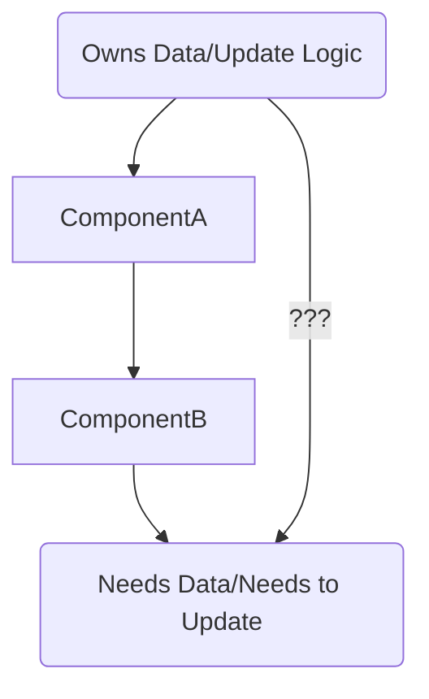
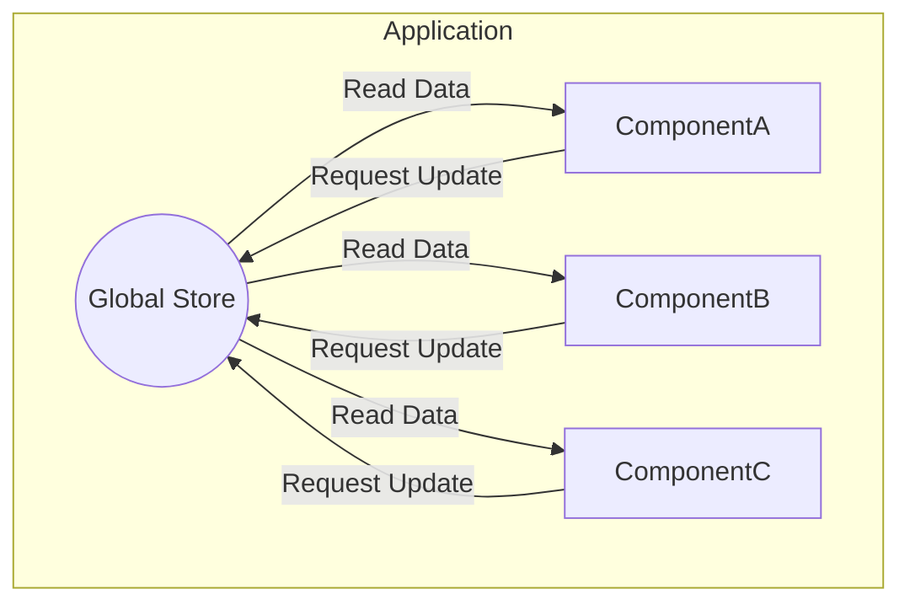
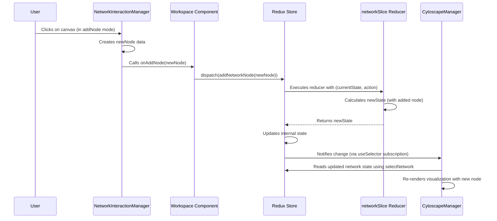

# Chapter 8: Redux State Management

Welcome to the final chapter! In [Chapter 7: Simulation Results & Analysis](07_simulation_results___analysis.md), we saw how the application calculates and presents meaningful insights from the simulation data, like checking conservation laws or calculating geometric properties.

Throughout this tutorial, we've discussed many different pieces of information the application needs to keep track of:
*   The current `SpinNetwork` structure (nodes, edges, metadata - [Chapter 1: Spin Network Data Model](01_spin_network_data_model.md)).
*   Which node or edge is currently selected.
*   The current interaction mode ('select', 'addNode', etc. - [Chapter 3: Network Interaction Manager](03_network_interaction_manager.md)).
*   Whether the sidebars are visible and how wide they are ([Chapter 5: UI Layout & Panels](05_ui_layout___panels.md)).
*   All the custom node and edge type definitions ([Chapter 4: Type System (Node/Edge Styling)](04_type_system__node_edge_styling_.md)).
*   The simulation parameters, whether it's running, and the latest results ([Chapter 6: Simulation Engine & Core Logic](06_simulation_engine___core_logic.md) & [Chapter 7: Simulation Results & Analysis](07_simulation_results___analysis.md)).

That's a lot of information! How does the application manage all this data so that every component that needs it has access to the *latest* version, and changes happen in a predictable, organized way?

**What Problem Does This Solve?**

Imagine a large company with many departments. If each department keeps its own private records about customers, inventory, and sales, things quickly become chaotic and inconsistent. One department might have an old customer address, while another has the new one. Making sure everyone has the same, up-to-date information is a big challenge.

In a complex application like `spin_network_app`, different components (like the visualization, the properties panel, the toolbar, the simulation controls) all need to access and sometimes modify shared pieces of information (the "state"). If each component managed its own copy, keeping them synchronized would be a nightmare.

**Redux State Management** provides a solution. It acts like a **central, highly organized database or shared memory** for the *entire* application's state. It establishes strict rules for how this state can be read and updated, ensuring consistency and predictability. Think of it as the application's central control room.

**Use Case:** Let's revisit the scenario from [Chapter 3: Network Interaction Manager](03_network_interaction_manager.md). When you click on the canvas in 'addNode' mode, the `NetworkInteractionManager` needs to tell the application to add a node. This change needs to be reflected in the main network data, and the `CytoscapeManager` ([Chapter 2: Cytoscape Visualization Manager](02_cytoscape_visualization_manager.md)) needs to know about this update so it can redraw the network. How does Redux coordinate this?

## What is Application State?

"State" simply refers to all the data that describes the application at any given moment. It's the application's memory. This includes:
*   **Data State:** The core data the application works with (e.g., the `SpinNetwork` object).
*   **UI State:** Information about how the user interface looks and behaves (e.g., which element is selected, which panels are open, the current interaction mode).
*   **Session State:** User-specific data (e.g., preferences, recent files).

## The Problem: Keeping Components in Sync

In a simple application, one component might manage some state and pass it down to its child components as "props". But as the application grows, you might need to pass data through many intermediate components that don't even use the data themselves (this is called "prop drilling"). If a deeply nested component needs to change the state owned by a top-level component, it gets complicated quickly.



How does `ComponentC` easily get data from `App` or tell `App` to update its state? Passing functions and data down through A and B becomes messy.

## The Solution: Redux - A Central Store

Redux introduces a **single, global store** that holds the *entire* application state. Any component can directly read data from this store or request changes to it, without needing complex prop passing.



This makes data flow much clearer and more manageable.

## Key Redux Parts (The Control Room Analogy)

Think of Redux like a highly secure control room for our application's state:

1.  **The Store:** This is the **central room** itself. It holds the single, definitive copy of the application's state object. (Created in `src/store/index.ts`).
2.  **Actions:** These are like **official request forms**. They are simple JavaScript objects that describe *what* change is being requested. They MUST have a `type` field (a string describing the action, e.g., `'network/addNetworkNode'`) and can optionally carry some data (the "payload", e.g., the details of the node to add).
    ```javascript
    // Example Action object
    {
      type: 'network/addNetworkNode',
      payload: { id: 'n3', position: {x:10, y:20}, intertwiner: 1.0 }
    }
    ```
3.  **Reducers:** These are the **strict rule-following staff** inside the control room. A reducer is a special kind of function. It takes two arguments: the *current* state and the *action* (request form). Based *only* on these inputs, it produces the *next* state.
    *   **Pure Functions:** Reducers must be "pure" – they don't change the original state directly (they create a *new* state object), and they don't have side effects (like calling APIs). Given the same state and action, they always produce the same new state.
    *   **Slices:** In our app, we organize reducers into "slices", each managing a specific part of the state (e.g., `networkSlice.ts` manages the `SpinNetwork` data, `uiSlice.ts` manages UI state). They are found in `src/store/slices/`.

    ```typescript
    // --- Simplified concept from src/store/slices/networkSlice.ts ---
    // The reducer function for 'network/addNetworkNode' action
    addNetworkNode: (state, action) => {
      // 'state' holds the current network state
      // 'action.payload' holds the new node data
      
      // IMPORTANT: Don't modify 'state' directly!
      // Create a *new* state object based on the old one + the change
      const newNode = action.payload;
      const newNodes = [...state.currentNetwork.nodes, newNode]; // New array
      const newNetwork = {
        ...state.currentNetwork, // Copy other parts
        nodes: newNodes,         // Use the new nodes array
        metadata: { ...state.currentNetwork.metadata, modified: Date.now() } // Update metadata
      };
      
      // Return the *new* state
      state.currentNetwork = newNetwork; 
      // (Redux Toolkit simplifies this with Immer, but the principle is immutability)
    },
    ```
    *Note: We use Redux Toolkit which uses a library called Immer behind the scenes. This lets us write code that *looks* like it's modifying the state directly (like `state.currentNetwork = newNetwork`), but Immer cleverly handles creating the immutable updates for us.*

4.  **Dispatch:** This is the act of **sending an action (request form) to the store (control room)**. Components don't call reducers directly. They `dispatch` actions. Redux ensures the action reaches the correct reducer. We use a special hook `useAppDispatch` for this.

    ```typescript
    // --- Simplified usage in a React component ---
    import { useAppDispatch } from '../store/hooks';
    import { addNetworkNode } from '../store/slices/networkSlice'; // Action creator

    function MyComponent() {
      const dispatch = useAppDispatch(); // Get the dispatch function

      const handleAddClick = (newNodeData) => {
        // Dispatch the action object to the store
        dispatch(addNetworkNode(newNodeData));
      };
      // ...
    }
    ```
    `addNetworkNode(newNodeData)` here is an "action creator" function generated by Redux Toolkit. It simply creates the action object (`{ type: 'network/addNetworkNode', payload: newNodeData }`) for us.

5.  **Selectors:** These are functions used to **extract specific pieces of data** from the store's state object. Components use selectors to subscribe to only the parts of the state they care about. We use a special hook `useAppSelector` for this. Selectors are often defined in `src/store/selectors/`.

    ```typescript
    // --- Simplified usage in a React component ---
    import { useAppSelector } from '../store/hooks';
    import { selectNodes } from '../store/selectors'; // Selector function

    function NetworkDisplay() {
      // Select only the list of nodes from the store
      const nodes = useAppSelector(selectNodes);

      return (
        <ul>
          {nodes.map(node => <li key={node.id}>{node.label || node.id}</li>)}
        </ul>
      );
    }
    ```
    When the `nodes` part of the Redux state changes, React Redux will automatically cause `NetworkDisplay` to re-render with the new data.

## How `spin_network_app` Uses Redux

Our application organizes the state into logical chunks called "slices," each managed by its own reducer file in `src/store/slices/`:

*   `networkSlice.ts`: Manages the `SpinNetwork` data (`currentNetwork`), including nodes, edges, metadata, and also handles the undo/redo history. Defines actions like `addNetworkNode`, `updateNetworkNode`, `removeNetworkNode`, `undo`, `redo`.
*   `uiSlice.ts`: Manages UI-related state like the currently selected element (`selectedElement`), the interaction mode (`interactionMode`), sidebar visibility and sizes (`sidebarVisibility`, `sidebarSizes`), collapsed sections (`collapsedSections`), and theme settings. Defines actions like `setSelectedElement`, `setInteractionMode`, `toggleSidebar`.
*   `typeSlice.ts`: Manages the lists of custom `NodeType` and `EdgeType` definitions and their usage counts. Defines actions like `addNodeType`, `updateNodeType`, `removeNodeType`.
*   `simulationSlice.ts`: Manages the state related to simulations, including the simulation parameters (`parameters`), whether the simulation is running (`isRunning`), the current simulation time (`currentTime`), and the latest calculated results (`geometricData`, `statisticsData`, `conservationData`). Defines actions like `setSimulationRunning`, `updateParameters`, `updateGeometricData`.
*   `recentNetworksSlice.ts`: Keeps track of recently opened or saved networks.

**Accessing the Store:**

React components interact with the Redux store using two custom hooks defined in `src/store/hooks.ts`:

*   `useAppDispatch()`: Returns the store's `dispatch` function, allowing components to send actions.
*   `useAppSelector(selectorFunction)`: Allows components to read data from the store. It takes a `selector` function (like those in `src/store/selectors/index.ts` or `src/store/selectors/typeSelectors.ts`) as an argument, which specifies which piece of state to retrieve.

**Persistence (`redux-persist`):**

We also use a library called `redux-persist` (configured in `src/store/index.ts`) to automatically save parts of the Redux state (like the network, UI settings, types) to the browser's local storage (`localforage`). When you reopen the application, `redux-persist` reloads this saved state, allowing you to continue where you left off.

## Example Flow: Adding a Node via Redux

Let's trace our use case – adding a node – using the Redux pattern:

1.  **User Interaction:** The user clicks on the canvas background while in `addNode` mode.
2.  **Interaction Manager:** The `NetworkInteractionManager` ([Chapter 3: Network Interaction Manager](03_network_interaction_manager.md)) detects the click. It creates the data for the new node (`newNodeData`).
3.  **Callback:** It calls the `onAddNode` callback function provided by its parent (`Workspace.tsx`).
4.  **Dispatch Action:** Inside `Workspace.tsx`, the `onAddNode` function uses the `useAppDispatch` hook to get the `dispatch` function. It then calls `dispatch(addNetworkNode(newNodeData))`. This sends the `addNetworkNode` action (with the new node data as payload) to the Redux store.

    ```typescript
    // --- Simplified from Workspace.tsx ---
    import { useAppDispatch } from '../../store/hooks';
    import { addNetworkNode } from '../../store/slices/networkSlice';
    import { NetworkNode } from '../../models/types';
    // ...

    const Workspace = () => {
        const dispatch = useAppDispatch();

        const handleAddNode = useCallback((node: NetworkNode) => {
            console.log('Dispatching addNetworkNode action for node:', node.id);
            dispatch(addNetworkNode(node)); // <--- Dispatching the action
        }, [dispatch]);

        return (
            <NetworkInteractionManager
                // ... other props
                onAddNode={handleAddNode}
            />
            // ... CytoscapeManager etc.
        );
    };
    ```

5.  **Reducer Runs:** Redux routes the action to the `networkSlice`. The `addNetworkNode` reducer function inside `networkSlice.ts` receives the current network state and the action.
6.  **New State Created:** The reducer creates a *new* `SpinNetwork` object that includes the added node (using immutable update patterns, potentially via Immer).
7.  **Store Updated:** Redux updates the central store with the new state returned by the reducer.
8.  **Component Update:** The `CytoscapeManager` component uses `useAppSelector(selectNetwork)` to get the current network data from the store. Because the network data in the store has changed, React Redux detects this and triggers a re-render of `CytoscapeManager`.
9.  **Visualization Refreshes:** `CytoscapeManager` receives the updated network data (with the new node) as a prop and redraws the visualization ([Chapter 2: Cytoscape Visualization Manager](02_cytoscape_visualization_manager.md)), showing the newly added node.

## Under the Hood: The Redux Flow

This sequence diagram illustrates the flow for adding a node:



The key principles are:
*   **Single Source of Truth:** All important application data lives in one place (the Store).
*   **State is Read-Only:** Components never change the state directly.
*   **Changes are Made with Pure Functions:** Changes only happen by dispatching actions, which are processed by pure reducer functions that compute the *next* state immutably.

This makes the application's data flow predictable, easier to debug (you can trace actions and state changes), and simpler to manage, especially as the application grows in complexity.

## Conclusion

In this final chapter, we learned about **Redux State Management**, the central nervous system of the `spin_network_app`.

*   It solves the problem of keeping data consistent across many components by providing a **single, central store** for the application's state.
*   It enforces a predictable data flow using **Actions** (describing what happened), **Reducers** (pure functions calculating the new state), and **Dispatch** (sending actions to the store).
*   Components read data using **Selectors** (`useAppSelector`) and request changes using **Dispatch** (`useAppDispatch`).
*   Our app uses "slices" (`networkSlice`, `uiSlice`, `typeSlice`, `simulationSlice`) to organize the state and reducers.
*   `redux-persist` helps save and load the state, remembering your work and settings.

By centralizing state and enforcing strict update rules, Redux makes the application more robust, maintainable, and easier to reason about.

This concludes our tutorial series on the `spin_network_app`! We've journeyed from the basic `SpinNetwork` data model, through visualization, interaction, styling, UI layout, the simulation engine, results analysis, and finally, state management. We hope this has given you a solid understanding of how the different parts of the application work together. Happy exploring and simulating!

---

Generated by [AI Codebase Knowledge Builder](https://github.com/The-Pocket/Tutorial-Codebase-Knowledge)