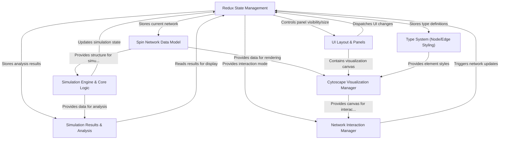

# Tutorial: spin_network_app

This project allows users to **visualize** and **simulate** *spin networks*, which are graph structures used in physics concepts like loop quantum gravity.
You can build networks by adding nodes and edges, configure their visual appearance using a *type system*, run physics *diffusion simulations* on them, and then analyze the results, such as *quantum geometric properties* (volume, area, dimension) and statistical distributions. The application uses Redux for managing its state and Cytoscape.js for rendering the network graph.

**Source Repository:** [https://github.com/space-cadet/spin_network_app](https://github.com/space-cadet/spin_network_app)

## Chapters

1. [Spin Network Data Model](01_spin_network_data_model.md)
2. [Cytoscape Visualization Manager](02_cytoscape_visualization_manager.md)
3. [Network Interaction Manager](03_network_interaction_manager.md)
4. [Type System (Node/Edge Styling)](04_type_system__node_edge_styling_.md)
5. [UI Layout & Panels](05_ui_layout___panels.md)
6. [Simulation Engine & Core Logic](06_simulation_engine___core_logic.md)
7. [Simulation Results & Analysis](07_simulation_results___analysis.md)
8. [Redux State Management](08_redux_state_management.md)

---

Generated by [AI Codebase Knowledge Builder](https://github.com/The-Pocket/Tutorial-Codebase-Knowledge)