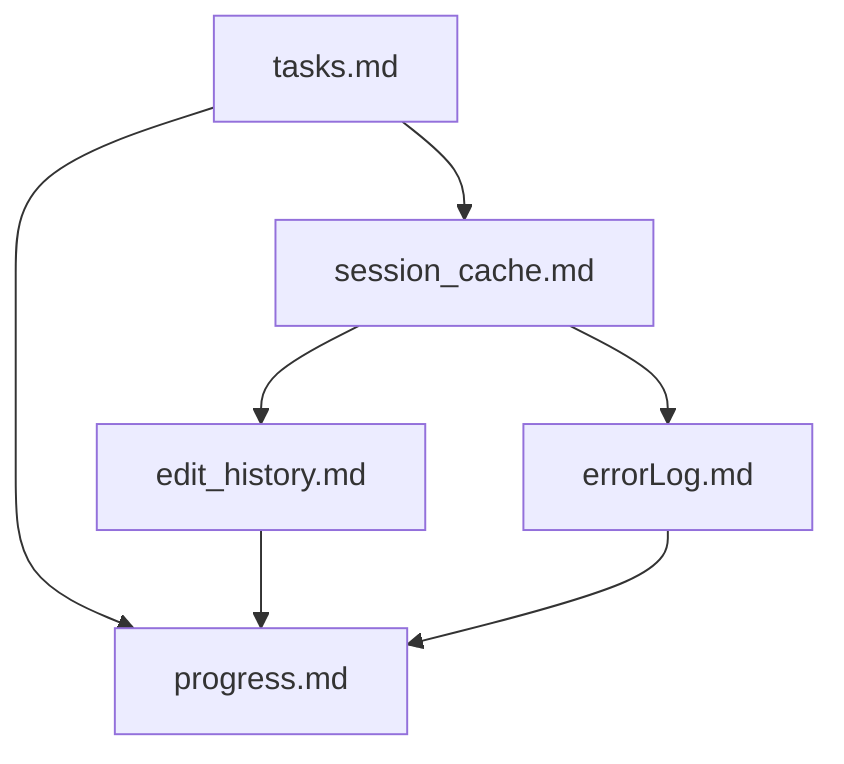
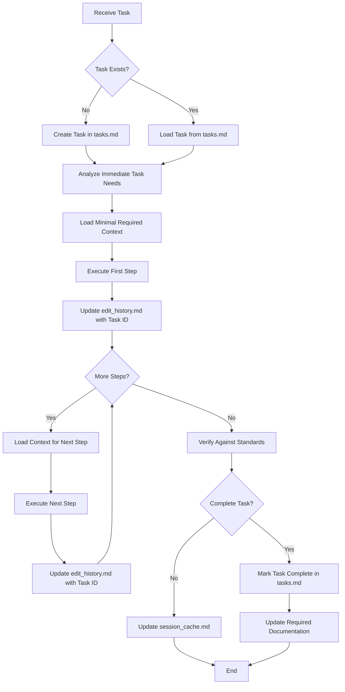
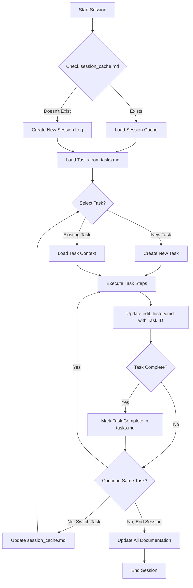
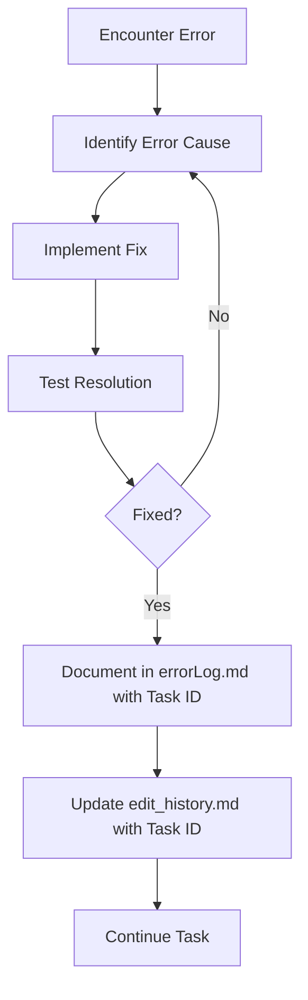
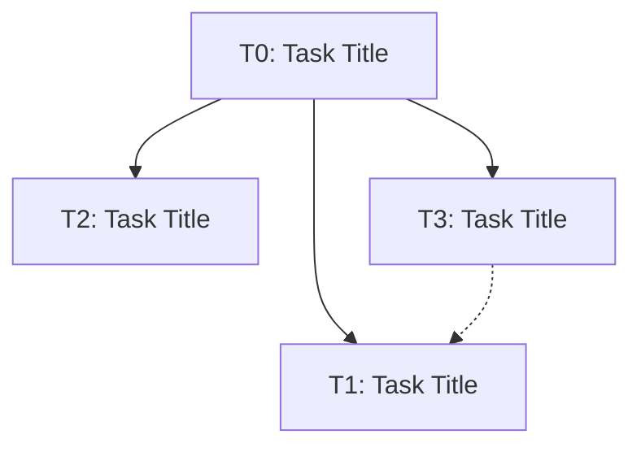

# Integrated Code Rules and Memory Bank System

*Last Updated: April 14, 2025*

⚠️ IMPORTANT: NEVER modify files without explicit user approval. Always present a plan and wait for confirmation before making any changes.

### File Locations

- Memory Bank files (session_cache.md, edit_history.md, errorLog.md, tasks.md, etc.) should be located in the `/memory-bank/` directory
- Template files for memory bank documents should be in the `/templates/` directory at the project root
- Integrated Rules files remain in the project root
- This structure ensures consistent organization and prevents confusion about file locations

## 1. Unified System Purpose and Philosophy

### 1.1 Core Purpose

The Integrated Code Rules and Memory Bank System is designed to:
- Balance task execution efficiency with comprehensive project knowledge
- Maintain consistent coding standards and documentation practices
- Ensure project continuity across multiple sessions
- Optimize resource usage by loading only necessary information
- Standardize tool usage and communication formats
- Support multiple concurrent tasks with clear context boundaries

### 1.2 Balanced Approach

This system implements a balance between:
- **Task-First Efficiency**: Prioritizing immediate task execution with minimal context
- **Consistent Documentation**: Maintaining sufficient project knowledge for continuity
- **Standardized Implementation**: Following consistent coding patterns and practices
- **Progressive Knowledge**: Building and maintaining project history when valuable
- **Multi-Task Management**: Supporting work on multiple aspects of a project simultaneously

### 1.3 Documentation Update Cadence

- `tasks.md` must be updated whenever creating, pausing, resuming, or completing a task
- `edit_history.md` must be updated on a periodic basis:
  - After every file/folder creation operation
  - After every file edit operation
  - Or at minimum after every few chat messages
  - For rapid sequential edits to the same file, batch updates are acceptable to maintain efficiency
  - Each entry should include the relevant task ID
- `errorLog.md` should be updated whenever an error is encountered and resolved, with reference to the related task ID
- `session_cache.md` should be updated at session boundaries, when switching tasks, or at significant implementation milestones

## 2. Communication Style

### 2.1 Task-Oriented Communication

1. Use direct, clear statements focused on actions and results
2. Avoid unnecessary explanations of process or methodology
3. Be concise and avoid conversational language
4. Focus on what was done and what will be done next
5. For task discussions, use action-oriented language
6. Reference task IDs when discussing specific work items

### 2.2 Implementation Process

When starting work:
1. Focus immediately on understanding the specific task
2. Assign a task ID and register it in tasks.md
3. Load only the minimum files needed for the current step
4. Execute the step completely before getting additional context
5. Document changes in a targeted, minimal way, referencing the task ID
6. Complete tasks efficiently with minimal information gathering
7. When switching tasks, preserve context by updating session_cache.md

## 3. Core Memory Bank Files

### 3.1 Essential Files

```
memory-bank/
├── activeContext.md      # Current task context
├── edit_history.md       # File modification log (with task references)
├── errorLog.md           # Error tracking (with task references)
├── session_cache.md      # Multi-task session state
├── tasks.md              # Task registry and tracking
├── progress.md           # Implementation status
└── projectbrief.md       # Project overview

templates/                # Template files for memory bank documents
├── session_cache.md
├── tasks.md
├── edit_history.md
└── ...
```

### 3.2 File Templates

Templates for all memory bank files are stored in the `/memory-bank/templates/` directory and follow the formats defined in section 10.

### 3.3 File Relationships



### 3.4 Validation Rules

1. All files must have:
   - Clear header with last updated date
   - Consistent section formatting
   - Status indicators where applicable
   - Task ID references where applicable

2. Prohibited:
   - Unstructured notes
   - Redundant information
   - File-specific details in wrong documents
   - Missing task ID references

### 3.5 Maintenance Guidelines

- Update `tasks.md` whenever task status changes
- Update `edit_history.md` after each file change, with task ID reference
- Update `session_cache.md` when switching between tasks
- Review `errorLog.md` weekly
- Archive `session_cache.md` after all active tasks complete
- Keep `progress.md` organized by task ID

### 3.6 File Size Management Protocol

To prevent `edit_history.md`, `errorLog.md`, and `tasks.md` from becoming excessively large, the following protocol should be implemented:

1.  **Size-Based Rotation:**
    *   The `edit_history.md` and `errorLog.md` files should have an upper limit of 500 lines.
    *   The `tasks.md` file should archive completed tasks after they have been complete for more than 30 days.
    *   When a file exceeds this limit, it should be moved to an `archive/` subfolder.
    *   The file should be renamed using the format `edit_history_YYYY-MM.md`, `errorLog_YYYY-MM.md`, or `tasks_YYYY-MM.md`.

2.  **Archiving Process:**
    *   Create an `archive/` subfolder within the `memory-bank/` directory to store the archive files.
    *   The archiving process should be performed automatically when the file size exceeds the limit.

3.  **File Naming Convention:**
    *   Archive files should be named using the format `edit_history_YYYY-MM.md`, `errorLog_YYYY-MM.md`, or `tasks_YYYY-MM.md`, where YYYY is the year and MM is the month when the file was archived.

4.  **Integration with Memory Bank System:**
    *   Update `projectbrief.md` to include a reference to the `archive/` directory.
    *   Modify the `read_mb` command to optionally load archive files when historical context is needed.

5.  **Application to Other Files:**
    *   While the primary focus is on `edit_history.md`, `errorLog.md`, and `tasks.md`, consider applying similar size-based rotation rules to other Memory Bank files if they become excessively large.

## 4. Implementation Guidelines

### 4.1 Safety & Scope

1. Operate exclusively within the designated project directory and subdirectories
2. Do not access, read, or modify files outside defined scope
3. Avoid executing shell commands that might affect system state
4. Always verify paths before file operations
5. Project building, installation, dependency management, and similar tasks should not be executed by the LLM unless explicitly requested by the user.

### 4.2 Mandatory Step-by-Step Approval

1. NEVER modify files without EXPLICIT user approval first
2. For each discrete file modification:
   - Present a concise description of WHAT will be changed
   - Get explicit approval BEFORE making the change
3. No need to present all planned changes at once - proceed incrementally
4. Complex changes can be broken into manageable approval steps
5. If approval is ambiguous, request clarification
6. Focus on necessary files/components related to the task
7. Avoid unnecessary project-wide scans

### 4.3 Efficiency Rules

1. Do not read file content you already have
2. Avoid reading entire repos or directories
3. Focus only on the specific files needed for the current step
4. When examining code, look for the specific components relevant to the task
5. Trust that you can access more information if needed rather than loading it preemptively
6. When switching tasks, only load the minimum context needed for the new task

## 5. Integration with Development Workflow

This integrated system is designed to:
- Support rapid task execution while maintaining documentation quality
- Ensure code standards are maintained without excessive overhead
- Provide just enough context for effective implementation
- Document only what's necessary for project continuity
- Balance immediate task needs with long-term project knowledge
- Support multiple concurrent tasks with clear boundaries

## 6. Integrated Command System

### 6.1 Task Management Commands

| Command | Description |
|---------|-------------|
| `create_task [title]` | Create a new task with unique ID in tasks.md |
| `switch_task [task_id]` | Switch focus to a different task, updating session_cache.md |
| `pause_task [task_id]` | Mark a task as paused in tasks.md |
| `resume_task [task_id]` | Resume a paused task |
| `complete_task [task_id]` | Mark a task as completed and update related documentation |

### 6.2 Task Execution Commands

| Command | Description |
|---------|-------------|
| `do_task [task_id]` | Execute specific task with minimal context loading |
| `continue_task [task_id]` | Resume previous task using minimal context from cache |
| `verify_task [task_id]` | Check implementation against code standards |

### 6.3 Memory Management Commands

| Command | Description |
|---------|-------------|
| `read_mb` | Load Critical tier files needed for current task |
| `read_mb [file]` | Load specific file only |
| `read_mb standard` | Load Critical + Essential tiers |
| `read_mb complete` | Load all Memory Bank files (rarely needed) |
| `update_mb [file]` | Update specific file with minimal changes |
| `log_error [title] [task_id]` | Record a new error with details in errorLog.md |
| `record_edits [task_id] [description]` | Add file modifications to edit_history.md |
| `read_errors [component]` | Load error history for a specific component or error type |
| `read_task [task_id]` | Load task-specific information from tasks.md |

### 6.4 Session Management Commands

| Command | Description |
|---------|-------------|
| `continue_session` | Flag this as a continuation; prioritize session_cache.md |
| `complete_session` | Mark session as complete, update necessary docs |
| `cache_session` | Create continuation point with minimal updates |
| `start_session` | Begin new session with fresh timestamp |

### 6.5 Code Implementation Commands

| Command | Description |
|---------|-------------|
| `verify_code` | Check code against project standards |
| `format_code` | Ensure code follows formatting guidelines |
| `document_code` | Update documentation for code changes |

## 7. Knowledge Organization and Management

### 7.1 Tiered Knowledge Structure

Knowledge is organized in four tiers with task-oriented loading priorities:

1. **Bootstrap Tier (Minimal Required Knowledge)**
   - `bootstrap.md` - Core system structure, loaded only when essential
   - `tasks.md` - Registry of all tasks, loaded when task IDs are needed
   - Access only when needed to understand command system or task structure

2. **Critical Tier (Task-Relevant Only)**
   - `activeContext.md` - Current state relevant to immediate task
   - `progress.md` - Status information needed for current step
   - `session_cache.md` - Task contexts for active and paused tasks
   - `errorLog.md` - Record of errors, their causes, and resolutions for reference (load when debugging)
   - `edit_history.md` - Chronological record of file modifications with timestamps (load when context about recent changes is needed)
   - Load only files directly relevant to current task step

3. **Essential Tier (Load Only When Required)**
   - `projectbrief.md` - Reference only when task scope is unclear
   - `.cursorrules` - Reference only when implementation patterns are needed
   - Load only when task requirements aren't clear from Critical tier

4. **Reference Tier (Avoid Unless Specifically Needed)**
   - `productContext.md` - Why and how the project works
   - `systemPatterns.md` - Architecture and design patterns
   - `techContext.md` - Technical implementation details
   - Load only specific files when directly relevant to current task step

### 7.2 Task-First Loading Process

1. Analyze the immediate task requirements
2. Identify task ID in tasks.md or create a new task
3. Identify the minimal set of files needed for the current step
4. Load only those files directly relevant to the current task
5. Execute the current step completely
6. Load additional files only when needed for the next step
7. Update only files with meaningful changes related to the task
8. When switching tasks, update session_cache.md to preserve context

### 7.3 Documentation Decision Framework

| Change Type | Documentation Requirements |
|-------------|----------------------------|
| Task creation | Update tasks.md with new task ID and details |
| Task status change | Update tasks.md with new status |
| Task switching | Update session_cache.md to preserve context |
| Interface changes | Update API docs, activeContext.md with task reference |
| Implementation details | Code comments only, edit_history.md with task ID |
| Architecture changes | Update systemPatterns.md, add task reference |
| New features | Update progress.md, projectbrief.md with task reference |
| Bug fixes | Update progress.md with task reference |
| Refactoring | Minimal documentation unless patterns change |
| Error resolution | Update errorLog.md with error details, fix, and task ID |
| File modification | Update edit_history.md with file changes and task ID |
| Multiple file edits | Update both session_cache.md and edit_history.md with task ID |
| Ongoing work | Update session_cache.md with clear "in progress" indicators (🔄) |
| Mixed change types | Document according to highest impact change type, ensuring all aspects are covered and include task ID |

## 8. Technical Implementation Standards

### 8.1 XML Tag Format

Tool use is formatted using XML-style tags:

```
<tool_name>
<parameter1_name>value1</parameter1_name>
<parameter2_name>value2</parameter2_name>
...
</tool_name>
```

### 8.2 File Operations

**Note:** File editing and creation operations should be performed using the Desktop Commander (dc) MCP server. When editing files, the Desktop Commander MCP server should prioritize using block edits (`edit_block` tool) whenever possible to minimize token usage and ensure precise changes.

#### Reading Files

```
<read_file>
<path>src/main.js</path>
</read_file>
```

With line specifications:

```
<read_file>
<path>src/app.ts</path>
<start_line>46</start_line>
<end_line>68</end_line>
</read_file>
```

#### Searching Files

```
<search_files>
<path>.</path>
<regex>your-pattern-here</regex>
<file_pattern>*.ts</file_pattern>
</search_files>
```

#### Directory Listing

```
<list_files>
<path>.</path>
<recursive>false</recursive>
</list_files>
```

#### File Modification (Diff Format)

For precise, surgical modifications:

```
<apply_diff>
<path>File path here</path>
<diff>
<<<<<<< SEARCH
:start_line:1
:end_line:5
-------
def calculate_total(items):
    total = 0
    for item in items:
        total += item
    return total
=======
def calculate_total(items):
    """Calculate total with 10% markup"""
    return sum(item * 1.1 for item in items)
>>>>>>> REPLACE
</diff>
</apply_diff>
```

#### File Creation/Overwriting

```
<write_to_file>
<path>config.json</path>
<content>
{
  "apiEndpoint": "https://api.example.com",
  "version": "1.0.0"
}
</content>
</write_to_file>
```

### 8.3 Code Standards

- Use modular design with clear separation of concerns
- Make surgical, precise changes when editing existing files
- Maintain consistent indentation and formatting
- Document interfaces and APIs with clear specifications
- Follow asynchronous patterns for I/O operations
- Implement proper error handling and validation

### 8.4 Documentation Standards

- Update only files with meaningful changes
- Include creation and last updated timestamps
- Include task ID references in all documentation updates
- Use clear section headings with ## heading level
- Use status indicators: ✅ (Complete), 🔄 (In Progress), ⏸️ (Paused), ⬜ (Not Started)
- Make targeted updates rather than comprehensive rewrites

## 9. Integrated Workflows

### 9.1 Task-First Implementation Flow



**Note:** Each step should reference the appropriate task ID, and the "Execute First Step" and "Execute Next Step" boxes inherently include multiple edit operations, each of which should trigger the `record_edits` command to update `edit_history.md`.

### 9.2 Multi-Task Management Flow



**Note:** When switching between tasks, use the `switch_task` command to ensure context is preserved in the session cache. The "ExecuteTask" box represents multiple cycles of implementation and documentation.

### 9.3 Documentation Update Process

1. After creating a task, add it to tasks.md with a unique ID
2. When switching tasks, update session_cache.md to preserve context
3. After completing a task step, determine documentation requirements based on change type
4. Update only the necessary files based on the Documentation Decision Framework
5. Always include task ID references in documentation updates
6. Always update timestamps and status indicators
7. For continuing tasks, update session_cache.md with minimal state information
8. For completed tasks, update tasks.md to mark the task as complete
9. Update edit_history.md after each file modification (using `record_edits`) or at most every few messages
10. Log errors in errorLog.md (using `log_error`) when encountered and document their resolution

### 9.4 Error Handling and Resolution Flow



**Note:** Use the `log_error` command when documenting errors in errorLog.md, and the `record_edits` command when updating edit_history.md with the fixes applied. Always include the task ID in both.

## 10. Core File Structure and Templates

### 10.1 tasks.md (Task Registry)

```markdown
# Task Registry
*Last Updated: [Timestamp]*

## Active Tasks
| ID | Title | Status | Priority | Started | Dependencies | Owner |
|----|-------|--------|----------|---------|--------------|-------|
| T1 | Implement login API | 🔄 IN PROGRESS | HIGH | 2025-04-10 | - | [Name] |
| T2 | Fix pagination bug | 🔄 IN PROGRESS | MEDIUM | 2025-04-12 | - | [Name] |
| T3 | Refactor database layer | ⏸️ PAUSED | LOW | 2025-04-08 | T1 | [Name] |

## Task Details

### T1: [Task Title]
**Description**: [Detailed description of the task]
**Status**: 🔄 IN PROGRESS
**Last Active**: [Timestamp]
**Completion Criteria**:
- [Criterion 1]
- [Criterion 2]
- [Criterion 3]

**Related Files**:
- `[file1]`
- `[file2]`
- `[file3]`

**Notes**:
[Important decisions or context]

### T2: [Task Title]
[Same structure as T1]

### T3: [Task Title]
[Same structure as T1]

## Completed Tasks
| ID | Title | Completed | Related Tasks |
|----|-------|-----------|---------------|
| T0 | Project setup | 2025-04-07 | - |

## Task Relationships

```

### 10.2 session_cache.md (Multi-Task Version)

```markdown
# Session Cache

*Last Updated: [Timestamp]*

## Overview
- Active Tasks: [Count]
- Paused Tasks: [Count]
- Last Task Focus: [Task ID]

## Task Registry
- [T1]: [Brief description] - 🔄 IN PROGRESS
- [T2]: [Brief description] - 🔄 IN PROGRESS
- [T3]: [Brief description] - ⏸️ PAUSED

## Active Tasks

### [Task ID 1]: [Task Title]
**Status:** 🔄 IN PROGRESS
**Priority:** [High/Medium/Low]
**Started:** [Date]
**Last Active:** [Timestamp]
**Dependencies:** [Task IDs if applicable]

#### Context
[Essential context needed to resume this task]

#### Critical Files
- `[file1]`: [relevance]
- `[file2]`: [relevance]

#### Implementation Progress
1. ✅ [Completed step]
2. 🔄 [Current step]
3. ⬜ [Next step]
4. ⬜ [Planned step]

#### Working State
[Key variables, decisions, or implementation details]

### [Task ID 2]: [Task Title]
[Same structure as above]

## Paused Tasks

### [Task ID 3]: [Task Title]
**Status:** ⏸️ PAUSED
**Paused On:** [Timestamp]
**Reason:** [Brief explanation]
[Abbreviated version of the active task structure with sufficient context to resume]

## Session Notes
[General notes relevant across multiple tasks]
```

### 10.3 activeContext.md (Multi-Task Version)

```markdown
# Active Context

*Last Updated: [Timestamp]*

## Current Focus
**Primary Task:** [Task ID]
**Secondary Tasks:** [Task IDs]

## Active Tasks
- [T1]: [Brief description] - [Current step]
- [T2]: [Brief description] - [Current step]

## Implementation Focus
[Specific components currently being modified]

## Task-Specific Context

### Task [T1]
[Context specific to this task]

### Task [T2]
[Context specific to this task]

## Current Decisions
[Only decisions directly affecting current tasks]

## Next Actions By Task
- [T1]: [Next action]
- [T2]: [Next action]
```

### 10.4 edit_history.md (With Task References)

```markdown
# Edit History

*Created: [Date]*

## File Modification Log

### [Date]

#### [Time] - [Task ID]: [Brief Task Description]

- Created/Modified/Updated `[file path]` - [Brief description of changes]
- Created/Modified/Updated `[file path]` - [Brief description of changes]
- ...

#### [Time] - [Task ID]: [Brief Task Description]

- ...
```

### 10.5 errorLog.md (With Task References)

```markdown
# Error Log

## [YYYY-MM-DD HH:MM TZ]: [Task ID] - [Error Title/Component]

**File:** `[file path]`

**Error Message:**
\`\`\`
[Exact error message text]
\`\`\`

**Cause:**
[Brief explanation of what caused the error]

**Fix:**
[Steps taken to resolve the error]

**Key Code Changes:**
\`\`\`[language]
[Code snippet or diff showing the fix]
\`\`\`

**Affected Files:**
- [List of files modified to fix the error]

**Related Task:** [Task ID]
```

### 10.6 progress.md (Task-Organized Version)

```markdown
# Implementation Progress

*Last Updated: [Timestamp]*

## Active Tasks

### [Task ID]: [Task Title]
**Status:** 🔄 IN PROGRESS
**Priority:** [High/Medium/Low]

#### Completed Steps
- ✅ [Step 1]
- ✅ [Step 2]

#### Current Work
- 🔄 [Current step]

#### Up Next
- ⬜ [Next step]
- ⬜ [Planned step]

### [Task ID]: [Task Title]
[Same structure as above]

## Completed Tasks

### [Task ID]: [Task Title]
**Completed:** [Date]
**Summary:** [Brief summary of what was accomplished]
```

## 11. External Tools and Integration

### 11.1 MCP (Model Context Protocol) Servers

Available MCP servers include:

- **deepwebresearch**: Web research and content extraction
- **youtube**: Video analysis and content retrieval
- **github**: Repository management and interaction

#### Example: MCP Tool Usage

```
<use_mcp_tool>
<server_name>github</server_name>
<tool_name>get_file_contents</tool_name>
<arguments>
{
  "owner": "username",
  "repo": "repository",
  "path": "file.js"
}
</arguments>
</use_mcp_tool>
```

### 11.2 API Integration

- Use structured JSON for data exchange
- Implement proper error handling for API responses
- Follow RESTful principles for endpoint design
- Document all API contracts as part of the implementation

### 11.3 External Libraries

- Prefer established libraries over custom implementations
- Document dependencies in the appropriate Memory Bank files
- Maintain compatibility with existing project dependencies
- Verify license compatibility before introducing new dependencies

Remember: The system's effectiveness comes from balancing task efficiency with appropriate documentation, loading only what's needed when it's needed, and following a consistent, standardized approach to both code and documentation. The multi-task support allows working on several aspects of a project simultaneously without losing context.
