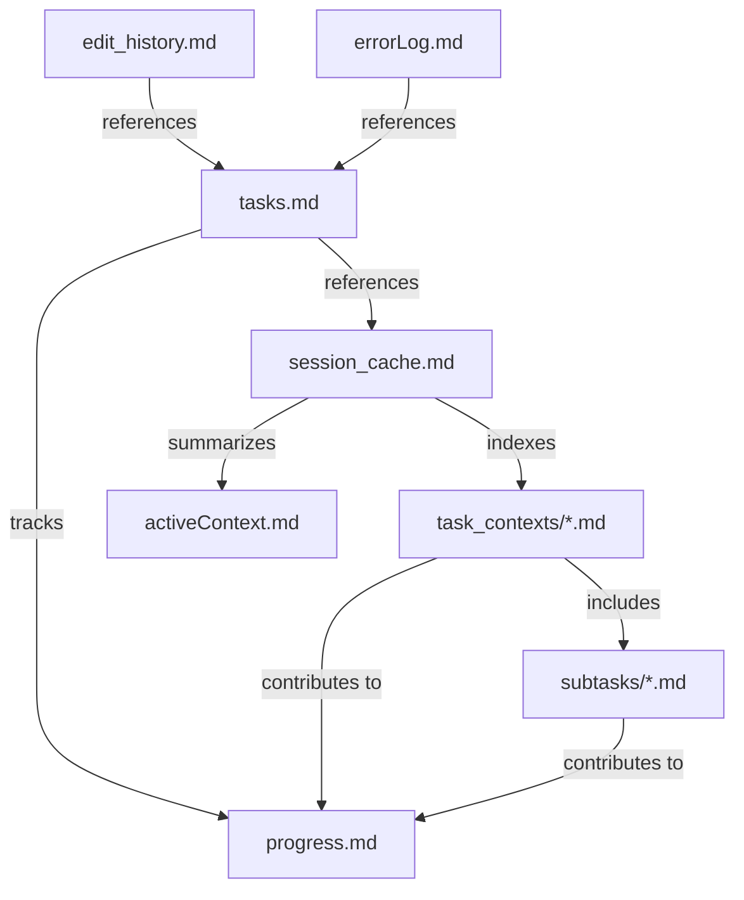
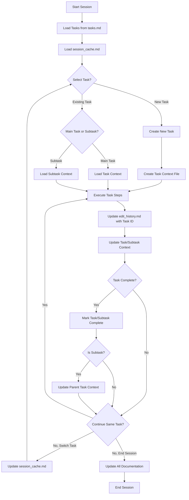
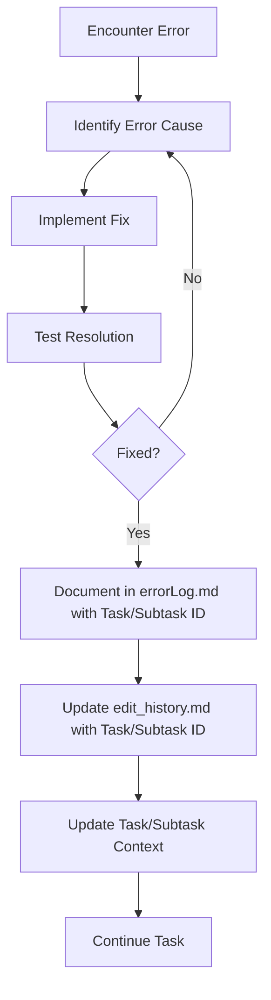
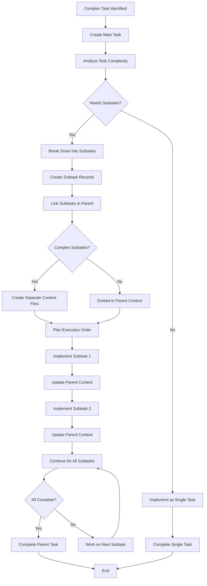
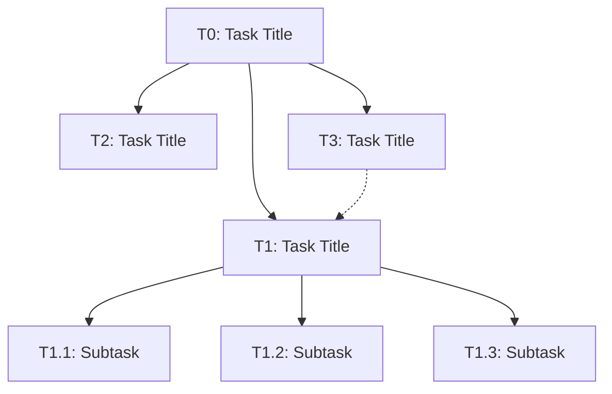

# Integrated Code Rules and Memory Bank System v5.0

*Last Updated: April 17, 2025*

⚠️ IMPORTANT: NEVER modify files without explicit user approval. Always present a plan and wait for confirmation before making any changes.

## Table of Contents
1. [Unified System Purpose and Philosophy](#1-unified-system-purpose-and-philosophy)
2. [Communication Style](#2-communication-style)
3. [Core Memory Bank Files](#3-core-memory-bank-files)
   - [Essential Files and Structure](#31-essential-files-and-structure)
   - [Task Context Files](#32-task-context-files)
   - [File Templates](#33-file-templates)
   - [File Relationships](#34-file-relationships)
   - [Validation Rules](#35-validation-rules)
   - [Maintenance Guidelines](#36-maintenance-guidelines)
   - [File Size Management Protocol](#37-file-size-management-protocol)
4. [Implementation Guidelines](#4-implementation-guidelines)
5. [Integration with Development Workflow](#5-integration-with-development-workflow)
6. [Integrated Command System](#6-integrated-command-system)
   - [Task Management Commands](#61-task-management-commands)
   - [Subtask Management Commands](#62-subtask-management-commands)
   - [Task Execution Commands](#63-task-execution-commands)
   - [Memory Management Commands](#64-memory-management-commands)
   - [Session Management Commands](#65-session-management-commands)
   - [Code Implementation Commands](#66-code-implementation-commands)
7. [Knowledge Organization and Management](#7-knowledge-organization-and-management)
8. [Technical Implementation Standards](#8-technical-implementation-standards)
9. [Integrated Workflows](#9-integrated-workflows)
10. [Core File Structure and Templates](#10-core-file-structure-and-templates)
11. [Task Hierarchy Management](#11-task-hierarchy-management)
12. [External Tools and Integration](#12-external-tools-and-integration)

## 1. Unified System Purpose and Philosophy

### 1.1 Core Purpose

The Integrated Code Rules and Memory Bank System is designed to:
- Balance task execution efficiency with comprehensive project knowledge
- Maintain consistent coding standards and documentation practices
- Ensure project continuity across multiple sessions
- Optimize resource usage by loading only necessary information
- Standardize tool usage and communication formats
- Support multiple concurrent tasks with clear context boundaries
- Enable hierarchical task management with parent-child relationships
- Provide modular context organization for complex projects

### 1.2 Balanced Approach

This system implements a balance between:
- **Task-First Efficiency**: Prioritizing immediate task execution with minimal context
- **Consistent Documentation**: Maintaining sufficient project knowledge for continuity
- **Standardized Implementation**: Following consistent coding patterns and practices
- **Progressive Knowledge**: Building and maintaining project history when valuable
- **Multi-Task Management**: Supporting work on multiple aspects of a project simultaneously
- **Modular Organization**: Breaking down complex tasks into manageable subtasks
- **Context Isolation**: Keeping task contexts separate but interconnected
- **Hierarchical Structure**: Organizing work in meaningful parent-child relationships

### 1.3 Documentation Update Cadence

For all memory bank files, updates require explicit user approval:

- `tasks.md` updates should be proposed when:
  - Creating, pausing, resuming, or completing a task or subtask

- `edit_history.md` updates should be proposed:
  - After file/folder creation operations
  - After file edit operations
  - Or at minimum after every few chat messages
  - For rapid sequential edits to the same file, batch update proposals are acceptable
  - Each proposal should include the relevant task ID

- `errorLog.md` updates should be proposed when an error is encountered and resolved
  - The proposal should include reference to the related task ID

- `session_cache.md` updates should be proposed at session boundaries, when switching tasks, 
  or at significant implementation milestones
  
- `task_contexts/task_context_[TaskID].md` updates should be proposed when significant progress 
  is made on a task or when switching between tasks
  
- `subtasks/subtask_[ParentID]_[SubtaskID].md` updates should be proposed when working on 
  specific subtasks

All proposed updates must receive explicit user approval before implementation.

## 2. Communication Style

### 2.1 Task-Oriented Communication

1. Use direct, clear statements focused on actions and results
2. Avoid unnecessary explanations of process or methodology
3. Be concise and avoid conversational language
4. Focus on what was done and what will be done next
5. For task discussions, use action-oriented language
6. Reference task IDs and subtask IDs when discussing specific work items
7. Maintain hierarchy awareness by indicating parent-child relationships
8. Use consistent terminology across related task contexts

### 2.2 Implementation Process

When starting work:
1. Focus immediately on understanding the specific task or subtask
2. Assign a task ID and register it in tasks.md (or link it to a parent task if it's a subtask)
3. Load only the minimum files needed for the current step
4. Execute the step completely before getting additional context
5. Document changes in a targeted, minimal way, referencing the task ID
6. Complete tasks efficiently with minimal information gathering
7. When switching tasks, preserve context by updating the appropriate task context file
8. For complex tasks, create a hierarchy with subtasks as needed

## 3. Core Memory Bank Files

### 3.1 Essential Files and Structure

```
memory-bank/
├── activeContext.md            # Current task context summary
├── edit_history.md             # File modification log (with task references)
├── errorLog.md                 # Error tracking (with task references)
├── session_cache.md            # Multi-task session index
├── tasks.md                    # Task registry and tracking
├── progress.md                 # Implementation status
├── projectbrief.md             # Project overview
├── task_contexts/              # Individual task context files
│   ├── task_context_T1.md      # Context for Task T1
│   ├── task_context_T2.md      # Context for Task T2
│   └── ...
└── subtasks/                   # Detailed subtask contexts
    ├── subtask_T1_1.md         # Context for Subtask 1 of Task T1
    ├── subtask_T1_2.md         # Context for Subtask 2 of Task T1
    └── ...

templates/                      # Template files for memory bank documents
├── session_cache.md
├── tasks.md
├── task_context.md
├── subtask_context.md
└── ...
```

### 3.2 Task Context Files

Task context files are designed to store detailed information about individual tasks, breaking up the monolithic session_cache.md into manageable, focused modules:

1. **Primary Task Context Files**
   - Located in the `task_contexts/` directory
   - Named using the pattern `task_context_T[n].md` (e.g., `task_context_T1.md`)
   - Contains detailed information about task implementation, progress, and state
   - References related subtasks when applicable
   - Updated whenever significant progress is made on the task

2. **Subtask Context Files**
   - Located in the `subtasks/` directory
   - Named using the pattern `subtask_T[parent]_[n].md` (e.g., `subtask_T1_2.md`)
   - Contains implementation details specific to the subtask
   - Links back to the parent task
   - Created when a subtask requires significant independent context

3. **When to Create Separate Files**
   - Create a separate subtask file when:
     - The subtask has substantial independent context
     - The subtask involves a significant body of work
     - The subtask may be worked on independently of other subtasks
     - The parent task context would become unwieldy if it included all subtask details
   - Use sections within the parent task context file when:
     - The subtask is small or tightly coupled with the parent task
     - The total context remains manageable within a single file
     - The subtask is unlikely to be worked on independently

### 3.3 File Templates

Templates for all memory bank files are stored in the `/templates/` directory at the project root. New templates have been added to support the modular task context structure:

1. **task_context.md** - Template for individual task context files
2. **subtask_context.md** - Template for subtask context files
3. **session_cache.md** - Updated template for the session index file

All templates follow the formats defined in section 10 and provide consistent structure across the memory bank system.

### 3.4 File Relationships



The new modular structure establishes a hierarchy of relationships:
1. `tasks.md` remains the central registry of all tasks and subtasks
2. `session_cache.md` becomes a lightweight index pointing to individual task context files
3. Task context files contain detailed information and may reference subtask files
4. Subtask files are linked to their parent tasks while maintaining focused context
5. All files continue to reference task IDs for cross-file traceability

### 3.5 Validation Rules

1. All files must have:
   - Clear header with last updated date
   - Consistent section formatting
   - Status indicators where applicable
   - Task ID references where applicable

2. Task Context Files must include:
   - Reference to the parent task ID in subtask files
   - List of subtasks in parent task files
   - Current implementation status
   - Links to related files

3. Prohibited:
   - Unstructured notes
   - Redundant information across files
   - File-specific details in wrong documents
   - Missing task ID references
   - Orphaned subtasks (not referenced by a parent task)
   - Circular parent-child relationships

### 3.6 Maintenance Guidelines

- Update `tasks.md` whenever task status changes or subtasks are created
- Update `task_contexts/task_context_[TaskID].md` when:
  - Making significant progress on a task
  - Creating or completing subtasks
  - Switching focus between tasks
  - Reaching implementation milestones
- Update `subtasks/subtask_[ParentID]_[SubtaskID].md` when:
  - Working on that specific subtask
  - Completing significant subtask milestones
- Update `edit_history.md` after each file change, with task/subtask ID reference
- Update `session_cache.md` when switching between tasks
- Review and prune `task_contexts/` directory after major milestones
- Archive completed task and subtask context files after they've been completed for 30 days
- Keep `progress.md` organized by task ID with subtasks nested under parent tasks

### 3.7 File Size Management Protocol

To prevent files from becoming excessively large, the following protocol should be implemented:

1. **Size-Based File Splitting:**
   - Individual task context files should have an upper limit of 500 lines
   - When a task grows complex, decompose it into subtasks with separate context files
   - `edit_history.md` and `errorLog.md` files should have an upper limit of 500 lines
   - `tasks.md` should archive completed tasks after they have been complete for more than 30 days
   - `session_cache.md` should remain a lightweight index (less than 200 lines)

2. **Archiving Process:**
   - When a file exceeds its size limit, move older content to an `archive/` subfolder
   - For task context files, create subtask breakdowns instead of archiving
   - Use the established naming convention: `[filename]_YYYY-MM.md`
   - Maintain an `archive/` subfolder within the `memory-bank/` directory

3. **Modular Structure Benefits:**
   - The modular task context approach inherently prevents any single file from growing too large
   - New tasks and subtasks automatically get their own files, distributing content
   - Session cache remains small by functioning as an index rather than storing all details

4. **Context Pruning:**
   - Periodically review task context files to remove unnecessary details
   - Focus on maintaining just enough context to resume work efficiently
   - Archive completed task and subtask context files after 30 days

## 4. Implementation Guidelines

### 4.1 Safety & Scope

1. Operate exclusively within the designated project directory and subdirectories
2. Do not access, read, or modify files outside defined scope
3. Avoid executing shell commands that might affect system state
4. Always verify paths before file operations
5. Project building, installation, dependency management, and similar tasks should not be executed by the LLM unless explicitly requested by the user

### 4.2 Mandatory Step-by-Step Approval

1. NEVER modify files without EXPLICIT user approval first
2. For each discrete file modification:
   - Present a concise description of WHAT will be changed
   - Get explicit approval BEFORE making the change
3. No need to present all planned changes at once - proceed incrementally
4. Complex changes can be broken into manageable approval steps
5. If approval is ambiguous, request clarification
6. Focus on necessary files/components related to the task or subtask
7. Avoid unnecessary project-wide scans

### 4.3 Efficiency Rules

1. Do not read file content you already have
2. Avoid reading entire repos or directories
3. Focus only on the specific files needed for the current step
4. When examining code, look for the specific components relevant to the task or subtask
5. Trust that you can access more information if needed rather than loading it preemptively
6. When switching tasks or subtasks, only load the minimum context needed for the new focus
7. Use task context files to avoid reloading information already documented

### 4.4 Memory Bank File Approval Protocol

1. **All memory bank file modifications require explicit user approval**
   - This includes tasks.md, edit_history.md, errorLog.md, session_cache.md, and all other files in the memory-bank directory
   - No automatic updates are permitted, regardless of context

2. **Approval Workflow**
   - Present the current state of the file (if needed for context)
   - Request explicit approval
   - Only proceed after receiving clear approval
   - Document the approval in edit_history.md

3. **Approval Request Format**
   - Clearly state: "Requesting approval to update [file_name]:"
   - End with: "Please confirm this update with 'APPROVE:[file_name]'"

## 5. Integration with Development Workflow

This integrated system is designed to:

- Support rapid task execution while maintaining documentation quality
- Break down complex projects into manageable task hierarchies
- Ensure code standards are maintained without excessive overhead
- Provide just enough context for effective implementation
- Document only what's necessary for project continuity
- Balance immediate task needs with long-term project knowledge
- Support multiple concurrent tasks with clear boundaries
- Enable seamless switching between related tasks and subtasks
- Maintain clear parent-child relationships for complex work
- Distribute context across modular files to improve efficiency

The modular task context structure particularly enhances:

1. **Complex Project Management** - Breaking work into hierarchical components
2. **Context Preservation** - Storing task state in dedicated files
3. **Focused Implementation** - Loading only what's relevant to the current subtask
4. **Team Collaboration** - Clear boundaries between different work streams
5. **Long-Running Projects** - Better organization of extended development efforts

## 6. Integrated Command System

### 6.1 Task Management Commands

| Command | Description |
|---------|-------------|
| `propose_task_create [title]` | Propose creating a new task with unique ID in tasks.md |
| `propose_task_switch [task_id]` | Propose switching focus to a different task, updating context files |
| `propose_task_pause [task_id]` | Propose marking a task as paused in tasks.md |
| `propose_task_resume [task_id]` | Propose resuming a paused task |
| `propose_task_complete [task_id]` | Propose marking a task as completed and updating related documentation |
| `propose_task_update [task_id]` | Propose updating task details in tasks.md |
| `propose_task_link [parent_id] [child_id]` | Propose creating or updating relationship between tasks |

### 6.2 Subtask Management Commands

| Command | Description |
|---------|-------------|
| `propose_subtask_create [parent_id] [title]` | Propose creating a new subtask under a parent task |
| `propose_subtask_switch [parent_id] [subtask_id]` | Propose switching focus to a specific subtask |
| `propose_subtask_complete [parent_id] [subtask_id]` | Propose marking a subtask as completed |
| `propose_subtask_update [parent_id] [subtask_id]` | Propose updating subtask details |
| `propose_subtask_promote [subtask_id]` | Propose converting a subtask to a full task |
| `propose_subtask_merge [parent_id] [subtask_ids...]` | Propose combining multiple subtasks |
| `propose_subtask_reorder [parent_id] [ordered_ids...]` | Propose changing execution order of subtasks |

### 6.3 Task Execution Commands

| Command | Description |
|---------|-------------|
| `do_task [task_id]` | Execute specific task with minimal context loading |
| `do_subtask [parent_id] [subtask_id]` | Execute specific subtask |
| `continue_task [task_id]` | Resume previous task using context from task context file |
| `continue_subtask [parent_id] [subtask_id]` | Resume previous subtask |
| `verify_task [task_id]` | Check implementation against code standards |
| `verify_subtask [parent_id] [subtask_id]` | Check subtask implementation |

### 6.4 Memory Management Commands

| Command | Description |
|---------|-------------|
| `propose_mb_update [file]` | Present proposed changes to a memory bank file and request approval |
| `read_mb` | Load Critical tier files needed for current task (read-only) |
| `read_mb [file]` | Load specific file only (read-only) |
| `read_mb standard` | Load Critical + Essential tiers (read-only) |
| `read_mb complete` | Load all Memory Bank files (read-only) |
| `read_task_context [task_id]` | Load context for a specific task (read-only) |
| `read_subtask_context [parent_id] [subtask_id]` | Load context for a specific subtask (read-only) |
| `update_mb [file]` | Update specific file with approved changes only |
| `update_task_context [task_id]` | Update context file for a specific task with approval |
| `update_subtask_context [parent_id] [subtask_id]` | Update subtask context file with approval |
| `propose_error_log [title] [task_id]` | Propose a new error record for errorLog.md |
| `propose_edits [task_id] [description]` | Propose file modifications for edit_history.md |
| `read_errors [component]` | Load error history for a specific component or error type (read-only) |
| `read_task [task_id]` | Load task-specific information from tasks.md (read-only) |
| `propose_task [action] [task_id]` | Propose creation, modification, or status change for a task |

### 6.5 Session Management Commands

| Command | Description |
|---------|-------------|
| `continue_session` | Flag this as a continuation; prioritize task context loading |
| `complete_session` | Mark session as complete, update necessary docs |
| `cache_session` | Create continuation point with minimal updates |
| `start_session` | Begin new session with fresh timestamp |
| `switch_context [task_id]` | Change primary focus to a different task |

### 6.6 Code Implementation Commands

| Command | Description |
|---------|-------------|
| `verify_code` | Check code against project standards |
| `format_code` | Ensure code follows formatting guidelines |
| `document_code` | Update documentation for code changes |

## 7. Knowledge Organization and Management

### 7.1 Tiered Knowledge Structure

Knowledge is organized in four tiers with task-oriented loading priorities:

1. **Bootstrap Tier (Minimal Required Knowledge)**
   - `bootstrap.md` - Core system structure, loaded only when essential
   - `tasks.md` - Registry of all tasks and subtasks, loaded when task IDs are needed
   - Access only when needed to understand command system or task structure

2. **Critical Tier (Task-Relevant Only)**
   - `activeContext.md` - Current state relevant to immediate task/subtask
   - `progress.md` - Status information needed for current step
   - `session_cache.md` - Task index and current session status
   - `task_contexts/task_context_[CurrentTask].md` - Context for the current task
   - `subtasks/subtask_[CurrentTask]_[SubtaskID].md` - Context for the current subtask (if applicable)
   - `errorLog.md` - Record of errors relevant to current task (load when debugging)
   - `edit_history.md` - Recent file modifications relevant to current task
   - Load only files directly relevant to current task step

3. **Essential Tier (Load Only When Required)**
   - `projectbrief.md` - Reference only when task scope is unclear
   - `.cursorrules` - Reference only when implementation patterns are needed
   - Task contexts for related tasks that impact current work
   - Load only when task requirements aren't clear from Critical tier

4. **Reference Tier (Avoid Unless Specifically Needed)**
   - `productContext.md` - Why and how the project works
   - `systemPatterns.md` - Architecture and design patterns
   - `techContext.md` - Technical implementation details
   - Task contexts for unrelated tasks
   - Historical subtask contexts
   - Load only specific files when directly relevant to current task step

### 7.2 Task-First Loading Process

1. Analyze the immediate task or subtask requirements
2. Identify task/subtask ID in tasks.md or create a new task/subtask
3. Load task context from the appropriate context file:
   - For main tasks: `task_contexts/task_context_[TaskID].md`
   - For subtasks: `subtasks/subtask_[ParentID]_[SubtaskID].md`
4. Identify the minimal set of files needed for the current step
5. Load only those files directly relevant to the current task/subtask
6. Execute the current step completely
7. Update the task/subtask context file with progress and current state
8. Load additional files only when needed for the next step
9. When switching tasks/subtasks, update context files to preserve state

### 7.3 Documentation Decision Framework

| Change Type | Documentation Requirements |
|-------------|----------------------------|
| Task creation | Update tasks.md with new task ID and details, create task context file |
| Subtask creation | Update tasks.md and parent task context file, create subtask context file if complex |
| Task status change | Update tasks.md and relevant task context file with new status |
| Task switching | Update both previous and new task context files, update session_cache.md |
| Interface changes | Update API docs, activeContext.md, task context file with reference |
| Implementation details | Code comments, task/subtask context file, edit_history.md with ID |
| Architecture changes | Update systemPatterns.md, task context file, add task reference |
| New features | Update progress.md, projectbrief.md, task context file with reference |
| Bug fixes | Update progress.md, task context file with reference |
| Refactoring | Task context file, minimal other documentation unless patterns change |
| Error resolution | Update errorLog.md with error details, fix, and task/subtask ID |
| File modification | Update edit_history.md and task/subtask context file with changes |
| Multiple file edits | Update task/subtask context, session_cache.md, and edit_history.md |
| Ongoing work | Update task/subtask context with clear "in progress" indicators (🔄) |
| Mixed change types | Document according to highest impact change type with task/subtask ID |
| Subtask completion | Update parent task context, tasks.md, and subtask context file |

## 8. Technical Implementation Standards

### 8.1 XML Tag Format

Tool use is formatted using XML-style tags:

```
<tool_name>
<parameter1_name>value1</parameter1_name>
<parameter2_name>value2</parameter2_name>
...
</tool_name>
```

### 8.2 File Operations

**Note:** File editing and creation operations should be performed using the Desktop Commander (dc) MCP server. When editing files, the Desktop Commander MCP server should prioritize using block edits (`edit_block` tool) whenever possible to minimize token usage and ensure precise changes.

#### Reading Files

```
<read_file>
<path>src/main.js</path>
</read_file>
```

With line specifications:

```
<read_file>
<path>src/app.ts</path>
<start_line>46</start_line>
<end_line>68</end_line>
</read_file>
```

#### Task Context Files

```
<read_file>
<path>memory-bank/task_contexts/task_context_T1.md</path>
</read_file>
```

```
<read_file>
<path>memory-bank/subtasks/subtask_T1_2.md</path>
</read_file>
```

#### Searching Files

```
<search_files>
<path>.</path>
<pattern>your-pattern-here</pattern>
<file_pattern>*.ts</file_pattern>
</search_files>
```

#### Directory Listing

```
<list_directory>
<path>memory-bank/task_contexts</path>
</list_directory>
```

#### File Modification (Block Edit Format)

For precise, surgical modifications:

```
<edit_block>
<blockContent>File path here
<<<<<<< SEARCH
Original content to find
=======
New content to replace with
>>>>>>> REPLACE
</blockContent>
</edit_block>
```

## 9. Integrated Workflows

### 9.1 Task-First Implementation Flow

```mermaid
flowchart TD
    Start[Receive Task] --> TaskID{Task Exists?}
    TaskID -->|No| ProposeTask[Propose New Task]
    TaskID -->|Yes| LoadTask[Load Task from tasks.md]
    ProposeTask --> GetApproval1[Get User Approval]
    GetApproval1 -->|Approved| CreateTask[Create Task in tasks.md]
    
    CreateTask --> ProposeContext[Propose Task Context File]
    ProposeContext --> GetApproval2[Get User Approval]
    GetApproval2 -->|Approved| CreateContext[Create Task Context File]
    
    CreateContext --> Analyze[Analyze Task Requirements]
    LoadTask --> LoadContext[Load Task Context File]
    LoadContext --> Analyze
    
    Analyze --> SubtaskNeeded{Subtask Needed?}
    SubtaskNeeded -->|Yes| ProposeSubtask[Propose Subtask]
    SubtaskNeeded -->|No| LoadMinimal[Load Minimal Required Context]
    
    ProposeSubtask --> GetApproval3[Get User Approval]
    GetApproval3 -->|Approved| CreateSubtask[Create Subtask]
    CreateSubtask --> ProposeSubContext[Propose Subtask Context File]
    ProposeSubContext --> GetApproval4[Get User Approval]
    GetApproval4 -->|Approved| CreateSubContext[Create Subtask Context File]
    CreateSubContext --> LoadMinimal
    
    LoadMinimal --> Execute[Execute Current Step]
    Execute --> ProposeEdits[Propose edit_history.md Update]
    ProposeEdits --> GetApproval5[Get User Approval]
    GetApproval5 -->|Approved| RecordEdits[Update edit_history.md]
    
    RecordEdits --> ProposeContextUpdate[Propose Task/Subtask Context Update]
    ProposeContextUpdate --> GetApproval6[Get User Approval]
    GetApproval6 -->|Approved| UpdateContext[Update Task/Subtask Context]
    
    UpdateContext --> Evaluate{More Steps?}
    
    Evaluate -->|Yes| NextContext[Load Context for Next Step]
    NextContext --> NextStep[Execute Next Step]
    NextStep --> ProposeHistoryUpdate[Propose edit_history.md Update]
    ProposeHistoryUpdate --> GetApproval7[Get User Approval]
    GetApproval7 -->|Approved| UpdateHistory[Update edit_history.md]
    
    UpdateHistory --> ProposeTaskContextUpdate[Propose Task/Subtask Context Update]
    ProposeTaskContextUpdate --> GetApproval8[Get User Approval]
    GetApproval8 -->|Approved| UpdateTaskContext[Update Task/Subtask Context]
    
    UpdateTaskContext --> Evaluate
    
    Evaluate -->|No| Verify[Verify Against Standards]
    Verify --> CompleteTask{Complete Task?}
    CompleteTask -->|Yes| ProposeCompletion[Propose Task Completion]
    CompleteTask -->|No| ProposeSessionUpdate[Propose session_cache.md Update]
    
    ProposeCompletion --> GetApproval9[Get User Approval]
    GetApproval9 -->|Approved| MarkComplete[Mark Task Complete in tasks.md]
    
    ProposeSessionUpdate --> GetApproval10[Get User Approval]
    GetApproval10 -->|Approved| UpdateSession[Update session_cache.md]
    
    MarkComplete --> ProposeDocUpdate[Propose Documentation Updates]
    ProposeDocUpdate --> GetApproval11[Get User Approval]
    GetApproval11 -->|Approved| Document[Update Required Documentation]
    
    UpdateSession --> End[End]
    Document --> End
```



**Note:** Each step should reference the appropriate task/subtask ID, and the "Execute Current Step" and "Execute Next Step" boxes inherently include multiple edit operations, each of which should trigger the `record_edits` command to update `edit_history.md`. The task context file is updated continuously to maintain the current state of the task.

### 9.2 Multi-Task Management Flow



**Note:** When switching between tasks or subtasks, use the appropriate command to ensure context is preserved in the task/subtask context files. The "ExecuteTask" box represents multiple cycles of implementation and documentation. Parent tasks are automatically updated when subtasks are completed.

### 9.3 Documentation Update Process

1. After creating a task, add it to tasks.md with a unique ID and create a task context file
2. After creating a subtask, update tasks.md and parent task context, create subtask context file if needed
3. When switching tasks, update both previous and new task context files to preserve state
4. After completing a task step, determine documentation requirements based on change type
5. Update only the necessary files based on the Documentation Decision Framework
6. Always include task/subtask ID references in documentation updates
7. Always update timestamps and status indicators in affected files
8. For continuing tasks, update the task/subtask context file with current state
9. When completing a subtask, update parent task context to reflect progress
10. For completed tasks, update tasks.md to mark the task as complete
11. Update edit_history.md after each file modification (using `record_edits`)
12. Log errors in errorLog.md (using `log_error`) when encountered and document their resolution

### 9.4 Error Handling and Resolution Flow



**Note:** Use the `log_error` command when documenting errors in errorLog.md, and the `record_edits` command when updating edit_history.md with the fixes applied. Always include the task/subtask ID in both. Update the respective task or subtask context file with information about the resolution.

### 9.5 Task Hierarchy Management Flow



This workflow illustrates how to manage complex tasks by breaking them down into manageable subtasks while maintaining clear parent-child relationships and keeping documentation synchronized across the hierarchy.

## 10. Core File Structure and Templates

### 10.1 tasks.md (Task Registry with Subtask Support)

```markdown
# Task Registry
*Last Updated: [Timestamp]*

## Active Tasks
| ID | Title | Status | Priority | Started | Dependencies | Owner |
|----|-------|--------|----------|---------|--------------|-------|
| T1 | Implement login API | 🔄 IN PROGRESS | HIGH | 2025-04-10 | - | [Name] |
| T2 | Fix pagination bug | 🔄 IN PROGRESS | MEDIUM | 2025-04-12 | - | [Name] |
| T3 | Refactor database layer | ⏸️ PAUSED | LOW | 2025-04-08 | T1 | [Name] |

## Task Details

### T1: [Task Title]
**Description**: [Detailed description of the task]
**Status**: 🔄 IN PROGRESS
**Last Active**: [Timestamp]
**Completion Criteria**:
- [Criterion 1]
- [Criterion 2]
- [Criterion 3]

**Subtasks**:
- T1.1: [Subtask Title] - 🔄 IN PROGRESS
- T1.2: [Subtask Title] - ✅ COMPLETE
- T1.3: [Subtask Title] - ⬜ NOT STARTED

**Related Files**:
- `[file1]`
- `[file2]`
- `[file3]`

**Notes**:
[Important decisions or context]

### T2: [Task Title]
[Same structure as T1]

### T3: [Task Title]
[Same structure as T1]

## Completed Tasks
| ID | Title | Completed | Related Tasks |
|----|-------|-----------|---------------|
| T0 | Project setup | 2025-04-07 | - |

## Task Relationships

```

### 10.2 session_cache.md (Task Index Version)

```markdown
# Session Cache

*Last Updated: [Timestamp]*

## Overview
- Active Tasks: [Count]
- Paused Tasks: [Count]
- Last Task Focus: [Task ID]

## Task Registry
- [T1]: [Brief description] - 🔄 IN PROGRESS
- [T1.1]: [Brief description] - 🔄 IN PROGRESS (Subtask of T1)
- [T1.2]: [Brief description] - ✅ COMPLETE (Subtask of T1)
- [T2]: [Brief description] - 🔄 IN PROGRESS
- [T3]: [Brief description] - ⏸️ PAUSED

## Current Session Focus
Primary focus is on [Task/Subtask ID]. This work involves [brief context].

## Active Task Context Files
- `task_contexts/task_context_T1.md`: Context for T1 - Last updated [timestamp]
- `subtasks/subtask_T1_1.md`: Context for subtask T1.1 - Last updated [timestamp]
- `task_contexts/task_context_T2.md`: Context for T2 - Last updated [timestamp]

## Paused Task Context Files
- `task_contexts/task_context_T3.md`: Context for T3 - Last updated [timestamp]

## Session Notes
[General notes relevant across multiple tasks]
```

### 10.3 task_context_[TaskID].md (Task Context Template)

```markdown
# Task Context: [Task ID] - [Task Title]

*Last Updated: [Timestamp]*

## Task Details
**Status:** 🔄 IN PROGRESS
**Priority:** [High/Medium/Low]
**Started:** [Date]
**Last Active:** [Timestamp]
**Dependencies:** [Task IDs if applicable]
**Parent Task:** [Parent ID, if this is a promoted subtask]
**Location in tasks.md:** [Section reference]

## Context
[Essential context needed to resume this task]

## Subtasks
- [Subtask ID 1]: [Title] - 🔄 IN PROGRESS
  - Context: [Brief context for this subtask]
  - Progress: [Current progress]
  - Files: `[relevant file paths]`

- [Subtask ID 2]: [Title] - ✅ COMPLETE
  - Summary: [What was accomplished]
  - Files: `[relevant file paths]`

- [Subtask ID 3]: [Title] - ⬜ NOT STARTED
  - Plan: [Brief plan for this subtask]

## Critical Files
- `[file1]`: [relevance]
- `[file2]`: [relevance]

## Implementation Progress
1. ✅ [Completed step]
2. 🔄 [Current step]
3. ⬜ [Next step]
4. ⬜ [Planned step]

## Working State
[Key variables, decisions, or implementation details]

## Challenges and Solutions
[Any significant challenges encountered and how they were/will be addressed]

## Related Tasks
- [Related Task ID 1]: [Relationship]
- [Related Task ID 2]: [Relationship]

## Notes
[Important notes specific to this task]
```

### 10.4 subtask_[ParentID]_[SubtaskID].md (Subtask Context Template)

```markdown
# Subtask Context: [Parent ID].[Subtask ID] - [Subtask Title]

*Last Updated: [Timestamp]*

## Subtask Details
**Parent Task:** [Parent ID] - [Parent Title]
**Status:** 🔄 IN PROGRESS
**Priority:** [High/Medium/Low]
**Started:** [Date]
**Last Active:** [Timestamp]

## Context
[Essential context needed to resume this subtask]

## Critical Files
- `[file1]`: [relevance]
- `[file2]`: [relevance]

## Implementation Progress
1. ✅ [Completed step]
2. 🔄 [Current step]
3. ⬜ [Next step]
4. ⬜ [Planned step]

## Working State
[Key variables, decisions, or implementation details]

## Relationship to Parent Task
[How this subtask contributes to the parent task]

## Notes
[Important notes specific to this subtask]
```

### 10.5 activeContext.md (Multi-Level Task Version)

```markdown
# Active Context

*Last Updated: [Timestamp]*

## Current Focus
**Primary Task:** [Task ID]
**Active Subtask:** [Subtask ID]
**Secondary Tasks:** [Task IDs]

## Active Tasks
- [T1]: [Brief description] - [Current step]
  - [T1.1]: [Brief description] - [Current step]
- [T2]: [Brief description] - [Current step]

## Implementation Focus
[Specific components currently being modified]

## Task-Specific Context

### Task [T1]
[Context specific to this task]

#### Subtask [T1.1]
[Context specific to this subtask]

### Task [T2]
[Context specific to this task]

## Current Decisions
[Only decisions directly affecting current tasks]

## Next Actions By Task
- [T1]: [Next action]
  - [T1.1]: [Next action]
- [T2]: [Next action]
```

### 10.6 edit_history.md (With Task/Subtask References and Approval)

```markdown
# Edit History

*Created: [Date]*

## File Modification Log

### [Date]

#### [Time] - [Task ID].[Subtask ID]: [Brief Task Description]

- Created/Modified/Updated `[file path]` - [Brief description of changes]
- Created/Modified/Updated `[file path]` - [Brief description of changes]
- ...

#### [Time] - [Task ID]: [Brief Task Description]

- ...
```

### 10.7 errorLog.md (With Task/Subtask References)

```markdown
# Error Log

## [YYYY-MM-DD HH:MM TZ]: [Task ID].[Subtask ID] - [Error Title/Component]

**File:** `[file path]`

**Error Message:**
\`\`\`
[Exact error message text]
\`\`\`

**Cause:**
[Brief explanation of what caused the error]

**Fix:**
[Steps taken to resolve the error]

**Key Code Changes:**
\`\`\`[language]
[Code snippet or diff showing the fix]
\`\`\`

**Affected Files:**
- [List of files modified to fix the error]

**Related Task:** [Task ID].[Subtask ID]
```

### 10.8 progress.md (Hierarchical Task Version)

```markdown
# Implementation Progress

*Last Updated: [Timestamp]*

## Active Tasks

### [Task ID]: [Task Title]
**Status:** 🔄 IN PROGRESS
**Priority:** [High/Medium/Low]

#### Subtasks
- [Subtask ID 1]: [Title] - 🔄 IN PROGRESS
- [Subtask ID 2]: [Title] - ✅ COMPLETE
- [Subtask ID 3]: [Title] - ⬜ NOT STARTED

#### Completed Steps
- ✅ [Step 1]
- ✅ [Step 2]

#### Current Work
- 🔄 [Current step]

#### Up Next
- ⬜ [Next step]
- ⬜ [Planned step]

### [Task ID]: [Task Title]
[Same structure as above]

## Completed Tasks

### [Task ID]: [Task Title]
**Completed:** [Date]
**Summary:** [Brief summary of what was accomplished]

#### Completed Subtasks
- [Subtask ID 1]: [Title] - Completed [Date]
- [Subtask ID 2]: [Title] - Completed [Date]
```

## 11. Task Hierarchy Management

### 11.1 Task Hierarchies and Relationships

Task hierarchies provide a structured approach to organizing complex work:

1. **Parent-Child Relationships**
   - **Parent Tasks**: Represent larger objectives or features
   - **Subtasks**: Represent component parts of the parent task
   - **Nested Subtasks**: Can be used for further decomposition (e.g., T1.2.3)
   - **Sibling Tasks**: Related tasks at the same level

2. **Relationship Types**
   - **Contains**: Parent task contains subtasks (T1 contains T1.1, T1.2, etc.)
   - **Depends On**: Task requires another to be completed first (T2 depends on T1)
   - **Blocks**: Task prevents progress on another (T3 blocks T4)
   - **Related To**: Tasks share context or implementation details
   - **Alternative To**: Tasks represent different approaches to the same goal

3. **Visual Representation**
   - Use mermaid diagrams in tasks.md to visualize task relationships
   - Solid arrows (-->) for direct dependencies
   - Dashed arrows (-..->) for soft dependencies or relationships
   - Nested boxes for containment relationships

### 11.2 Task Decomposition Guidelines

When to decompose a task into subtasks:

1. **Complexity Indicators**
   - Task requires work across multiple components or systems
   - Estimated work exceeds one day of development time
   - Task involves multiple distinct steps with different skill requirements
   - Implementation requires different types of expertise
   - Task touches more than 3-5 files

2. **Decomposition Strategy**
   - Break down by system component or layer
   - Break down by implementation phase
   - Break down by feature sub-component
   - Break down by expertise domain
   - Ensure each subtask has clear boundaries and completion criteria

3. **Optimal Subtask Size**
   - Each subtask should be completable in 2-4 hours
   - Each subtask should have a clear, singular focus
   - Each subtask should result in a verifiable outcome
   - Avoid overly granular subtasks that create documentation overhead

### 11.3 Task ID and Naming Conventions

1. **Task ID Structure**
   - Main tasks: T1, T2, T3, etc.
   - First-level subtasks: T1.1, T1.2, etc.
   - Second-level subtasks: T1.1.1, T1.1.2, etc.
   - Maximum recommended nesting: 3 levels (e.g., T1.2.3)

2. **Task Naming Guidelines**
   - Begin with action verb (Implement, Create, Fix, Refactor, etc.)
   - Be specific about the component or functionality
   - Include scope limitations when appropriate
   - Keep names concise but descriptive

3. **Context File Naming**
   - Main task context: `task_context_T1.md`
   - First-level subtask: `subtask_T1_1.md`
   - Second-level subtask: `subtask_T1_1_1.md`
   - Always use underscores as separators for consistency

### 11.4 Task Promotion and Demotion

1. **Subtask Promotion**
   - When a subtask grows in scope or complexity
   - When a subtask becomes independent of its original parent
   - When a subtask needs its own subtasks

2. **Promotion Process**
   - Create new main task entry in tasks.md
   - Copy relevant context from subtask to new task context file
   - Update references in parent task and session_cache.md
   - Add relationship to original parent in "Related Tasks" section

3. **Task Demotion**
   - When a task is determined to be a component of another task
   - When multiple tasks should be grouped under a common parent

4. **Demotion Process**
   - Create appropriate subtask entries in the parent task
   - Create subtask context files as needed
   - Update task relationships and references
   - Update session_cache.md index

### 11.5 Managing Task Context Across Hierarchies

1. **Context Inheritance**
   - Subtasks inherit relevant context from parent tasks
   - Parent tasks maintain summary information about subtasks
   - Changes in subtask status propagate up to parent tasks

2. **Context Distribution**
   - Parent task contexts contain high-level information
   - Subtask contexts contain detailed implementation information
   - Cross-references maintain relationships between contexts

3. **Context Updates**
   - When updating a subtask, also update the parent task's subtask summary
   - When completing a subtask, update the parent task's progress
   - Maintain consistent status indicators across the hierarchy

## 12. External Tools and Integration

### 12.1 MCP (Model Context Protocol) Servers

Available MCP servers include:

- **deepwebresearch**: Web research and content extraction
- **youtube**: Video analysis and content retrieval
- **github**: Repository management and interaction
- **dc**: Desktop Commander for file operations

#### Example: MCP Tool Usage

```
<use_mcp_tool>
<server_name>github</server_name>
<tool_name>get_file_contents</tool_name>
<arguments>
{
  "owner": "username",
  "repo": "repository",
  "path": "file.js"
}
</arguments>
</use_mcp_tool>
```

### 12.2 Task Context Management Tools

The following tools assist with the modular task context approach:

1. **Task Context Generator**
   - Creates appropriate task context files based on task type
   - Ensures consistent formatting and structure
   - Automatically updates relationships and dependencies

2. **Context Search Utility**
   - Searches across task contexts for specific information
   - Provides targeted loading of relevant context
   - Maintains reference links between related contexts

3. **Task Hierarchy Visualizer**
   - Generates visual representations of task relationships
   - Shows subtask structure and dependencies
   - Highlights critical path and bottlenecks

### 12.3 API Integration

- Use structured JSON for data exchange
- Implement proper error handling for API responses
- Follow RESTful principles for endpoint design
- Document all API contracts as part of the implementation
- Track API-related tasks with distinct subtasks for:
  - API design
  - Implementation
  - Testing
  - Documentation

### 12.4 External Libraries

- Prefer established libraries over custom implementations
- Document dependencies in the appropriate Memory Bank files
- Maintain compatibility with existing project dependencies
- Verify license compatibility before introducing new dependencies
- Create separate subtasks for library integration when appropriate

### 12.5 Version Control Integration

- Link task IDs to version control commits using consistent prefixes (e.g., [T1.2])
- Organize branches by task hierarchy when appropriate
- Use pull request templates that reference task and subtask IDs
- Document git operations in task context files
- Maintain consistent commit message format that includes task/subtask references

### 12.6 CI/CD Integration

- Associate CI/CD pipeline configurations with specific tasks
- Document build and deployment processes in task context files
- Create dedicated subtasks for CI/CD-related implementations
- Track deployment issues with specific error entries in errorLog.md
- Maintain release notes organized by completed tasks and subtasks

Remember: The system's effectiveness comes from its modular structure, carefully maintaining relationships between tasks and subtasks while preserving focused context in separate files. This approach balances task efficiency with appropriate documentation, loading only what's needed when it's needed, and following a consistent, standardized approach to both code and documentation.
