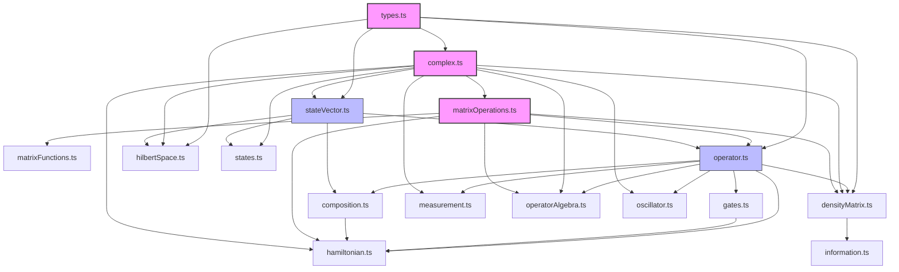

# Module Dependency Map

```mermaid
graph TD
    types[types.ts] --> complex[complex.ts]
    complex --> matrixOperations[matrixOperations.ts]
    matrixOperations --> matrixFunctions[matrixFunctions.ts]
    types --> stateVector[stateVector.ts]
    complex --> stateVector
    types --> operator[operator.ts]
    matrixOperations --> operator
    stateVector --> operator
    operator --> gates[gates.ts]
    operator --> composition[composition.ts]
    stateVector --> composition
    types --> densityMatrix[densityMatrix.ts]
    operator --> densityMatrix
    complex --> densityMatrix
    matrixOperations --> densityMatrix
    densityMatrix --> information[information.ts]
    operator --> hamiltonian[hamiltonian.ts]
    gates --> hamiltonian
    composition --> hamiltonian
    matrixOperations --> hamiltonian
    complex --> hamiltonian
    types --> hilbertSpace[hilbertSpace.ts]
    complex --> hilbertSpace
    stateVector --> hilbertSpace
    operator --> measurement[measurement.ts]
    complex --> measurement
    operator --> operatorAlgebra[operatorAlgebra.ts]
    complex --> operatorAlgebra
    matrixOperations --> operatorAlgebra
    operator --> oscillator[oscillator.ts]
    complex --> oscillator
    complex --> states[states.ts]
    stateVector --> states

    %% Styling
    classDef core fill:#f9f,stroke:#333,stroke-width:2px;
    classDef dependent fill:#bbf,stroke:#333,stroke-width:1px;
    class types,complex,matrixOperations core;
    class stateVector,operator dependent;
```