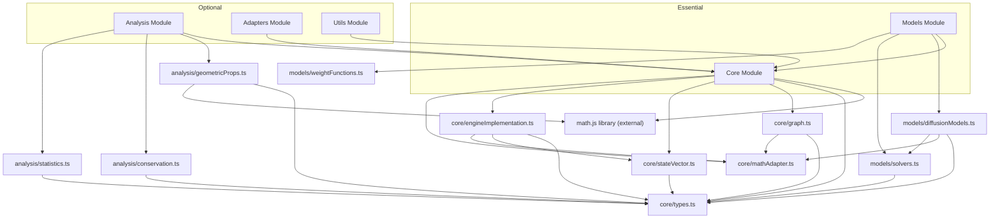

# Spin Network Library Architecture

## Overview

The Spin Network Library is designed for simulating quantum diffusion processes on spin networks. The library is structured with clear separation of concerns and follows object-oriented design principles. This document provides a comprehensive analysis of the library structure, identifying core components and dependencies.

## Component Structure

The library is organized into five main modules:

1. **Core** - Fundamental building blocks and interfaces
2. **Models** - Diffusion models and numerical solvers
3. **Analysis** - Tools for analyzing simulation results
4. **Utils** - Utility functions
5. **Adapters** - Interfaces for visualization (minimal implementation)

## Core Components vs Optional Components

### Core Components (Essential for Simulation)

These components form the backbone of the simulation capability:

- Graph representation (`SpinNetworkGraph`)
- State vector (`SimulationStateVector`)
- Simulation engine (`SpinNetworkSimulationEngine`)
- Diffusion models (`OrdinaryDiffusionModel`, `TelegraphDiffusionModel`)
- Numerical solvers (`EulerSolver`, `MidpointSolver`, `RungeKutta4Solver`)
- Math adapter (`MathAdapter`)

### Optional/Auxiliary Components

These enhance the library but aren't essential for core simulation functionality:

- Analysis tools (`GeometricPropertiesCalculator`, `ConservationLawChecker`, `SimulationAnalyzer`)
- Visualization adapters (currently minimal implementation)
- Logging utilities (referenced but not implemented)
- Serialization utilities (referenced but not implemented)
- File I/O utilities (referenced but not implemented)

## Implementation Status

| Component | Status | Purpose |
|-----------|--------|---------|
| `core/types.ts` | ✅ Complete | Core interfaces and type definitions |
| `core/graph.ts` | ✅ Complete | Graph representation implementation |
| `core/stateVector.ts` | ✅ Complete | State vector implementation |
| `core/engineImplementation.ts` | ✅ Complete | Simulation engine implementation |
| `core/mathAdapter.ts` | ✅ Complete | Math.js integration utilities |
| `models/diffusionModels.ts` | ✅ Complete | Diffusion model implementations |
| `models/solvers.ts` | ✅ Complete (except Adaptive) | Numerical solver implementations |
| `models/weightFunctions.ts` | ⚠️ Referenced but minimal | Weight function implementations |
| `analysis/geometricProps.ts` | ✅ Complete | Geometric properties calculator |
| `analysis/conservation.ts` | ✅ Complete | Conservation law checker |
| `analysis/statistics.ts` | ✅ Complete | Statistical analysis tools |
| `adapters/index.ts` | ⚠️ Minimal placeholder | Visualization adapter interfaces |
| `utils/index.ts` | ⚠️ Minimal replacement | Utility functions (logging, serialization, file I/O missing) |

## Class Diagram

```mermaid
classDiagram
    %% Core Interfaces
    class SimulationGraph {
        <<interface>>
        +nodes: SimulationNode[]
        +edges: SimulationEdge[]
        +getNode(id: string): SimulationNode
        +getEdge(id: string): SimulationEdge
        +getAdjacentNodes(nodeId: string): SimulationNode[]
        +getConnectedEdges(nodeId: string): SimulationEdge[]
        +getNodeCount(): number
        +getEdgeCount(): number
        +addNode(node: SimulationNode): SimulationGraph
        +removeNode(nodeId: string): SimulationGraph
        +addEdge(edge: SimulationEdge): SimulationGraph
        +removeEdge(edgeId: string): SimulationGraph
        +getDegree(nodeId: string): number
        +getNeighbors(nodeId: string): string[]
        +toAdjacencyMatrix(): Matrix
        +toLaplacianMatrix(weightFunction?: WeightFunction): Matrix
        +toJSON(): Record
        +fromJSON(data: Record): SimulationGraph
    }

    class StateVector {
        <<interface>>
        +size: number
        +nodeIds: string[]
        +getValue(nodeId: string): number
        +setValue(nodeId: string, value: number): StateVector
        +getValueAtIndex(index: number): number
        +setValueAtIndex(index: number, value: number): StateVector
        +add(other: StateVector): StateVector
        +subtract(other: StateVector): StateVector
        +multiply(scalar: number): StateVector
        +toMathArray(): MathArray
        +fromMathArray(array: MathArray, nodeIds: string[]): StateVector
        +normalize(): StateVector
        +clone(): StateVector
        +equals(other: StateVector): boolean
        +toJSON(): Record
    }

    class DiffusionModel {
        <<interface>>
        +initialize(graph: SimulationGraph, parameters: SimulationParameters): void
        +setInitialState(state: StateVector): void
        +evolveStep(dt: number): StateVector
        +evolveTo(t: number, dt: number): StateVector
        +getCurrentState(): StateVector
        +getCurrentTime(): number
        +reset(): void
    }

    class NumericalSolver {
        <<interface>>
        +step(t: number, y: StateVector, dt: number, f: Function): StateVector
    }

    class SimulationEngine {
        <<interface>>
        +initialize(graph: SimulationGraph, parameters: SimulationParameters): void
        +step(): void
        +runUntil(time: number): void
        +runSteps(steps: number): void
        +pause(): void
        +resume(): void
        +reset(): void
        +getCurrentState(): StateVector
        +getCurrentTime(): number
        +getHistory(): SimulationHistory
        +isRunning(): boolean
        +addEventListener(event: string, callback: Function): void
        +removeEventListener(event: string, callback: Function): void
    }

    class SimulationHistory {
        <<interface>>
        +addState(time: number, state: StateVector): void
        +getStateAtTime(time: number): StateVector
        +getClosestState(time: number): StateTimeObject
        +getTimes(): number[]
        +getDuration(): number
        +clear(): void
        +toJSON(): Record
        +fromJSON(data: Record): SimulationHistory
    }

    %% Core Implementations
    class SpinNetworkGraph {
        -_nodes: Map
        -_edges: Map
        -_adjacencyList: Map
        -_nodeEdges: Map
        +constructor()
        +getNode(id: string): SimulationNode
        +getEdge(id: string): SimulationEdge
        +getAdjacentNodes(nodeId: string): SimulationNode[]
        +getConnectedEdges(nodeId: string): SimulationEdge[]
        +getNodeCount(): number
        +getEdgeCount(): number
        +addNode(node: SimulationNode): SimulationGraph
        +removeNode(nodeId: string): SimulationGraph
        +addEdge(edge: SimulationEdge): SimulationGraph
        +removeEdge(edgeId: string): SimulationGraph
        +getDegree(nodeId: string): number
        +getNeighbors(nodeId: string): string[]
        +toAdjacencyMatrix(): Matrix
        +toLaplacianMatrix(weightFunction?: WeightFunction): Matrix
        +toJSON(): Record
        +fromJSON(data: Record): SimulationGraph
    }

    class SimulationStateVector {
        -_values: number[]
        -_nodeIds: string[]
        -_nodeIdToIndex: Map
        +constructor(nodeIds: string[], initialValues?: number[])
        +static createDeltaState(nodeIds: string[], nodeId: string, value?: number): SimulationStateVector
        +static createUniformState(nodeIds: string[], value?: number): SimulationStateVector
        +static createGaussianState(nodeIds: string[], centerNodeId: string, sigma: number, nodePositions: Map): SimulationStateVector
        +static fromMathArray(array: MathArray, nodeIds: string[]): StateVector
        +getValue(nodeId: string): number
        +setValue(nodeId: string, value: number): StateVector
        +getValueAtIndex(index: number): number
        +setValueAtIndex(index: number, value: number): StateVector
        +add(other: StateVector): StateVector
        +subtract(other: StateVector): StateVector
        +multiply(scalar: number): StateVector
        +toMathArray(): MathArray
        +fromMathArray(array: MathArray, nodeIds: string[]): StateVector
        +normalize(): StateVector
        +clone(): StateVector
        +equals(other: StateVector): boolean
        +toJSON(): Record
    }

    class SimulationHistoryImpl {
        -_times: number[]
        -_states: Map
        +addState(time: number, state: StateVector): void
        +getStateAtTime(time: number): StateVector
        +getClosestState(time: number): StateTimeObject
        +getTimes(): number[]
        +getDuration(): number
        +clear(): void
        +toJSON(): Record
        +fromJSON(data: Record): SimulationHistory
    }

    class SpinNetworkSimulationEngine {
        -_graph: SimulationGraph
        -_parameters: SimulationParameters
        -_currentTime: number
        -_currentState: StateVector
        -_initialState: StateVector
        -_running: boolean
        -_history: SimulationHistoryImpl
        -_diffusionModel: DiffusionModel
        -_eventListeners: Map
        -_laplacianMatrix: Matrix
        -_initializeState(): void
        -_createLaplacianMatrix(): Matrix
        -_evolveState(): void
        -_notifyListeners(event: string, data): void
        +initialize(graph: SimulationGraph, parameters: SimulationParameters): void
        +step(): void
        +runUntil(time: number): void
        +runSteps(steps: number): void
        +pause(): void
        +resume(): void
        +reset(): void
        +getCurrentState(): StateVector
        +getCurrentTime(): number
        +getHistory(): SimulationHistory
        +isRunning(): boolean
        +addEventListener(event: string, callback: Function): void
        +removeEventListener(event: string, callback: Function): void
    }

    class MathAdapter {
        +static createAdjacencyMatrix(graph: SimulationGraph): Matrix
        +static createLaplacianMatrix(graph: SimulationGraph, weightFunction): Matrix
        +static matrixExponential(matrix: Matrix, t: number): Matrix
        +static eigenDecomposition(matrix: Matrix): EigenResult
        +static multiply(x: Matrix, y: Matrix): MathArray
        +static add(x: Matrix, y: Matrix): Matrix
        +static subtract(x: Matrix, y: Matrix): Matrix
        +static divide(x: Matrix, y: number): Matrix
        +static matrixToStateVector(matrix: Matrix, nodeIds: string[]): StateVector
        +static solveOrdinaryDiffusion(laplacian: Matrix, initialState: Matrix, alpha: number, t: number): MathArray
        +static solveTelegraphDiffusion(laplacian: Matrix, initialState: Matrix, initialVelocity: Matrix, beta: number, cSquared: number, t: number, dt: number): MathArray
        -static rungeKutta4Step(t: number, y: Matrix, dt: number, f: Function): Matrix
    }

    %% Diffusion Models
    class OrdinaryDiffusionModel {
        -_graph: SimulationGraph
        -_parameters: SimulationParameters
        -_currentState: StateVector
        -_initialState: StateVector
        -_laplacian: Matrix
        -_currentTime: number
        -_solver: NumericalSolver
        -_createLaplacianMatrix(): Matrix
        +initialize(graph: SimulationGraph, parameters: SimulationParameters): void
        +setInitialState(state: StateVector): void
        +evolveStep(dt: number): StateVector
        +evolveTo(t: number, dt: number): StateVector
        +getCurrentState(): StateVector
        +getCurrentTime(): number
        +reset(): void
    }

    class TelegraphDiffusionModel {
        -_graph: SimulationGraph
        -_parameters: SimulationParameters
        -_currentState: StateVector
        -_currentVelocity: StateVector
        -_initialState: StateVector
        -_initialVelocity: StateVector
        -_laplacian: Matrix
        -_currentTime: number
        -_solver: NumericalSolver
        -_createLaplacianMatrix(): Matrix
        +initialize(graph: SimulationGraph, parameters: SimulationParameters): void
        +setInitialState(state: StateVector): void
        +setInitialVelocity(velocity: StateVector): void
        +evolveStep(dt: number): StateVector
        +evolveTo(t: number, dt: number): StateVector
        +getCurrentState(): StateVector
        +getCurrentTime(): number
        +reset(): void
    }

    class DiffusionModelFactory {
        +static createModel(parameters: SimulationParameters): DiffusionModel
    }

    %% Numerical Solvers
    class EulerSolver {
        +step(t: number, y: StateVector, dt: number, f: Function): StateVector
    }

    class MidpointSolver {
        +step(t: number, y: StateVector, dt: number, f: Function): StateVector
    }

    class RungeKutta4Solver {
        +step(t: number, y: StateVector, dt: number, f: Function): StateVector
    }

    class AdaptiveRKF45Solver {
        -_tolerance: number
        -_minStep: number
        -_maxStep: number
        +constructor(tolerance: number, minStep: number, maxStep: number)
        +step(t: number, y: StateVector, dt: number, f: Function): StateVector
    }

    class SolverFactory {
        +static createSolver(method: string): NumericalSolver
    }

    %% Analysis Components
    class GeometricPropertiesCalculator {
        +calculateTotalVolume(state: StateVector): number
        +calculateVolumeEntropy(state: StateVector): number
        +calculateTotalArea(graph: SimulationGraph): number
        +calculateEffectiveDimension(graph: SimulationGraph, state: StateVector): number
        +calculateProperty(name: string, graph: SimulationGraph, state: StateVector): number
    }

    class ConservationLawChecker {
        <<placeholder>>
        +checkProbabilityConservation()
        +checkPositivityConservation()
        +checkTotalOccupancyConservation()
    }

    class SimulationAnalyzer {
        <<placeholder>>
        +calculateMeanSquareDisplacement()
        +calculateSpectralDimension()
        +calculateReturnProbability()
        +calculateDiffusionCoefficient()
    }

    %% Utilities
    class UtilityFunctions {
        +generateId(): string
        +deepClone(obj: T): T
        +arraysHaveSameElements(arr1: T[], arr2: T[]): boolean
    }

    %% Adapters
    class MinimalVisualizationAdapter {
        <<interface>>
        +initialize(graph: any): void
        +updateState(state: any): void
    }

    %% Relationships
    SimulationGraph <|.. SpinNetworkGraph
    StateVector <|.. SimulationStateVector
    SimulationEngine <|.. SpinNetworkSimulationEngine
    SimulationHistory <|.. SimulationHistoryImpl
    NumericalSolver <|.. EulerSolver
    NumericalSolver <|.. MidpointSolver
    NumericalSolver <|.. RungeKutta4Solver
    NumericalSolver <|.. AdaptiveRKF45Solver
    DiffusionModel <|.. OrdinaryDiffusionModel
    DiffusionModel <|.. TelegraphDiffusionModel
    
    SpinNetworkSimulationEngine o-- SimulationHistoryImpl
    SpinNetworkSimulationEngine *-- SimulationGraph
    SpinNetworkSimulationEngine *-- StateVector
    SpinNetworkSimulationEngine *-- DiffusionModel
    
    DiffusionModelFactory ..> OrdinaryDiffusionModel : creates
    DiffusionModelFactory ..> TelegraphDiffusionModel : creates
    
    OrdinaryDiffusionModel *-- NumericalSolver
    TelegraphDiffusionModel *-- NumericalSolver
    
    SolverFactory ..> EulerSolver : creates
    SolverFactory ..> MidpointSolver : creates
    SolverFactory ..> RungeKutta4Solver : creates
    SolverFactory ..> AdaptiveRKF45Solver : creates
```



## Dependency Map



## Build Issue Analysis

The encountered build error was due to missing utility files:

```
Could not resolve "./simulationLogger" from "lib/utils/index.ts"
```

The `lib/utils/index.ts` file was referencing files that were not implemented:
- `simulationLogger.ts` (for tracking simulation events)
- `serialization.ts` (for data serialization)
- `fileIO.ts` (for file operations)

These files are auxiliary and not core to the simulation functionality. The fix involved replacing the references with a minimal set of utility functions to allow the library to build successfully.

## Recommendations for Future Development

1. **Complete the Adaptive Solver Implementation**: The `AdaptiveRKF45Solver` class is defined but its implementation is a placeholder. This would enhance numerical stability for complex simulations.

2. **Implement Missing Utility Files**: Gradually implement the missing utility files:
   - `simulationLogger.ts` for better debugging
   - `serialization.ts` for saving/loading simulation states
   - `fileIO.ts` for file operations

3. **Enhance Visualization Adapters**: The current adapters implementation is minimal. Developing proper visualization adapters would improve the library's usability.

4. **Add Unit Tests**: Comprehensive test coverage would ensure the library functions as expected under different conditions.

5. **Add Documentation**: Include detailed API documentation and examples to make the library easier to use.

## Conclusion

The Spin Network Library provides a solid foundation for simulating quantum diffusion processes on spin networks. The core simulation functionality is well-implemented with a clean separation of concerns. The missing components are primarily related to auxiliary features (logging, serialization, visualization) that don't affect the core numerical simulation capabilities.

The architecture follows good object-oriented design principles with clear interfaces and immutable data structures. This makes the library thread-safe and easier to reason about, especially for complex simulation scenarios.