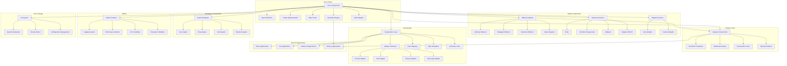

```mermaid
graph TD
    subgraph "Core Library"
        Core["Core Components"] --> Types["Type Definitions"]
        Core --> Graph["Graph Implementation"]
        Core --> StateVector["State Vector"]
        Core --> Engine["Simulation Engine"]
        Core --> Math["Math Adapter"]
    end
    
    subgraph "Model Components"
        DiffusionModels["Diffusion Models"] --> Ordinary["Ordinary Diffusion"]
        DiffusionModels --> Telegraph["Telegraph Diffusion"]
        DiffusionModels --> Fractional["Fractional Diffusion"]
        DiffusionModels --> Wave["Wave Equation"]
        
        Solvers["Numerical Solvers"] --> Euler["Euler"]
        Solvers --> RK4["4th Order Runge-Kutta"]
        Solvers --> Midpoint["Midpoint"]
        Solvers --> Adaptive["Adaptive RKF45"]
        
        WFunctions["Weight Functions"] --> SpinWeights["Spin Weights"]
        WFunctions --> CustomWeights["Custom Weights"]
    end
    
    subgraph "Analysis Tools"
        AnalysisTools["Analysis Components"] --> Geometric["Geometric Properties"]
        AnalysisTools --> Statistics["Statistical Analysis"]
        AnalysisTools --> Conservation["Conservation Laws"]
        AnalysisTools --> Spectral["Spectral Analysis"]
    end
    
    subgraph "Visualization"
        VizLayer["Visualization Layer"] --> VizAdapters["Adapter Interfaces"]
        VizAdapters --> Canvas["Canvas Adapter"]
        VizAdapters --> SVG["SVG Adapter"]
        VizAdapters --> ThreeJS["Three.js Adapter"]
        VizAdapters --> Cytoscape["Cytoscape Adapter"]
        VizLayer --> ColorMaps["Color Mapping"]
        VizLayer --> Styles["Style Templates"]
        VizLayer --> Animation["Animation Tools"]
    end
    
    subgraph "Templates & Generation"
        TemplateGen["Graph Templates"] --> Line["Line Graphs"]
        TemplateGen --> Ring["Ring Graphs"]
        TemplateGen --> Grid["Grid Graphs"]
        TemplateGen --> Random["Random Graphs"]
    end
    
    subgraph "Utilities"
        UtilFunctions["Utility Functions"] --> Logger["Logging System"]
        UtilFunctions --> Performance["Performance Monitor"]
        UtilFunctions --> ErrorHandling["Error Handling"]
        UtilFunctions --> Validation["Parameter Validation"]
    end
    
    subgraph "I/O & Storage"
        IOSystem["I/O System"] --> Serialization["Graph Serialization"]
        IOSystem --> ResultsExport["Results Export"]
        IOSystem --> Config["Configuration Management"]
    end
    
    Core --> DiffusionModels
    Core --> Solvers
    Core --> WFunctions
    Core --> AnalysisTools
    DiffusionModels --> AnalysisTools
    Core --> VizLayer
    Core --> TemplateGen
    Core --> UtilFunctions
    Core --> IOSystem
    
    subgraph "External Applications"
        ReactApp["React Applications"]
        VueApp["Vue Applications"]
        VanillaJS["Vanilla JS Applications"]
        NodeJS["Node.js Applications"]
    end
    
    VizLayer --> ReactApp
    VizLayer --> VueApp
    VizLayer --> VanillaJS
    AnalysisTools --> NodeJS
    Engine --> NodeJS
```