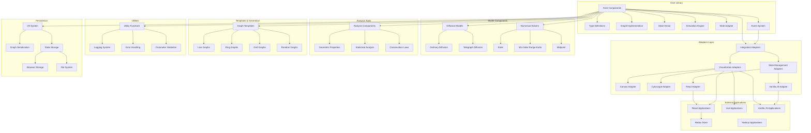

```mermaid
graph TD
    subgraph "Core Library"
        Core["Core Components"] --> Types["Type Definitions"]
        Core --> Graph["Graph Implementation"]
        Core --> StateVector["State Vector"]
        Core --> Engine["Simulation Engine"]
        Core --> Math["Math Adapter"]
        Core --> EventEmitter["Event System"]
    end
    
    subgraph "Model Components"
        DiffusionModels["Diffusion Models"] --> Ordinary["Ordinary Diffusion"]
        DiffusionModels --> Telegraph["Telegraph Diffusion"]
        
        Solvers["Numerical Solvers"] --> Euler["Euler"]
        Solvers --> RK4["4th Order Runge-Kutta"]
        Solvers --> Midpoint["Midpoint"]
    end
    
    subgraph "Analysis Tools"
        AnalysisTools["Analysis Components"] --> Geometric["Geometric Properties"]
        AnalysisTools --> Statistics["Statistical Analysis"]
        AnalysisTools --> Conservation["Conservation Laws"]
    end
    
    subgraph "Adapters Layer"
        Adapters["Integration Adapters"] --> VizAdapters["Visualization Adapters"]
        Adapters --> StateAdapters["State Management Adapters"]
        
        VizAdapters --> Canvas["Canvas Adapter"]
        VizAdapters --> Cytoscape["Cytoscape Adapter"]
        
        StateAdapters --> ReactAdapter["React Adapter"]
        StateAdapters --> VanillaAdapter["Vanilla JS Adapter"]
    end
    
    subgraph "Templates & Generation"
        TemplateGen["Graph Templates"] --> Line["Line Graphs"]
        TemplateGen --> Ring["Ring Graphs"]
        TemplateGen --> Grid["Grid Graphs"]
        TemplateGen --> Random["Random Graphs"]
    end
    
    subgraph "Utilities"
        UtilFunctions["Utility Functions"] --> Logger["Logging System"]
        UtilFunctions --> ErrorHandling["Error Handling"]
        UtilFunctions --> Validation["Parameter Validation"]
    end
    
    subgraph "Persistence"
        IOSystem["I/O System"] --> Serialization["Graph Serialization"]
        IOSystem --> StateStorage["State Storage"]
        StateStorage --> LocalStorage["Browser Storage"]
        StateStorage --> FileSystem["File System"]
    end
    
    Core --> DiffusionModels
    Core --> Solvers
    Core --> AnalysisTools
    Core --> Adapters
    Core --> TemplateGen
    Core --> UtilFunctions
    Core --> IOSystem
    EventEmitter --> Adapters
    
    subgraph "External Applications"
        ReactApp["React Applications"] --> ReduxStore["Redux Store"]
        VueApp["Vue Applications"]
        VanillaJS["Vanilla JS Applications"]
        NodeJS["Node.js Applications"]
    end
    
    ReactAdapter --> ReactApp
    VizAdapters --> ReactApp
    VizAdapters --> VueApp
    VizAdapters --> VanillaJS
    VanillaAdapter --> VanillaJS
```