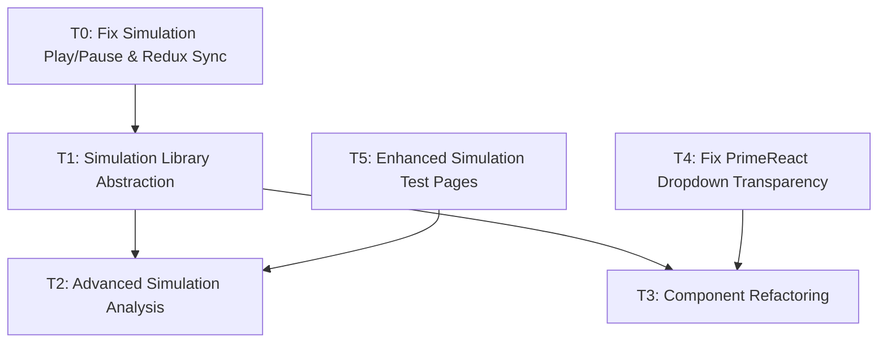

# Task Registry
*Last Updated: April 14, 2025 (19:15 IST)*

## Active Tasks
| ID | Title | Status | Priority | Started | Dependencies | Owner |
|----|-------|--------|----------|---------|--------------|-------|
| T1 | Simulation Library Abstraction | 🔄 IN PROGRESS | HIGH | 2025-04-14 | - | Deepak |
| T2 | Advanced Simulation Analysis | ⏸️ PAUSED | MEDIUM | 2025-04-14 | T1 | Deepak |
| T3 | Component Refactoring | ⏸️ PAUSED | MEDIUM | 2025-04-14 | T1 | Deepak |
| T5 | Enhanced Simulation Test Pages | 🔄 IN PROGRESS | HIGH | 2025-04-14 | - | Deepak |

## Task Details

### T1: Simulation Library Abstraction
**Description**: Abstract the simulation functionality from the UI components to create standalone libraries that users can import into their code to run simulations on spin networks without UI dependencies. This will improve modularity and allow for more flexible usage of the simulation engine.
**Status**: 🔄 IN PROGRESS
**Last Active**: April 14, 2025 (17:35 IST)
**Completion Criteria**:
- Create new modular library structure in `lib/` directory
- Move core simulation logic with updated interfaces
- Move and refactor models and analysis tools
- Set up proper entry points and API
- Create clean separation between simulation and UI components
- Add documentation and usage examples
- Test library functionality independently
- Refactor original app to use the new library

**Related Files**:
- `/src/simulation/index.ts`
- `/src/simulation/core/engineImplementation.ts`
- `/src/simulation/core/types.ts`
- `/src/simulation/core/graph.ts`
- `/src/simulation/core/stateVector.ts`
- `/src/simulation/models/diffusionModels.ts`
- `/src/simulation/models/solvers.ts`
- `/src/simulation/models/weightFunctions.ts`
- `/memory-bank/implementation-details/simulation-library-abstraction.md`

**Notes**:
Planning phase is complete with a detailed implementation strategy documented. Implementation will proceed in phases with careful testing to ensure nothing breaks in the existing application while we extract the simulation functionality.

### T2: Advanced Simulation Analysis
**Description**: Add more in-depth analysis and visualization of simulation results. Implement additional tools for analyzing simulation data and provide more comprehensive insights into the behavior of spin networks.
**Status**: ⏸️ PAUSED
**Last Active**: April 14, 2025 (17:00 IST)
**Paused On**: April 14, 2025 (17:15 IST)
**Reason**: Dependent on completion of Simulation Library Abstraction (T1)
**Completion Criteria**:
- Add Fourier analysis of simulation results
- Implement spectral decomposition of operators
- Create correlation function calculator
- Add multi-scale analysis tools
- Implement export functionality for analysis results
- Create enhanced visualization components for analysis results

**Related Files**:
- `/src/simulation/analysis/conservation.ts`
- `/src/simulation/analysis/geometricProps.ts`
- `/src/simulation/analysis/statistics.ts`
- `/src/components/simulation/SimulationResultsPanel.tsx`

**Notes**:
This task will be resumed after the simulation library abstraction is complete, as the new library structure will make it easier to implement and integrate advanced analysis features.

### T3: Component Refactoring
**Description**: Break down large components into smaller, more maintainable units. Improve organization and reduce complexity of UI components, particularly in the simulation-related panels.
**Status**: ⏸️ PAUSED
**Last Active**: April 14, 2025 (16:45 IST)
**Paused On**: April 14, 2025 (17:00 IST)
**Reason**: Dependent on completion of Simulation Library Abstraction (T1)
**Completion Criteria**:
- Break down SimulationResultsPanel.tsx into smaller components
- Refactor SimulationControlPanel.tsx into modular components
- Create reusable hooks for simulation data access
- Extract tab components into separate files
- Improve component organization and maintainability
- Implement better state management patterns
- Add comprehensive component documentation

**Related Files**:
- `/src/components/simulation/SimulationResultsPanel.tsx`
- `/src/components/panels/SimulationControlPanel.tsx`
- `/src/hooks/useSimulation.ts`
- `/src/hooks/useReduxSimulation.ts`

**Notes**:
This refactoring will be more efficient after the simulation library abstraction is complete, as the new architecture will clarify component boundaries and responsibilities.

### T5: Enhanced Simulation Test Pages
**Description**: Improve the test-simulation.html page by adding randomized network generation and create a detailed physics notebook page that explains the simulation's mathematical foundations and implementation details.
**Status**: 🔄 IN PROGRESS
**Last Active**: April 14, 2025 (22:15 IST)
**Completion Criteria**:
- Add randomized network generation to test-simulation.html
- Create a new physics-notebook.html page with detailed explanations
- Include mathematical equations and their corresponding code implementations
- Break down all geometric properties calculations
- Explain diffusion models and their physics foundations
- Make sections collapsible for better usability
- Add table of contents for easy navigation
- Link the test and notebook pages together
- Create responsive design for all viewport sizes

**Related Files**:
- `/public/test-simulation.html`
- `/public/physics-notebook.html` (new file)
- `/src/test-simulation.js`

**Notes**:
The enhanced test pages will serve as educational resources to help users understand the physics and mathematics behind the simulation. The randomized network generation will allow users to see how different network topologies affect the simulation results. The physics notebook provides a comprehensive explanation of all equations and their code implementations.

## Completed Tasks
| ID | Title | Completed | Related Tasks |
|----|-------|-----------|---------------|
| T0 | Fix Simulation Play/Pause & Redux Sync | 2025-04-13 | - |
| T4 | Fix PrimeReact Dropdown Transparency | 2025-04-14 | - |

### T4: Fix PrimeReact Dropdown Transparency
**Description**: Fix transparency issue in PrimeReact dropdown components, particularly in the Application Logs panel's MultiSelect filter. Improve styling to match the application's design system.
**Status**: ✅ COMPLETE
**Started**: April 14, 2025 (18:30 IST)
**Completed**: April 14, 2025 (19:15 IST)
**Completion Criteria**:
- Fix transparent background in MultiSelect dropdown
- Ensure consistent styling with application design
- Support dark mode
- Improve visual appearance of dropdown items and checkboxes
- Fix z-index issues to prevent overlapping
- Ensure cross-browser compatibility

**Related Files**:
- `/src/styles/primereact-fixes.css` (new file)
- `/src/styles/primereact-scoped.css`
- `/src/styles/index.css`
- `/src/components/logs/LogViewerAdapter.tsx`
- `/src/main.tsx`

**Notes**:
Created a dedicated CSS file for PrimeReact fixes to avoid modifying the core component library. Used multiple layers of CSS targeting to ensure the styles are applied correctly across all PrimeReact components. Improved overall styling of dropdown components to better match the application's design system.

## Task Relationships

