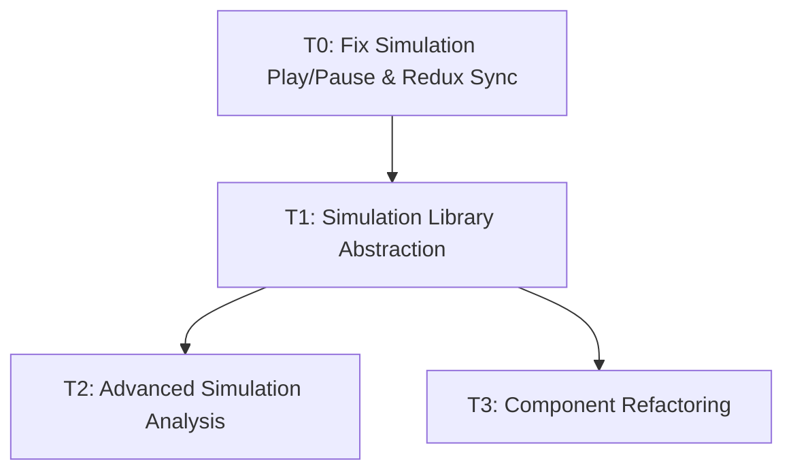

# Task Registry
*Last Updated: April 14, 2025 (18:15 IST)*

## Active Tasks
| ID | Title | Status | Priority | Started | Dependencies | Owner |
|----|-------|--------|----------|---------|--------------|-------|
| T1 | Simulation Library Abstraction | 🔄 IN PROGRESS | HIGH | 2025-04-14 | - | Deepak |
| T2 | Advanced Simulation Analysis | ⏸️ PAUSED | MEDIUM | 2025-04-14 | T1 | Deepak |
| T3 | Component Refactoring | ⏸️ PAUSED | MEDIUM | 2025-04-14 | T1 | Deepak |

## Task Details

### T1: Simulation Library Abstraction
**Description**: Abstract the simulation functionality from the UI components to create standalone libraries that users can import into their code to run simulations on spin networks without UI dependencies. This will improve modularity and allow for more flexible usage of the simulation engine.
**Status**: 🔄 IN PROGRESS
**Last Active**: April 14, 2025 (17:35 IST)
**Completion Criteria**:
- Create new modular library structure in `lib/` directory
- Move core simulation logic with updated interfaces
- Move and refactor models and analysis tools
- Set up proper entry points and API
- Create clean separation between simulation and UI components
- Add documentation and usage examples
- Test library functionality independently
- Refactor original app to use the new library

**Related Files**:
- `/src/simulation/index.ts`
- `/src/simulation/core/engineImplementation.ts`
- `/src/simulation/core/types.ts`
- `/src/simulation/core/graph.ts`
- `/src/simulation/core/stateVector.ts`
- `/src/simulation/models/diffusionModels.ts`
- `/src/simulation/models/solvers.ts`
- `/src/simulation/models/weightFunctions.ts`
- `/memory-bank/implementation-details/simulation-library-abstraction.md`

**Notes**:
Planning phase is complete with a detailed implementation strategy documented. Implementation will proceed in phases with careful testing to ensure nothing breaks in the existing application while we extract the simulation functionality.

### T2: Advanced Simulation Analysis
**Description**: Add more in-depth analysis and visualization of simulation results. Implement additional tools for analyzing simulation data and provide more comprehensive insights into the behavior of spin networks.
**Status**: ⏸️ PAUSED
**Last Active**: April 14, 2025 (17:00 IST)
**Paused On**: April 14, 2025 (17:15 IST)
**Reason**: Dependent on completion of Simulation Library Abstraction (T1)
**Completion Criteria**:
- Add Fourier analysis of simulation results
- Implement spectral decomposition of operators
- Create correlation function calculator
- Add multi-scale analysis tools
- Implement export functionality for analysis results
- Create enhanced visualization components for analysis results

**Related Files**:
- `/src/simulation/analysis/conservation.ts`
- `/src/simulation/analysis/geometricProps.ts`
- `/src/simulation/analysis/statistics.ts`
- `/src/components/simulation/SimulationResultsPanel.tsx`

**Notes**:
This task will be resumed after the simulation library abstraction is complete, as the new library structure will make it easier to implement and integrate advanced analysis features.

### T3: Component Refactoring
**Description**: Break down large components into smaller, more maintainable units. Improve organization and reduce complexity of UI components, particularly in the simulation-related panels.
**Status**: ⏸️ PAUSED
**Last Active**: April 14, 2025 (16:45 IST)
**Paused On**: April 14, 2025 (17:00 IST)
**Reason**: Dependent on completion of Simulation Library Abstraction (T1)
**Completion Criteria**:
- Break down SimulationResultsPanel.tsx into smaller components
- Refactor SimulationControlPanel.tsx into modular components
- Create reusable hooks for simulation data access
- Extract tab components into separate files
- Improve component organization and maintainability
- Implement better state management patterns
- Add comprehensive component documentation

**Related Files**:
- `/src/components/simulation/SimulationResultsPanel.tsx`
- `/src/components/panels/SimulationControlPanel.tsx`
- `/src/hooks/useSimulation.ts`
- `/src/hooks/useReduxSimulation.ts`

**Notes**:
This refactoring will be more efficient after the simulation library abstraction is complete, as the new architecture will clarify component boundaries and responsibilities.

## Completed Tasks
| ID | Title | Completed | Related Tasks |
|----|-------|-----------|---------------|
| T0 | Fix Simulation Play/Pause & Redux Sync | 2025-04-13 | - |

## Task Relationships

