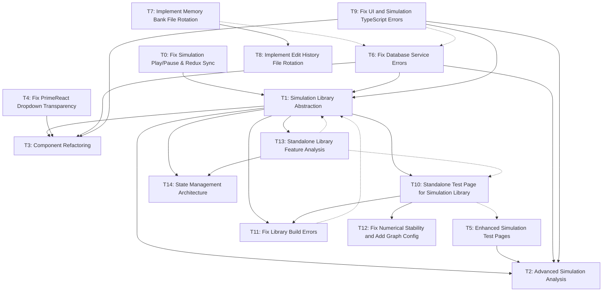

# Task Registry
*Last Updated: April 17, 2025 (14:30 IST)*

## Active Tasks
| ID | Title | Status | Priority | Started | Dependencies | Owner |
|----|-------|--------|----------|---------|--------------|-------|
| T1 | Simulation Library Abstraction | 🔄 IN PROGRESS | HIGH | 2025-04-14 | - | Deepak |
| T2 | Advanced Simulation Analysis | ⏸️ PAUSED | MEDIUM | 2025-04-14 | T1 | Deepak |
| T3 | Component Refactoring | ⏸️ PAUSED | MEDIUM | 2025-04-14 | T1 | Deepak |
| T5 | Enhanced Simulation Test Pages | 🔄 IN PROGRESS | HIGH | 2025-04-14 | - | Deepak |
| T6 | Fix Database Service Errors | 🔄 IN PROGRESS | HIGH | 2025-04-15 | - | Deepak |
| T9 | Fix UI and Simulation TypeScript Errors | 🔄 IN PROGRESS | HIGH | 2025-04-15 | - | Deepak |
| T10 | Standalone Test Page for Simulation Library | 🔄 IN PROGRESS | HIGH | 2025-04-15 | T1 | Deepak |
| T12 | Fix Numerical Stability and Add Graph Config | ⏸️ PAUSED | HIGH | 2025-04-16 | T10 | Deepak |
| T13 | Standalone Library Feature Analysis | ✅ COMPLETE | HIGH | 2025-04-16 | T1 | Deepak |
| T14 | State Management Architecture for Standalone Library | 🔄 IN PROGRESS | HIGH | 2025-04-17 | T13, T1 | Deepak |

## Task Details

### T14: State Management Architecture for Standalone Library
**Description**: Design a comprehensive state management and event communication system for the standalone library to ensure complete separation from React/Redux dependencies. Update architecture diagram and enhancement plan to reflect the framework-agnostic approach.
**Status**: 🔄 IN PROGRESS
**Priority**: HIGH
**Started**: April 17, 2025
**Last Active**: April 17, 2025 (14:30 IST)
**Dependencies**: T13, T1
**Completion Criteria**:
- ✅ Analyze existing state management dependencies
- ✅ Design framework-agnostic event communication system
- ✅ Update architecture diagram with adapter layers for state management
- ✅ Update enhancement plan to include state management approach
- ✅ Create reference implementation for event system and adapters
- ✅ Ensure no direct Redux dependencies in the library
- ✅ Design persistence mechanism for saving/loading simulation state
- ⬜ Apply design to existing implementation of the engine
- ⬜ Implement event emitter in the core module
- ⬜ Create adapter interface for framework integration
- ⬜ Test with both React app and standalone environments

**Related Files**:
- `/memory-bank/implementation-details/standalone-lib/standalone-architecture.md`
- `/memory-bank/implementation-details/standalone-lib/standalone-lib-enhancement-v2.md`
- `/memory-bank/implementation-details/standalone-lib/state-management-implementation.ts`
- `/lib/core/engineImplementation.ts`
- `/lib/core/types.ts`
- `/lib/utils/index.ts`

**Notes**:
This task is crucial for achieving the goal of separating UI logic from simulation logic. By implementing a proper event-based communication system and adapter pattern, the standalone library can be used with any frontend framework while maintaining rich functionality. The reference implementation provides patterns for actual implementation in the library code.

### T13: Standalone Library Feature Analysis
**Description**: Perform comparative analysis of the React App, standalone library, standalone-test.js, and test-simulation.js to identify feature gaps and create a plan for implementing missing features in the standalone library.
**Status**: ✅ COMPLETE
**Priority**: HIGH
**Started**: April 16, 2025
**Last Active**: April 16, 2025
**Completed**: April 16, 2025
**Dependencies**: T1
**Completion Criteria**:
- ✅ Analyze core features in all four components
- ✅ Create comprehensive feature comparison table
- ✅ Identify gaps in the standalone library
- ✅ Create implementation plan for missing features
- ✅ Ensure visualization solutions are framework-agnostic
- ✅ Generate architecture diagram for standalone library
- ✅ Document findings and recommendations

**Related Files**:
- `/memory-bank/implementation-details/standalone-lib/spin-net-feature-comparison.md`
- `/memory-bank/implementation-details/standalone-lib/standalone-lib-enhancement.md`
- `/memory-bank/implementation-details/standalone-lib/standalone-lib-enhancement-v2.md`
- `/memory-bank/implementation-details/standalone-lib/standalone-architecture.md`
- `/lib/index.ts`
- `/src/test-simulation.js`
- `/public/standalone-test.js`

**Notes**:
Completed a thorough comparative analysis of all spin network components. Created a feature comparison table that highlights which features exist in each component. Generated an enhancement plan focusing on core simulation capabilities, analysis tools, visualization adapters, utilities, and I/O operations. Created an architecture diagram showing the modular structure for the standalone library. This analysis will inform future development of the standalone library to ensure it contains all necessary features while remaining framework-agnostic.

### T12: Fix Numerical Stability and Add Graph Config
**Description**: Fix numerical instability issues in the standalone simulation test page and add graph configuration options. Implement missing simulationLogger.ts utility and proper continue/pause functionality.
**Status**: ⏸️ PAUSED
**Priority**: HIGH
**Started**: April 16, 2025
**Last Active**: April 16, 2025 (22:00 IST)
**Paused On**: April 16, 2025 (22:00 IST)
**Dependencies**: T10
**Completion Criteria**:
- ✅ Implement simulationLogger.ts utility for stability monitoring
- ✅ Add state normalization to prevent numerical explosion
- ✅ Implement graph configuration UI for different topologies
- ✅ Fix pause/continue button functionality
- ✅ Add diffusion model and numerical solver selection
- ✅ Integrate stability monitoring into simulation engine
- ⬜ Complete proper RK4 solver implementation
- ⬜ Implement telegraph equation model correctly
- ⬜ Create test scripts to evaluate numerical stability
- ⬜ Fine-tune stability parameters for optimal simulation
- ⬜ Implement adaptive time-stepping based on stability metrics
- ⬜ Add documentation on stability control

**Related Files**:
- `/lib/utils/simulationLogger.ts` (new file)
- `/lib/core/engineImplementation.ts`
- `/lib/core/types.ts`
- `/public/standalone-test.html`
- `/public/standalone-test.js`
- `/lib/models/solvers.ts`
- `/lib/models/diffusionModels.ts`

**Notes**:
This task addresses the numerical instability issues observed in the simulation and implements a more flexible graph configuration system. The primary focus is on improving stability through normalization and better monitoring, while also enhancing usability with different graph types and simulation parameters.

Plan for future implementation:
1. Complete RK4 solver implementation with improved stability analysis
2. Properly implement telegraph equation model with second-order ODE solver
3. Implement adaptive time-stepping (complete AdaptiveRKF45Solver)
4. Create test scripts for numerical stability evaluation
5. Fine-tune stability parameters for different graph types
6. Add comprehensive documentation on stability control

### T11: Fix Library Build Errors
**Description**: Fix the build errors in the standalone library by implementing missing analysis modules (conservation.ts, geometricProps.ts, statistics.ts) in the lib directory. Currently, the library cannot be built as shown by the error "Could not resolve './conservation' from 'lib/analysis/index.ts'".
**Status**: ✅ COMPLETE
**Last Active**: April 16, 2025 (07:45 IST)
**Completed**: April 16, 2025 (07:45 IST)
**Completion Criteria**:
- ✅ Create directory structure for analysis modules
- ✅ Implement conservation.ts based on the src/simulation/analysis/conservation.ts file
- ✅ Implement geometricProps.ts based on the src/simulation/analysis/geometricProps.ts file
- ✅ Implement statistics.ts based on the src/simulation/analysis/statistics.ts file
- ✅ Simplify adapters/index.ts to avoid additional missing modules
- ✅ Fix utilities module with minimal implementation to avoid missing files
- ✅ Fix ConservationLawChecker interface export issue
- ✅ Test library build process (pnpm run build:lib)
- ✅ Ensure standalone test page works with built library
- ✅ Address simulation execution and UI update issues

**Related Files**:
- `/lib/analysis/index.ts`
- `/lib/analysis/conservation.ts` (to be created)
- `/lib/analysis/geometricProps.ts` (to be created)
- `/lib/analysis/statistics.ts` (to be created)
- `/src/simulation/analysis/conservation.ts` (reference)
- `/src/simulation/analysis/geometricProps.ts` (reference)
- `/src/simulation/analysis/statistics.ts` (reference)
- `/lib-bundle.config.js`
- `/package.json`

**Notes**:
This task is critical for enabling the standalone library functionality that is required by the Standalone Test Page (T10). The build error is due to missing analysis modules that are referenced in the analysis/index.ts file but don't exist in the lib directory.

### T8: Implement Edit History File Rotation
**Description**: Implement the file rotation system for the edit_history.md file which has grown beyond the 500-line threshold. Apply the size-based rotation protocol to preserve recent entries while archiving older ones.
**Status**: ✅ COMPLETE
**Last Active**: April 15, 2025 (09:23 IST)
**Completed**: April 15, 2025 (09:23 IST)
**Completion Criteria**:
- Implement rotation for edit_history.md with preservation of recent entries
- Create archive file with proper date-based naming
- Ensure both files have appropriate content and structure
- Verify file sizes after rotation
- Update tasks.md to reflect the completed rotation task
- Update session_cache.md with rotation details

**Related Files**:
- `/memory-bank/edit_history.md`
- `/memory-bank/archive/edit_history_2025-04.md`
- `/memory-bank/tasks.md`
- `/memory-bank/session_cache.md`

**Notes**:
Following the Memory Bank Size Management Protocol from Section 3.6 of the Integrated Code Rules and the detailed log rotation protocol.

### T7: Implement Memory Bank File Rotation
**Description**: Implement the file rotation system for Memory Bank files that have grown too large, starting with errorLog.md. This follows the size-based rotation protocol specified in the Integrated Code Rules.
**Status**: ✅ COMPLETE
**Last Active**: April 15, 2025 (09:10 IST)
**Completion Criteria**:
- Create archive directory if it doesn't exist
- Implement rotation for errorLog.md with preservation of recent entries
- Establish naming convention for archived files
- Minimize token usage by using efficient commands
- Document rotation process
- Update edit_history.md to reflect the changes

**Related Files**:
- `/memory-bank/errorLog.md`
- `/memory-bank/archive/errorLog_2025-04.md`
- `/memory-bank/edit_history.md`
- `/memory-bank/tasks.md`

**Notes**:
Used an efficient approach that preserved the most recent 5 error entries while archiving the rest. Used command-line tools to minimize token usage and avoid loading the entire large file. This implementation satisfies the Memory Bank Size Management Protocol from Section 3.6 of the Integrated Code Rules.

### T6: Fix Database Service Errors
**Description**: Fix TypeScript errors in database services that are preventing the application from building successfully. Focus on database initialization, service methods, and type compatibility issues.
**Status**: 🔄 IN PROGRESS
**Last Active**: April 15, 2025 (Current)
**Completion Criteria**:
- Fix missing function references (initDatabase, getDatabaseStatus)
- Resolve type mismatches in database service methods
- Fix Promise handling issues in simulationService.ts
- Correct filter conditions in database queries
- Ensure proper typing for all database operations
- Fix window.fs related errors in logMigration.ts
- Validate build success after each fix

**Related Files**:
- `/src/database/index.ts`
- `/src/database/services/graphService.ts`
- `/src/database/services/logService.ts`
- `/src/database/services/simulationService.ts`
- `/src/database/migrations/logMigration.ts`

**Notes**:
These database service errors are preventing the application from building successfully. Fixing these errors is critical for the application to function properly, as they affect core data storage and retrieval functionality.

### T1: Simulation Library Abstraction
**Description**: Abstract the simulation functionality from the UI components to create standalone libraries that users can import into their code to run simulations on spin networks without UI dependencies. This will improve modularity and allow for more flexible usage of the simulation engine.
**Status**: 🔄 IN PROGRESS
**Last Active**: April 15, 2025 (18:30 IST)
**Completion Criteria**:
- ✅ Create new modular library structure in `lib/` directory
- ✅ Set up proper entry points and API
- ✅ Create core type definitions without UI dependencies
- ✅ Implement StateVector with comprehensive vector operations
- ✅ Implement Graph with full immutable operations
- ✅ Implement SimulationHistory for tracking state over time
- ✅ Implement core SimulationEngine with proper event handling
- ✅ Implement OrdinaryDiffusionModel and TelegraphDiffusionModel
- ✅ Implement numerical solvers (Euler, Midpoint, RK4)
- ⬜ Implement weight functions
- ⬜ Implement analysis tools
- ⬜ Implement visualization adapters
- ⬜ Add comprehensive documentation and usage examples
- ⬜ Test library functionality independently
- ⬜ Refactor original app to use the new library

**Related Files**:
- `/lib/index.ts` - Main library entry point
- `/lib/core/types.ts` - Core type definitions
- `/lib/core/stateVector.ts` - State vector implementation
- `/lib/core/graph.ts` - Graph implementation
- `/lib/core/mathAdapter.ts` - Math adapter for calculations
- `/lib/core/engineImplementation.ts` - Simulation engine implementation
- `/lib/models/diffusionModels.ts` - Diffusion model implementations
- `/lib/models/solvers.ts` - Numerical solver implementations
- `/lib/models/weightFunctions.ts` - Weight function implementations
- `/memory-bank/implementation-details/simulation-library-abstraction.md`

**Notes**:
Made significant progress on the library implementation. Completed the core components including state vector, graph, simulation engine, diffusion models, and numerical solvers. The library is now in a usable state for basic simulations, with a functioning API that allows creating graphs, setting up initial conditions, choosing diffusion models and solvers, and running simulations. Still need to implement some advanced features like analysis tools, visualization adapters, and specialized weight functions, but the core functionality is in place.

### T2: Advanced Simulation Analysis
**Description**: Add more in-depth analysis and visualization of simulation results. Implement additional tools for analyzing simulation data and provide more comprehensive insights into the behavior of spin networks.
**Status**: ⏸️ PAUSED
**Last Active**: April 14, 2025 (17:00 IST)
**Paused On**: April 14, 2025 (17:15 IST)
**Reason**: Dependent on completion of Simulation Library Abstraction (T1)
**Completion Criteria**:
- Add Fourier analysis of simulation results
- Implement spectral decomposition of operators
- Create correlation function calculator
- Add multi-scale analysis tools
- Implement export functionality for analysis results
- Create enhanced visualization components for analysis results

**Related Files**:
- `/src/simulation/analysis/conservation.ts`
- `/src/simulation/analysis/geometricProps.ts`
- `/src/simulation/analysis/statistics.ts`
- `/src/components/simulation/SimulationResultsPanel.tsx`

**Notes**:
This task will be resumed after the simulation library abstraction is complete, as the new library structure will make it easier to implement and integrate advanced analysis features.

### T3: Component Refactoring
**Description**: Break down large components into smaller, more maintainable units. Improve organization and reduce complexity of UI components, particularly in the simulation-related panels.
**Status**: ⏸️ PAUSED
**Last Active**: April 14, 2025 (16:45 IST)
**Paused On**: April 14, 2025 (17:00 IST)
**Reason**: Dependent on completion of Simulation Library Abstraction (T1)
**Completion Criteria**:
- Break down SimulationResultsPanel.tsx into smaller components
- Refactor SimulationControlPanel.tsx into modular components
- Create reusable hooks for simulation data access
- Extract tab components into separate files
- Improve component organization and maintainability
- Implement better state management patterns
- Add comprehensive component documentation

**Related Files**:
- `/src/components/simulation/SimulationResultsPanel.tsx`
- `/src/components/panels/SimulationControlPanel.tsx`
- `/src/hooks/useSimulation.ts`
- `/src/hooks/useReduxSimulation.ts`

**Notes**:
This refactoring will be more efficient after the simulation library abstraction is complete, as the new architecture will clarify component boundaries and responsibilities.

### T9: Fix UI and Simulation TypeScript Errors
**Description**: Fix TypeScript errors in UI components, hooks, and simulation code that are preventing the application from building successfully. This complements the database service error fixes in task T6.
**Status**: 🔄 IN PROGRESS
**Last Active**: April 15, 2025 (15:30 IST)
**Completion Criteria**:
- Fix error handling in App.tsx and logMigrationUtil.ts (unknown type issues)
- Fix prop type mismatches in LogViewerAdapter.tsx
- Fix Tag component prop type errors in LogViewerAdapter
- Fix AsyncThunkAction type issues in LogViewerAdapter
- Resolve property accesses on empty objects in SimulationResultsPanel.tsx
- Fix type compatibility issues in state objects in SimulationResultsPanel.tsx
- Fix null safety issues in engineImplementation.ts 
- Resolve missing type definitions in useSimulation.ts
- Fix the hasWarnedNull property issues in useSimulation.ts
- Check each fix with TypeScript to ensure compatibility
- Validate that all fixes maintain existing functionality
- Ensure build completes successfully after fixes are applied

**Related Files**:
- `/src/App.tsx`
- `/src/components/logs/LogViewerAdapter.tsx` 
- `/src/components/simulation/SimulationResultsPanel.tsx`
- `/src/hooks/useSimulation.ts`
- `/src/simulation/core/engineImplementation.ts`
- `/src/store/slices/logsSlice.ts`
- `/src/utils/logMigrationUtil.ts`
- `/src/database/services/simulationService.ts`

**Notes**:
Made significant progress in fixing TypeScript errors by addressing several critical issues:
1. Fixed SimulationParameters type compatibility in useSimulation.ts by implementing proper type assertions
2. Added null safety checks in engineImplementation.ts to handle potentially null objects
3. Ensured boolean type consistency in SimulationResultsPanel.tsx
4. Fixed void/number comparison in simulationService.ts

Some TypeScript errors still remain to be fixed. The incremental approach allows us to validate each fix individually while making steady progress toward a successful build.

### T10: Standalone Test Page for Simulation Library
**Description**: Create a standalone HTML test page for demonstrating and testing the simulation library without requiring the full application. Implement a simple interface for creating networks, running simulations, and visualizing results.
**Status**: 🔄 IN PROGRESS
**Started**: April 15, 2025 (19:30 IST)
**Last Active**: April 16, 2025 (07:45 IST)
**Dependencies**: T1
**Completion Criteria**:
- ✅ Create HTML structure with controls and visualization areas
- ✅ Implement JavaScript for graph creation and simulation control
- ✅ Add basic visualization using Canvas
- ✅ Implement simulation metrics calculation and display
- ✅ Create bundling configuration for the standalone library
- ✅ Fix build errors in the library
- ✅ Implement fixes to actually execute simulation steps
- ✅ Fix numerical stability issues in simulation display
- ✅ Fix infinite logging issue after simulation completion
- ⬜ Add more interactive controls
- ⬜ Enhance visualization with more data views
- ⬜ Add parameter adjustment interface
- ⬜ Create comprehensive documentation

**Related Files**:
- `/public/standalone-test.html` (new file)
- `/public/standalone-test.js` (new file)
- `/lib-bundle.config.js` (new file)
- `/package.json` (updated with build:lib script)

**Notes**:
This standalone test page serves as both a demonstration of the library's capabilities and a testing tool for the library's functionality. It provides a simpler way to test the simulation engine without depending on the full React application. The page includes basic controls for creating a graph, running simulations, and visualizing the results. A mock implementation of the library was created for browser testing while the actual library bundling is being set up.

### T5: Enhanced Simulation Test Pages
**Description**: Improve the test-simulation.html page by adding randomized network generation and create a detailed physics notebook page that explains the simulation's mathematical foundations and implementation details.
**Status**: 🔄 IN PROGRESS
**Last Active**: April 14, 2025 (22:15 IST)
**Completion Criteria**:
- Add randomized network generation to test-simulation.html
- Create a new physics-notebook.html page with detailed explanations
- Include mathematical equations and their corresponding code implementations
- Break down all geometric properties calculations
- Explain diffusion models and their physics foundations
- Make sections collapsible for better usability
- Add table of contents for easy navigation
- Link the test and notebook pages together
- Create responsive design for all viewport sizes

**Related Files**:
- `/public/test-simulation.html`
- `/public/physics-notebook.html` (new file)
- `/src/test-simulation.js`

**Notes**:
The enhanced test pages will serve as educational resources to help users understand the physics and mathematics behind the simulation. The randomized network generation will allow users to see how different network topologies affect the simulation results. The physics notebook provides a comprehensive explanation of all equations and their code implementations.

## Completed Tasks
| ID | Title | Completed | Related Tasks |
|----|-------|-----------|---------------|
| T0 | Fix Simulation Play/Pause & Redux Sync | 2025-04-13 | - |
| T4 | Fix PrimeReact Dropdown Transparency | 2025-04-14 | - |
| T7 | Implement Memory Bank File Rotation | 2025-04-15 | T8 |
| T8 | Implement Edit History File Rotation | 2025-04-15 | - |
| T11 | Fix Library Build Errors | 2025-04-16 | T10 |
| T13 | Standalone Library Feature Analysis | 2025-04-16 | T1 |

### T4: Fix PrimeReact Dropdown Transparency
**Description**: Fix transparency issue in PrimeReact dropdown components, particularly in the Application Logs panel's MultiSelect filter. Improve styling to match the application's design system.
**Status**: ✅ COMPLETE
**Started**: April 14, 2025 (18:30 IST)
**Completed**: April 14, 2025 (19:15 IST)
**Completion Criteria**:
- Fix transparent background in MultiSelect dropdown
- Ensure consistent styling with application design
- Support dark mode
- Improve visual appearance of dropdown items and checkboxes
- Fix z-index issues to prevent overlapping
- Ensure cross-browser compatibility

**Related Files**:
- `/src/styles/primereact-fixes.css` (new file)
- `/src/styles/primereact-scoped.css`
- `/src/styles/index.css`
- `/src/components/logs/LogViewerAdapter.tsx`
- `/src/main.tsx`

**Notes**:
Created a dedicated CSS file for PrimeReact fixes to avoid modifying the core component library. Used multiple layers of CSS targeting to ensure the styles are applied correctly across all PrimeReact components. Improved overall styling of dropdown components to better match the application's design system.

## Task Relationships

