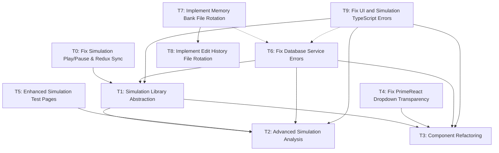

# Task Registry
*Last Updated: April 15, 2025 (11:00 IST)*

## Active Tasks
| ID | Title | Status | Priority | Started | Dependencies | Owner |
|----|-------|--------|----------|---------|--------------|-------|
| T1 | Simulation Library Abstraction | 🔄 IN PROGRESS | HIGH | 2025-04-14 | - | Deepak |
| T2 | Advanced Simulation Analysis | ⏸️ PAUSED | MEDIUM | 2025-04-14 | T1 | Deepak |
| T3 | Component Refactoring | ⏸️ PAUSED | MEDIUM | 2025-04-14 | T1 | Deepak |
| T5 | Enhanced Simulation Test Pages | 🔄 IN PROGRESS | HIGH | 2025-04-14 | - | Deepak |
| T6 | Fix Database Service Errors | 🔄 IN PROGRESS | HIGH | 2025-04-15 | - | Deepak |
| T9 | Fix UI and Simulation TypeScript Errors | 🔄 IN PROGRESS | HIGH | 2025-04-15 | - | Deepak |

## Task Details

### T8: Implement Edit History File Rotation
**Description**: Implement the file rotation system for the edit_history.md file which has grown beyond the 500-line threshold. Apply the size-based rotation protocol to preserve recent entries while archiving older ones.
**Status**: ✅ COMPLETE
**Last Active**: April 15, 2025 (09:23 IST)
**Completed**: April 15, 2025 (09:23 IST)
**Completion Criteria**:
- Implement rotation for edit_history.md with preservation of recent entries
- Create archive file with proper date-based naming
- Ensure both files have appropriate content and structure
- Verify file sizes after rotation
- Update tasks.md to reflect the completed rotation task
- Update session_cache.md with rotation details

**Related Files**:
- `/memory-bank/edit_history.md`
- `/memory-bank/archive/edit_history_2025-04.md`
- `/memory-bank/tasks.md`
- `/memory-bank/session_cache.md`

**Notes**:
Following the Memory Bank Size Management Protocol from Section 3.6 of the Integrated Code Rules and the detailed log rotation protocol.

### T7: Implement Memory Bank File Rotation
**Description**: Implement the file rotation system for Memory Bank files that have grown too large, starting with errorLog.md. This follows the size-based rotation protocol specified in the Integrated Code Rules.
**Status**: ✅ COMPLETE
**Last Active**: April 15, 2025 (09:10 IST)
**Completion Criteria**:
- Create archive directory if it doesn't exist
- Implement rotation for errorLog.md with preservation of recent entries
- Establish naming convention for archived files
- Minimize token usage by using efficient commands
- Document rotation process
- Update edit_history.md to reflect the changes

**Related Files**:
- `/memory-bank/errorLog.md`
- `/memory-bank/archive/errorLog_2025-04.md`
- `/memory-bank/edit_history.md`
- `/memory-bank/tasks.md`

**Notes**:
Used an efficient approach that preserved the most recent 5 error entries while archiving the rest. Used command-line tools to minimize token usage and avoid loading the entire large file. This implementation satisfies the Memory Bank Size Management Protocol from Section 3.6 of the Integrated Code Rules.

### T6: Fix Database Service Errors
**Description**: Fix TypeScript errors in database services that are preventing the application from building successfully. Focus on database initialization, service methods, and type compatibility issues.
**Status**: 🔄 IN PROGRESS
**Last Active**: April 15, 2025 (Current)
**Completion Criteria**:
- Fix missing function references (initDatabase, getDatabaseStatus)
- Resolve type mismatches in database service methods
- Fix Promise handling issues in simulationService.ts
- Correct filter conditions in database queries
- Ensure proper typing for all database operations
- Fix window.fs related errors in logMigration.ts
- Validate build success after each fix

**Related Files**:
- `/src/database/index.ts`
- `/src/database/services/graphService.ts`
- `/src/database/services/logService.ts`
- `/src/database/services/simulationService.ts`
- `/src/database/migrations/logMigration.ts`

**Notes**:
These database service errors are preventing the application from building successfully. Fixing these errors is critical for the application to function properly, as they affect core data storage and retrieval functionality.

### T1: Simulation Library Abstraction
**Description**: Abstract the simulation functionality from the UI components to create standalone libraries that users can import into their code to run simulations on spin networks without UI dependencies. This will improve modularity and allow for more flexible usage of the simulation engine.
**Status**: 🔄 IN PROGRESS
**Last Active**: April 14, 2025 (17:35 IST)
**Completion Criteria**:
- Create new modular library structure in `lib/` directory
- Move core simulation logic with updated interfaces
- Move and refactor models and analysis tools
- Set up proper entry points and API
- Create clean separation between simulation and UI components
- Add documentation and usage examples
- Test library functionality independently
- Refactor original app to use the new library

**Related Files**:
- `/src/simulation/index.ts`
- `/src/simulation/core/engineImplementation.ts`
- `/src/simulation/core/types.ts`
- `/src/simulation/core/graph.ts`
- `/src/simulation/core/stateVector.ts`
- `/src/simulation/models/diffusionModels.ts`
- `/src/simulation/models/solvers.ts`
- `/src/simulation/models/weightFunctions.ts`
- `/memory-bank/implementation-details/simulation-library-abstraction.md`

**Notes**:
Planning phase is complete with a detailed implementation strategy documented. Implementation will proceed in phases with careful testing to ensure nothing breaks in the existing application while we extract the simulation functionality.

### T2: Advanced Simulation Analysis
**Description**: Add more in-depth analysis and visualization of simulation results. Implement additional tools for analyzing simulation data and provide more comprehensive insights into the behavior of spin networks.
**Status**: ⏸️ PAUSED
**Last Active**: April 14, 2025 (17:00 IST)
**Paused On**: April 14, 2025 (17:15 IST)
**Reason**: Dependent on completion of Simulation Library Abstraction (T1)
**Completion Criteria**:
- Add Fourier analysis of simulation results
- Implement spectral decomposition of operators
- Create correlation function calculator
- Add multi-scale analysis tools
- Implement export functionality for analysis results
- Create enhanced visualization components for analysis results

**Related Files**:
- `/src/simulation/analysis/conservation.ts`
- `/src/simulation/analysis/geometricProps.ts`
- `/src/simulation/analysis/statistics.ts`
- `/src/components/simulation/SimulationResultsPanel.tsx`

**Notes**:
This task will be resumed after the simulation library abstraction is complete, as the new library structure will make it easier to implement and integrate advanced analysis features.

### T3: Component Refactoring
**Description**: Break down large components into smaller, more maintainable units. Improve organization and reduce complexity of UI components, particularly in the simulation-related panels.
**Status**: ⏸️ PAUSED
**Last Active**: April 14, 2025 (16:45 IST)
**Paused On**: April 14, 2025 (17:00 IST)
**Reason**: Dependent on completion of Simulation Library Abstraction (T1)
**Completion Criteria**:
- Break down SimulationResultsPanel.tsx into smaller components
- Refactor SimulationControlPanel.tsx into modular components
- Create reusable hooks for simulation data access
- Extract tab components into separate files
- Improve component organization and maintainability
- Implement better state management patterns
- Add comprehensive component documentation

**Related Files**:
- `/src/components/simulation/SimulationResultsPanel.tsx`
- `/src/components/panels/SimulationControlPanel.tsx`
- `/src/hooks/useSimulation.ts`
- `/src/hooks/useReduxSimulation.ts`

**Notes**:
This refactoring will be more efficient after the simulation library abstraction is complete, as the new architecture will clarify component boundaries and responsibilities.

### T9: Fix UI and Simulation TypeScript Errors
**Description**: Fix TypeScript errors in UI components, hooks, and simulation code that are preventing the application from building successfully. This complements the database service error fixes in task T6.
**Status**: 🔄 IN PROGRESS
**Last Active**: April 15, 2025 (14:30 IST)
**Completion Criteria**:
- Fix error handling in App.tsx and logMigrationUtil.ts (unknown type issues)
- Fix prop type mismatches in LogViewerAdapter.tsx
- Fix Tag component prop type errors in LogViewerAdapter
- Fix AsyncThunkAction type issues in LogViewerAdapter
- Resolve property accesses on empty objects in SimulationResultsPanel.tsx
- Fix type compatibility issues in state objects in SimulationResultsPanel.tsx
- Fix null safety issues in engineImplementation.ts 
- Resolve missing type definitions in useSimulation.ts
- Fix the hasWarnedNull property issues in useSimulation.ts
- Check each fix with TypeScript to ensure compatibility
- Validate that all fixes maintain existing functionality
- Ensure build completes successfully after fixes are applied

**Related Files**:
- `/src/App.tsx`
- `/src/components/logs/LogViewerAdapter.tsx` 
- `/src/components/simulation/SimulationResultsPanel.tsx`
- `/src/hooks/useSimulation.ts`
- `/src/simulation/core/engineImplementation.ts`
- `/src/store/slices/logsSlice.ts`
- `/src/utils/logMigrationUtil.ts`
- `/src/types/simulation.d.ts` (may need to create)

**Notes**:
These TypeScript errors are preventing the application from building successfully. The focus is on resolving type safety issues while maintaining the existing functionality. Some errors may require creating or updating type definitions to properly represent the application's data structures.

### T5: Enhanced Simulation Test Pages
**Description**: Improve the test-simulation.html page by adding randomized network generation and create a detailed physics notebook page that explains the simulation's mathematical foundations and implementation details.
**Status**: 🔄 IN PROGRESS
**Last Active**: April 14, 2025 (22:15 IST)
**Completion Criteria**:
- Add randomized network generation to test-simulation.html
- Create a new physics-notebook.html page with detailed explanations
- Include mathematical equations and their corresponding code implementations
- Break down all geometric properties calculations
- Explain diffusion models and their physics foundations
- Make sections collapsible for better usability
- Add table of contents for easy navigation
- Link the test and notebook pages together
- Create responsive design for all viewport sizes

**Related Files**:
- `/public/test-simulation.html`
- `/public/physics-notebook.html` (new file)
- `/src/test-simulation.js`

**Notes**:
The enhanced test pages will serve as educational resources to help users understand the physics and mathematics behind the simulation. The randomized network generation will allow users to see how different network topologies affect the simulation results. The physics notebook provides a comprehensive explanation of all equations and their code implementations.

## Completed Tasks
| ID | Title | Completed | Related Tasks |
|----|-------|-----------|---------------|
| T0 | Fix Simulation Play/Pause & Redux Sync | 2025-04-13 | - |
| T4 | Fix PrimeReact Dropdown Transparency | 2025-04-14 | - |
| T7 | Implement Memory Bank File Rotation | 2025-04-15 | T8 |
| T8 | Implement Edit History File Rotation | 2025-04-15 | - |

### T4: Fix PrimeReact Dropdown Transparency
**Description**: Fix transparency issue in PrimeReact dropdown components, particularly in the Application Logs panel's MultiSelect filter. Improve styling to match the application's design system.
**Status**: ✅ COMPLETE
**Started**: April 14, 2025 (18:30 IST)
**Completed**: April 14, 2025 (19:15 IST)
**Completion Criteria**:
- Fix transparent background in MultiSelect dropdown
- Ensure consistent styling with application design
- Support dark mode
- Improve visual appearance of dropdown items and checkboxes
- Fix z-index issues to prevent overlapping
- Ensure cross-browser compatibility

**Related Files**:
- `/src/styles/primereact-fixes.css` (new file)
- `/src/styles/primereact-scoped.css`
- `/src/styles/index.css`
- `/src/components/logs/LogViewerAdapter.tsx`
- `/src/main.tsx`

**Notes**:
Created a dedicated CSS file for PrimeReact fixes to avoid modifying the core component library. Used multiple layers of CSS targeting to ensure the styles are applied correctly across all PrimeReact components. Improved overall styling of dropdown components to better match the application's design system.

## Task Relationships

