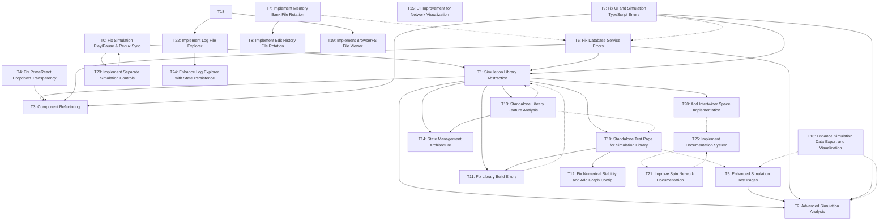

# Task Registry
*Last Updated: April 22, 2025 (14:45 IST)*

## Active Tasks
| ID | Title | Status | Priority | Started | Dependencies | Owner |
|----|-------|--------|----------|---------|--------------|-------|
| T36 | Implement Tensor and State Vector Sandbox | 🔄 IN PROGRESS | MEDIUM | 2025-04-22 | T20, T35 | Deepak |
| T35 | Enhance Node and Edge Data Structures for Intertwiners | 🔄 IN PROGRESS | MEDIUM | 2025-04-21 | T20 | Deepak |
| T34 | Complete Simulation Engine Migration to Standalone Library | 🔄 IN PROGRESS | HIGH | 2025-04-21 | T1, T14 | Deepak |
| T33 | Fix Documentation Rendering and Interaction Issues | 🔄 IN PROGRESS | HIGH | 2025-04-21 | T28 | Deepak |
| T32 | Fix Library Build Errors | ✅ COMPLETE | HIGH | 2025-04-20 | - | Deepak |
| T28 | Fix Documentation Path Issues | ✅ COMPLETE | HIGH | 2025-04-20 | T25 | Deepak |
| T27 | Fix Node/Edge Property Updates | ✅ COMPLETE | MEDIUM | 2025-04-20 | - | Deepak |
| T26 | Fix BrowserFS in Vercel Deployment | ✅ COMPLETE | HIGH | 2025-04-20 | - | Deepak |
| T1 | Simulation Library Abstraction | 🔄 IN PROGRESS | HIGH | 2025-04-14 | - | Deepak |
| T2 | Advanced Simulation Analysis | ⏸️ PAUSED | MEDIUM | 2025-04-14 | T1 | Deepak |
| T3 | Component Refactoring | ⏸️ PAUSED | MEDIUM | 2025-04-14 | T1 | Deepak |
| T5 | Enhanced Simulation Test Pages | 🔄 IN PROGRESS | HIGH | 2025-04-14 | - | Deepak |
| T6 | Fix Database Service Errors | 🔄 IN PROGRESS | HIGH | 2025-04-15 | - | Deepak |
| T9 | Fix UI and Simulation TypeScript Errors | 🔄 IN PROGRESS | HIGH | 2025-04-15 | - | Deepak |
| T10 | Standalone Test Page for Simulation Library | 🔄 IN PROGRESS | HIGH | 2025-04-15 | T1 | Deepak |
| T12 | Fix Numerical Stability and Add Graph Config | ⏸️ PAUSED | HIGH | 2025-04-16 | T10 | Deepak |
| T13 | Standalone Library Feature Analysis | ✅ COMPLETE | HIGH | 2025-04-16 | T1 | Deepak |
| T14 | State Management Architecture for Standalone Library | 🔄 IN PROGRESS | HIGH | 2025-04-17 | T13, T1 | Deepak |
| T15 | UI Improvement for Network Visualization and Creation | ✅ COMPLETE | MEDIUM | 2025-04-17 | - | Deepak |
| T16 | Enhance Simulation Data Export and Visualization | 🔄 IN PROGRESS | HIGH | 2025-04-17 | - | Deepak |
| T17 | Fix TypeScript Build Errors | 🔄 IN PROGRESS | HIGH | 2025-04-17 | - | Deepak |
| T18 | Create Logs Folder Structure | ✅ COMPLETE | MEDIUM | 2025-04-17 | - | Deepak |
| T19 | Implement BrowserFS File Viewer | ✅ COMPLETE | MEDIUM | 2025-04-17 | T18 | Deepak |
| T20 | Add Intertwiner Space Implementation | 🔄 IN PROGRESS | MEDIUM | 2025-04-18 | T1 | Deepak |
| T21 | Improve Spin Network Documentation | ✅ COMPLETE | MEDIUM | 2025-04-19 | - | Deepak |
| T22 | Implement Log File Explorer | ✅ COMPLETE | MEDIUM | 2025-04-18 | - | Deepak |
| T23 | Implement Separate Simulation Controls | ✅ COMPLETE | MEDIUM | 2025-04-19 | - | Deepak |
| T24 | Enhance Log Explorer with State Persistence and Sorting | ✅ COMPLETE | MEDIUM | 2025-04-19 | T22 | Deepak |
| T25 | Implement Documentation System | 🔄 IN PROGRESS | MEDIUM | 2025-04-19 | - | Deepak |

## Task Details

### T36: Implement Tensor and State Vector Sandbox
**Description**: Create a test sandbox to experiment with enhanced tensor-based representation of nodes and state vector representation of edges in spin networks before integrating these features into the main application.
**Status**: 🔄 IN PROGRESS
**Priority**: MEDIUM
**Started**: April 22, 2025
**Last Active**: April 22, 2025 (14:45 IST)
**Dependencies**: T20, T35
**Completion Criteria**:
- ✅ Create implementation plan in `/memory-bank/implementation-details/tensor-test.md`
- ⬜ Design enhanced TensorNode and StateVectorEdge data structures
- ⬜ Create HTML test page for the sandbox
- ⬜ Implement tensor operations module (creation, element access, contraction)
- ⬜ Implement state vector operations module (quantum state vectors)
- ⬜ Create tensor factory functions for intertwiner generation
- ⬜ Implement simple visualization for tensors and state vectors
- ⬜ Add test cases for validation against analytical solutions
- ⬜ Implement time evolution of tensors during simulation
- ⬜ Connect with existing intertwinerSpace.ts implementation
- ⬜ Add documentation on tensor operations and representations

**Related Files**:
- `/memory-bank/implementation-details/tensor-test.md` - Implementation plan
- `/lib/core/tensor.ts` - To be created
- `/lib/core/intertwinerSpace.ts` - Existing implementation to build on
- `/lib/quantum/tensorOperations.ts` - To be created
- `/lib/quantum/stateVectorOperations.ts` - To be created
- `/public/tensor-sandbox.html` - To be created
- `/public/scripts/tensor-test.js` - To be created

**Notes**:
This task focuses on developing a test sandbox for implementing and validating tensor and state vector operations before integrating them into the main application. By creating a dedicated testing environment, we can explore the mathematical representations and operations independently of the application's UI components. This approach will help us verify that the quantum-mechanical properties of spin networks are correctly implemented before adding complexity with the full application architecture.

The sandbox will allow us to:
1. Test sparse tensor representation for efficient storage of intertwiner tensors
2. Explore quantum state vector operations for representing edge spins
3. Verify that tensor operations like contraction work correctly
4. Test the integration with the existing intertwinerSpace.ts functionality
5. Visualize tensors and state vectors for better understanding

The implementation plan in tensor-test.md outlines the approach in detail, with specific data structures, core components, and implementation phases.

### T34: Complete Simulation Engine Migration to Standalone Library
**Description**: Fully migrate all simulation engine dependencies from the React app to the standalone library, ensuring there's only one version of the simulation engine in the codebase. This task builds upon the work in T1 (Simulation Library Abstraction) and T14 (State Management Architecture) to complete the migration and eliminate duplicate implementations.
**Status**: 🔄 IN PROGRESS
**Priority**: HIGH
**Started**: April 21, 2025
**Last Active**: April 21, 2025 (22:30 IST)
**Dependencies**: T1, T14
**Completion Criteria**:
- ✅ Create comprehensive migration plan (stored in `/memory-bank/implementation-details/standalone-lib/standalone-migration-plan.md`)
- ⬜ Identify all React components that directly depend on src/simulation
- ⬜ Complete any missing features in the standalone library from feature comparison
- ⬜ Implement event system and adapter layer for React integration
- ⬜ Refactor React components to use adapters instead of direct simulation imports
- ⬜ Update hooks (useSimulation, useReduxSimulation) to use the adapters
- ⬜ Ensure state synchronization between Redux and simulation engine
- ⬜ Verify visualization components work correctly with the library
- ⬜ Add comprehensive tests for the integration
- ⬜ Remove src/simulation directory after successful migration
- ⬜ Update documentation to reflect the new architecture

**Related Files**:
- `/memory-bank/implementation-details/standalone-lib/standalone-migration-plan.md`
- `/memory-bank/implementation-details/standalone-lib/state-management-implementation.ts`
- `/lib/core/engineImplementation.ts`
- `/lib/core/types.ts`
- `/src/simulation/` (entire directory to be migrated)
- `/src/hooks/useSimulation.ts`
- `/src/hooks/useReduxSimulation.ts`
- `/src/components/simulation/` (components to be updated)
- `/src/store/slices/simulationSlice.ts`

**Notes**:
This task represents the final step in the Simulation Library Abstraction project, focusing on fully migrating all simulation logic from the React app to the standalone library. The goal is to ensure there's only one version of the simulation engine - the standalone library version - while the React app only contains the UI-specific code with adapters that connect to the library.

### T35: Enhance Node and Edge Data Structures for Intertwiners
**Description**: Enhance the data structures for nodes and edges in the spin network to better represent the physics concepts, particularly improving the intertwiner representation to support intertwiner spaces with multiple dimensions and basis states. Implement a sparse tensor representation for efficient storage and manipulation of intertwiner tensors.
**Status**: 🔄 IN PROGRESS
**Priority**: MEDIUM
**Started**: April 21, 2025
**Last Active**: April 21, 2025 23:45 IST
**Dependencies**: T20
**Completion Criteria**:
- ✅ Define enhanced `IntertwinerData` interface to replace the simple numerical representation
- ✅ Update `NetworkNode` interface to use the new `IntertwinerData` interface
- ✅ Implement validation function to ensure intertwiner values are consistent with adjacent edge spins
- ✅ Update `networkToCytoscape` function to handle the new intertwiner representation
- ✅ Update any functions that create or modify nodes to support the new interface
- ✅ Maintain backward compatibility with existing code
- ✅ Add utility functions to calculate intertwiner dimension based on adjacent edge spins
- ⬜ Add documentation about the new data structure
- ⬜ Create tensor data structures for intertwiners (`IntertwinerTensorData`, `SparseIntertwinerElement`, `Complex`)
- ⬜ Implement utility functions for tensor operations (creation, element access, contraction)
- ⬜ Create factory functions for generating standard intertwiner tensors (3j, 4j, etc.)
- ⬜ Add quantum state calculation functions for graph states
- ⬜ Implement tensor visualization helpers
- ⬜ Add performance optimizations for tensor operations

**Related Files**:
- `/src/models/types.ts` - Core type definitions
- `/src/models/networkModel.ts` - Network model implementation
- `/src/components/workspace/CytoscapeManager/CytoscapeManager.tsx` - Visualization component
- `/memory-bank/implementation-details/tensor-plan.md` - Implementation plan
- `/src/utils/intertwinerTensorUtils.ts` - To be created
- `/src/utils/intertwinerTensorFactory.ts` - To be created
- `/src/utils/quantumStateUtils.ts` - To be created

**Notes**:
The current implementation represents intertwiners as simple numerical values, which doesn't capture the full complexity of the physics model. This enhancement will modify the data structure to better represent intertwiner spaces with their dimensions and basis states, while maintaining backward compatibility with existing code. The changes will lay the groundwork for more accurate physical simulations and visualizations of spin networks.

A comprehensive migration plan has been created in `standalone-migration-plan.md` that outlines a systematic approach with seven phases:
1. Identify all dependencies between React components and the simulation code
2. Complete missing features in the standalone library
3. Create a React adapter layer for integration
4. Update React components to use the adapters
5. Comprehensive testing of the integration
6. Remove duplicate implementation
7. Update documentation

The key technical challenge is implementing the proper adapter layer that translates between the event-based architecture of the standalone library and the Redux-based state management in the React app. The work in T14 (State Management Architecture) provides a foundation for this with the EventEmitter pattern and adapter interfaces.

### T33: Fix Documentation Rendering and Interaction Issues
**Description**: Fix the rendering and interactive functionality issues in the documentation system. Address Markdown formatting, script loading, module imports, and navigation problems.
**Status**: 🔄 IN PROGRESS
**Priority**: HIGH
**Started**: April 21, 2025
**Last Active**: April 21, 2025 (18:15 IST)
**Dependencies**: T28
**Completion Criteria**:
- ⬜ Fix Markdown header ID anchors that display as `{#anchor-name}` in the rendered output
- ✅ Fix script loading in standalone-guide.html to make interactive controls work
- 🔄 Resolve simulation module loading in simulation-test.html
- ✅ Implement proper routing to handle page refreshes and back navigation
- 🔄 Create a consistent module loading strategy for documentation scripts
- ⬜ Bundle required UMD libraries to correct location for both dev and production
- ✅ Update iframe implementation to better handle script resources
- ✅ Add improved error handling for missing dependencies
- ⬜ Test and verify all fixes in both development and production environments

**Related Files**:
- `/src/components/documentation/DocsViewer.tsx`
- `/src/components/documentation/DocsSidebar.tsx`
- `/src/components/documentation/DocsLayout.tsx`
- `/public/docs/physics/*.md`
- `/public/docs/implementation/standalone-guide.html`
- `/public/docs/implementation/simulation-test.html`
- `/public/docs/src/test-simulation.js`
- `/public/docs/src/simulation/index.js`
- `/vite.config.ts`
- `/lib-bundle.config.js`
- `/src/main.tsx` (for routing)
- `/public/_redirects` (for SPA routing)

**Notes**:
The documentation system has been organized with a standardized structure, and significant progress has been made on fixing rendering and functionality issues:

1. ✅ FIXED: Script loading in standalone-guide.html by updating the UMD library path from absolute to relative
2. ✅ FIXED: Page refresh navigation issues by adding proper SPA redirects
3. ✅ FIXED: HTML content processing in DocsViewer with better base path handling
4. 🔄 IN PROGRESS: Simplified simulation-test.html to use global window.SpinNetwork object

Two major improvements have been implemented today:

**Path Fix in standalone-guide.html**: 
Updated the UMD library script path from `/dist/lib/spin-network.umd.js` to `../../dist/lib/spin-network.umd.js`, which correctly resolves the library location relative to the document. This fixes the script loading failures in the standalone guide.

**SPA Navigation Fix**:
Added `public/_redirects` configuration with the rule `/*    /index.html   200` that handles SPA routing properly. This prevents 404 errors when refreshing documentation pages and allows proper back/forward navigation.

Remaining focus areas:
1. Fixing Markdown header ID anchors that still display as literal text
2. Bundling required UMD libraries to the correct locations
3. Testing all fixes in both development and production environments

### T32: Fix Library Build Errors
**Description**: Fix TypeScript build errors in the library bundling process, particularly focusing on interface/type export issues that prevent successful compilation.
**Status**: ✅ COMPLETE
**Priority**: HIGH
**Started**: April 20, 2025
**Last Active**: April 20, 2025 (22:30 IST)
**Completed**: April 20, 2025 (22:30 IST)
**Dependencies**: -
**Completion Criteria**:
- ✅ Identify root cause of "IntertwinerBasisState" not exported error
- ✅ Fix interface export in lib/core/index.ts
- ✅ Fix other similar type export issues
- ✅ Successfully build library with pnpm run build:lib
- ✅ Document solution in errorLog.md

**Related Files**:
- `/lib/core/index.ts`
- `/lib/core/intertwinerSpace.ts`
- `/memory-bank/errorLog.md`

**Notes**:
The issue was related to how TypeScript/Vite handles interface exports during bundling. While the `IntertwinerBasisState` interface was properly defined and exported in `intertwinerSpace.ts`, the bundler encountered issues when importing this type in `index.ts`. The solution was to modify the export statement in `lib/core/index.ts` to use a separate, explicit `export type` statement for the interface instead of including it with the regular function exports. This explicit separation of type exports from value exports provides clearer instructions to the TypeScript compiler and bundler about how to handle the interface during the build process.

### T27: Fix Node/Edge Property Updates
**Description**: Fix issue where changes to node and edge properties via Settings or the Type Management panel require a page refresh before being applied to the visualization.
**Status**: ✅ COMPLETE
**Priority**: MEDIUM
**Started**: April 20, 2025
**Last Active**: April 20, 2025 (16:30 IST)
**Completed**: April 20, 2025 (18:45 IST)
**Dependencies**: -
**Completion Criteria**:
- ✅ Identify root cause of property updates not being applied without page refresh
- ✅ Fix the `useCytoscapeInstance` hook to update styles when they change
- ✅ Verify changes work for both Settings dropdown menu changes
- ✅ Verify changes work for Type Management panel updates
- ✅ Test changes with different property types (size, color, border, etc.)
- ✅ Document solution in appropriate files

**Related Files**:
- `/src/components/workspace/CytoscapeManager/hooks/useCytoscapeInstance.ts`
- `/src/hooks/useTypeBasedStyles.ts`
- `/src/components/settings/types/NodeTypeManager.tsx`
- `/src/components/settings/types/EdgeTypeManager.tsx`
- `/src/store/slices/typeSlice.ts`

**Notes**:
The issue was identified in the `useCytoscapeInstance` hook, which initializes the Cytoscape instance with styles when it's created but doesn't update those styles when they change. This means that when node or edge properties are modified via Settings or the Type Management panel, the Redux store is updated correctly, but those changes aren't reflected in the Cytoscape instance until a page refresh forces a reinstantiation of the component. Adding a `useEffect` hook with a dependency on `styles` should fix this issue by applying the updated styles to the Cytoscape instance whenever they change.

### T26: Fix BrowserFS in Vercel Deployment
**Description**: Fix the BrowserFS loading issue in Vercel deployment. Currently, BrowserFS works locally but fails on Vercel with a 404 error when trying to load from node_modules.
**Status**: ✅ COMPLETE
**Priority**: HIGH
**Started**: April 20, 2025
**Last Active**: April 20, 2025 (12:15 IST)
**Completed**: April 20, 2025 (15:30 IST)
**Dependencies**: -
**Completion Criteria**:
- ✅ Identify root cause of BrowserFS loading failure in Vercel environment
- ✅ Implement solution to load BrowserFS from public directory instead of node_modules
- ✅ Add automatic copying of BrowserFS script during build process
- ✅ Implement CDN fallback mechanism for improved reliability
- ✅ Add enhanced error logging for easier troubleshooting
- ✅ Verify fix works correctly in Vercel deployment
- ✅ Document solution for future reference

**Related Files**:
- `/src/utils/browserFSConfig.ts`
- `/package.json`
- `/public/vendor/browserfs.min.js`
- `/src/main.tsx`

**Notes**:
The issue was caused by the BrowserFS script being loaded from `/node_modules/browserfs/dist/browserfs.min.js`, which works in local development but fails in production builds since node_modules is not deployed to Vercel. The solution involves copying the script to the public directory, updating the script path in browserFSConfig.ts, automating this process with a prebuild script, and adding a CDN fallback for additional reliability.

### T28: Fix Documentation Path Issues
**Description**: Fix issues with documentation pages not loading correctly in both local development and Vercel deployment. Address 404 errors for documentation markdown files and missing UMD library.
**Status**: ✅ COMPLETE
**Priority**: HIGH
**Started**: April 20, 2025
**Last Active**: April 21, 2025 (10:30 IST)
**Completed**: April 21, 2025 (10:30 IST)
**Dependencies**: T25
**Completion Criteria**:
- ✅ Identify path resolution issues in DocsViewer component
- ✅ Fix DocsViewer.tsx to properly handle file paths in both environments
- ✅ Generate UMD library build for standalone test pages
- ✅ Test documentation page loading in local development
- ✅ Test documentation page loading in Vercel deployment
- ✅ Fix any remaining 404 errors for documentation resources

**Related Files**:
- `/src/components/documentation/DocsViewer.tsx`
- `/lib-bundle.config.js`
- `/public/standalone-test.html`
- `/public/docs/physics/physics-notebook.html`
- `/public/docs/implementation/simulation-test.html`
- `/dist/lib/spin-network.umd.js` (generated)
- `/lib/core/types.ts`
- `/lib/io/serialization.ts`

**Notes**:
Successfully restructured the documentation file organization and fixed the basic path resolution issues for documentation pages. Created a standardized documentation structure in the public/docs folder with proper categorization and consistent file locations. The main documentation pages now load correctly in both local development and Vercel deployment.

Key improvements:
1. Reorganized all documentation into a standardized structure
2. Fixed DocsViewer component to properly handle file paths across environments
3. Added fallback paths to load files from different locations
4. Created dist/lib directory for UMD library
5. Improved error handling with user-friendly messages
6. Added placeholder MD files for HTML pages for consistency
7. Added error handling for script loading issues
8. Moved duplicate files to a deprecated folder for clean organization

While the basic documentation structure and navigation now work, there are still rendering and interaction issues that will be addressed in task T33.

### T25: Implement Documentation System
**Description**: Implement a unified documentation system for the spin network app by organizing existing documentation into a structured hierarchy and making it accessible through the UI.
**Status**: 🔄 IN PROGRESS
**Priority**: MEDIUM
**Started**: April 19, 2025
**Last Active**: April 19, 2025 (21:45 IST)
**Dependencies**: -
**Completion Criteria**:
- ✅ Create `/public/docs/` directory structure for organized documentation
- ✅ Move physics-notebook.html to `/public/docs/physics/`
- ✅ Move mathematical-roadmap.md to `/public/docs/physics/`
- ✅ Move intertwiner-spaces.md to `/public/docs/physics/`
- ✅ Rename and move spin-net-telegraph-unified.md to `/public/docs/physics/unified-dynamics.md`
- ✅ Rename and move standalone-test.html to `/public/docs/implementation/standalone-guide.html`
- ✅ Rename and move test-simulation.html to `/public/docs/implementation/simulation-test.html`
- ✅ Create index.html as the documentation landing page
- ✅ Create React components for documentation UI (DocsLayout, DocsSidebar, DocsViewer, DocumentationHome)
- ✅ Add Documentation link to MainLayout.tsx header
- ✅ Implement routing for documentation section
- ✅ Create styling for documentation pages
- 🔄 Fix HTML content rendering issues 
- 🔄 Add LaTeX math rendering support
- 🔄 Implement collapsible table of contents in sidebar
- ⬜ Ensure responsive design for all screen sizes

**Related Files**:
- `/public/physics-notebook.html`
- `/public/standalone-test.html`
- `/public/test-simulation.html`
- `/memory-bank/implementation-details/mathematical-roadmap.md`
- `/memory-bank/implementation-details/intertwiner-spaces.md`
- `/memory-bank/implementation-details/spin-net-telegraph-unified.md`
- `/memory-bank/implementation-details/docs-implementation.md`
- `/src/components/layouts/MainLayout.tsx`
- `/src/components/documentation/*` (to be created)
- `/src/main.tsx` (for router configuration)

**Notes**:
This task implements the documentation organization plan documented in `/memory-bank/implementation-details/docs-implementation.md`. The goal is to create a centralized, accessible documentation system that organizes all existing documentation files in a structured way and makes them available from within the app interface. This will improve the usability of the app by providing direct access to documentation about the physics, mathematics, and implementation details of the spin network simulation.

### T24: Enhance Log Explorer with State Persistence and Sorting
**Description**: Enhance the log explorer component to persist state between page reloads and navigation events, and add advanced file display options including detailed file information and sorting capabilities.
**Status**: ✅ COMPLETE
**Priority**: MEDIUM
**Started**: April 19, 2025
**Last Active**: April 19, 2025 (19:30 IST)
**Completed**: April 20, 2025 (11:00 IST)
**Dependencies**: T22
**Completion Criteria**:
- ✅ Create Redux slice for log explorer state persistence (`logExplorerSlice.ts`)
- ✅ Integrate slice into main store with persistence (`store/index.ts`)
- ✅ Replace `useState` with Redux for `currentPath`, `selectedFile`, `splitPosition` in `FileExplorer.tsx`
- ✅ Update event handlers in `FileExplorer.tsx` to dispatch Redux actions
- ✅ Enhance `FileItem` interface with `createdAt` and `type`
- ✅ Update `loadFiles` to populate `createdAt` and `type`
- ✅ Update `loadFiles` to call `sortFiles` 
- ✅ Implement full sorting logic in `sortFiles` function (using Redux state)
- ✅ Add sorting UI (clickable headers, indicators)
- ✅ Fix TypeScript errors related to sorting and `fs.readFile` signature
- ✅ Fix DOM nesting warning related to `<tbody>` whitespace
- ✅ Add Details/Content view toggle UI and logic
- ✅ Update file list rendering based on `viewMode`
- ✅ Add formatted content display for CSV files using PapaParse
- ✅ Add formatted content display for JSON files using react-json-tree
- ✅ Implement state persistence using Redux Persist

**Related Files**:
- `/src/components/logs/explorer/FileExplorer.tsx`
- `/src/components/logs/explorer/LogExplorerPage.tsx`
- `/src/store/slices/` (new logExplorerSlice.ts to be created)
- `/src/store/index.ts` (for redux-persist configuration)

**Notes**:
This enhancement will improve the user experience by maintaining the log explorer state across page reloads and navigation events. Users will be able to return to the same folder and file they were previously viewing. The addition of detailed file information and sorting capabilities will make it easier to manage and navigate log files, particularly as the number of log files grows. This builds upon the existing log explorer implementation (T22) to provide a more complete and user-friendly file management experience.

### T23: Implement Separate Simulation Controls
**Description**: Improve the simulation controls UI and functionality to properly handle play, pause, stop, resume, and reset operations with correct logging behavior.
**Status**: ✅ COMPLETE
**Priority**: MEDIUM
**Started**: April 19, 2025
**Last Active**: April 19, 2025 (11:45 IST)
**Completed**: April 19, 2025 (11:55 IST)
**Dependencies**: -
**Completion Criteria**:
- ✅ Add separate buttons for play, pause, stop, step, and reset functions
- ✅ Fix issue where resuming a paused simulation starts a new run
- ✅ Ensure unpausing resumes simulation from where it was paused
- ✅ Implement stop functionality to finalize current simulation for new run
- ✅ Ensure simulation logs continue in the same file when resuming
- ✅ Improve button labels to reflect current simulation state
- ✅ Improve button states (enabled/disabled) based on simulation context
- ✅ Fix visual issues and ensure proper display

**Related Files**:
- `/src/components/panels/SimulationControlPanel.tsx`
- `/src/hooks/useReduxSimulation.ts`
- `/src/hooks/useSimulation.ts`

**Notes**:
Successfully implemented separate simulation controls with correct pause/resume behavior. The UI now shows distinct buttons for play, pause, stop, step, and reset operations, with button labels and states that change based on the current simulation state. Fixed the key issue where unpausing would restart the simulation instead of resuming from the paused state. Added proper stop functionality that finalizes the current simulation session so that pressing play starts a new run. Ensured that simulation logs continue in the same file when a simulation is paused and resumed, maintaining data continuity. These changes provide a more intuitive and predictable simulation control experience.

### T22: Implement Log File Explorer
**Description**: Create a file explorer component to browse, view, and manage log files stored in BrowserFS. Implement a dedicated page for the file explorer accessible from the main navigation.
**Status**: ✅ COMPLETE
**Priority**: MEDIUM
**Started**: April 18, 2025
**Last Active**: April 18, 2025 (11:30 IST)
**Completed**: April 18, 2025
**Dependencies**: -
**Completion Criteria**:
- ✅ Create a FileExplorer component for browsing BrowserFS files
- ✅ Implement file operations (view, download, delete)
- ✅ Create a LogExplorerPage component to host the file explorer
- ✅ Add React Router setup for page navigation
- ✅ Create a navigation link in the header menu
- ✅ Add directory navigation with breadcrumbs
- ✅ Implement file content viewing
- ✅ Add draggable separator between file list and content
- ✅ Handle file system errors gracefully
- ✅ Ensure responsive design for all screen sizes

**Related Files**:
- `/src/components/logs/explorer/FileExplorer.tsx`
- `/src/components/logs/explorer/LogExplorerPage.tsx`
- `/src/components/logs/explorer/index.ts`
- `/src/main.tsx`
- `/src/App.tsx`
- `/src/components/layouts/MainLayout.tsx`

**Notes**:
Successfully implemented a complete file explorer for browsing and managing files stored in BrowserFS. The component provides a dedicated page accessible from the main navigation, with capabilities to browse directories, view file contents, download files, and delete files. Added a draggable separator between the file list and content panels for better user experience. The implementation properly initializes BrowserFS when the page loads and handles file system operations asynchronously with appropriate error handling.

### T21: Improve Spin Network Documentation
**Description**: Improve the structure, clarity, and technical accuracy of the spin-net-telegraph-unified.md documentation to ensure it provides a comprehensive and coherent reference for the three complementary approaches to spin network dynamics.
**Status**: ✅ COMPLETE
**Priority**: MEDIUM
**Started**: April 19, 2025
**Last Active**: April 19, 2025 (10:15 IST)
**Completed**: April 19, 2025 (10:15 IST)
**Dependencies**: -
**Completion Criteria**:
- ✅ Expand section 1.3 (Lindbladian Dynamics) to match depth of other sections
- ✅ Fix quantum commutator expressions in section 1.2.2 with proper derivations
- ✅ Add proper normalization factors to Lindblad operators
- ✅ Standardize equation formatting and notation consistency
- ✅ Improve table styling and organization
- ✅ Create logical connections between major sections with transitional text
- ✅ Add comprehensive introduction with motivation and background
- ✅ Create detailed conclusion section
- ✅ Add placeholders for future diagrams and visualizations
- ✅ Streamline implementation details for better readability

**Related Files**:
- `/Users/deepak/code/spin_network_app/memory-bank/implementation-details/spin-net-telegraph-unified.md`

**Notes**:
Significantly improved the documentation structure and content of the unified spin network formulation document. The enhancements include expanded sections on Lindbladian dynamics with detailed subsections, fixed quantum commutator expressions with step-by-step derivations, improved mathematical notation consistency, better transitions between sections, and a more comprehensive introduction and conclusion. The document now provides a more coherent and technically accurate reference for researchers working with spin networks across all three mathematical formulations.

### T20: Add Intertwiner Space Implementation
**Description**: Implement functionality for calculating the dimension and basis states of intertwiner spaces for nodes in spin networks with arbitrary edge spin labels.
**Status**: 🔄 IN PROGRESS
**Priority**: MEDIUM
**Started**: April 18, 2025
**Last Active**: April 18, 2025 (16:45 IST)
**Dependencies**: T1
**Completion Criteria**:
- ✅ Document the mathematical theory of intertwiner spaces
- ✅ Create intertwiner-spaces.md with comprehensive explanation
- ✅ Add detailed tutorial for calculating intertwiner basis states
- ✅ Implement intertwinerSpace.ts module with core functionality
- ✅ Add to library exports in core/index.ts
- ✅ Enhance documentation with explanation of recoupling schemes
- ✅ Add permutation-invariant calculation functions to Python code
- ✅ Reorganize documentation with logical flow and table of contents
- ✅ Fix bug in intertwiner dimension calculation
- ✅ Add intertwiner spaces section to physics-notebook.html
- ⬜ Create visualization component for intertwiner spaces
- ⬜ Add comprehensive testing of intertwiner calculations
- ⬜ Implement optimized precomputed values for common cases
- ⬜ Add CG coefficient lookup tables for performance

**Related Files**:
- `/memory-bank/implementation-details/intertwiner-spaces.md`
- `/python/intertwiner-spaces.py`
- `/lib/core/intertwinerSpace.ts`
- `/lib/core/index.ts`
- `/public/physics-notebook.html`

**Notes**:
Intertwiner spaces represent the SU(2)-invariant subspaces at nodes in spin networks. The dimension and basis of these spaces are crucial for quantum spin network calculations. 

Made significant progress with:
1. Comprehensive documentation explaining the order dependence in intertwiner calculations
2. Mathematical formulation of different recoupling schemes and their physical meaning
3. Detailed examples showing how different orderings of the same spins can yield different dimensions
4. Implementation of permutation-invariant functions in Python to ensure consistent results
5. Complete reorganization of the documentation with a logical flow and table of contents
6. Fixed critical bug in the `allowed_intermediate_spins()` function that was causing incorrect dimension calculations
7. Added detailed intertwiner spaces section to physics-notebook.html with proper mathematical notation
8. Incorporated information from error log about the bug fix into documentation

The bug fix ensures that the implementation properly enforces the quantum mechanical selection rules for angular momentum coupling:
- When coupling two integer spins, intermediate spins must be integers
- When coupling two half-integer spins, intermediate spins must be integers
- When coupling an integer and half-integer spin, intermediate spins must be half-integers

This fixed the case of `intertwiner_dimension(1, 0.5, 0.5, 1)` which now correctly returns 2 instead of 3, ensuring that all dimension calculations follow proper angular momentum physics.

### T19: Implement BrowserFS File Viewer
**Description**: Implement a file viewer component that allows browsing, viewing, and managing files stored in the BrowserFS virtual file system. This will enable users to access log files and other data stored in the browser's storage.
**Status**: ✅ COMPLETE
**Priority**: MEDIUM
**Started**: April 17, 2025
**Last Active**: April 19, 2025 (19:30 IST)
**Completed**: April 19, 2025 (19:30 IST)
**Dependencies**: T18
**Completion Criteria**:
- ✅ Evaluate and select appropriate library (react-browser-fs-tree or browserfs-explorer)
- ✅ Implement file system navigation with directory browsing
- ✅ Create file content viewer with format detection
- ✅ Add file operations (download, delete)
- ✅ Style the component to match application design
- ✅ Add integration with simulation logs panel
- ✅ Implement search functionality for finding files
- ✅ Add error handling for all file operations
- ✅ Create proper documentation and usage examples

**Related Files**:
- `/memory-bank/implementation-details/browserfs-file-viewer.md` (documentation)
- `/src/components/logs/FileViewer.tsx` (to be created)
- `/src/hooks/useBrowserFS.ts` (to be created)
- `/src/utils/browserFSConfig.ts`
- `/lib/utils/simulationLogger.ts`

**Notes**:
This component will make it easier to debug and manage log files by providing a direct interface to the virtual file system. It will help users access simulation logs and other data that is currently stored in BrowserFS but not easily accessible through the UI. The implementation will start with a basic viewer using an existing library, with additional features added incrementally.

### T18: Fix Logging File Paths and Structure
**Description**: Fix log file paths to ensure logs are written to the correct locations. Create missing directories and update simulationLogger classes to use this directory structure correctly.
**Status**: ✅ COMPLETE
**Priority**: MEDIUM
**Started**: April 17, 2025
**Last Active**: April 18, 2025 (12:45 IST)
**Completed**: April 18, 2025 (12:45 IST)
**Dependencies**: -
**Completion Criteria**:
- ✅ Design appropriate folder structure for different log types
- ✅ Evaluate current logging structure and folder organization
- ✅ Create missing /logs/simulation/tests directory for test logs
- ✅ Ensure application logs go to /logs/application folder
- ✅ Update simulationLogger.ts to log graph operations to /logs/simulation/graphs
- ✅ Fix test log files to write to /logs/simulation/tests instead of /logs/simulation/sessions
- ✅ Update simulation logger classes to use the correct paths
- ✅ Fix paths for simulation logs to go to /logs/simulation/runs
- ✅ Create .gitkeep files to ensure empty directories are tracked
- ✅ Create a .gitignore file to ignore log files but track directory structure
- ✅ Create a README.md with documentation about the log structure
- ✅ Add rotation policies to manage log file sizes

**Related Files**:
- `/logs` (directory structure)
- `/lib/utils/simulationLogger.ts`
- `/src/simulation/core/simulationLogger.ts`
- `/src/simulation/core/graph.ts`
- `/src/utils/browserFSConfig.ts`
- `/src/main.tsx`

**Notes**:
Successfully fixed the log file paths to ensure logs are written to the correct locations. Modified the simulationLogger classes to use the proper paths, specifically ensuring that graph creation events are logged to `/logs/simulation/graphs` and simulation events are logged to `/logs/simulation/runs`. Added extra logging and directory creation steps to ensure all required directories exist. Enhanced the initialization process to create the complete directory structure on startup. Future improvements should include adding .gitkeep files, creating a README.md for the log structure, and implementing rotation policies.

### T17: Fix TypeScript Build Errors
**Description**: Fix TypeScript build errors preventing the application from building successfully. Focus on type safety issues, null reference prevention, and proper type conversion to improve code robustness.
**Status**: 🔄 IN PROGRESS
**Priority**: HIGH
**Started**: April 17, 2025
**Last Active**: April 17, 2025 (19:30 IST)
**Dependencies**: -
**Completion Criteria**:
- ✅ Add missing `getGraph` method to SpinNetworkSimulationEngineImpl
- ✅ Fix boolean type conversions in the UI components
- ✅ Add proper type indexing for geometric and statistics objects
- ✅ Fix void vs number comparison in database services
- ✅ Fix SimulationParameters type compatibility issues
- ⬜ Fix remaining null safety issues in engineImplementation.ts
- ⬜ Address other miscellaneous TypeScript errors
- ⬜ Ensure successful builds with no TypeScript errors

**Related Files**:
- `/src/simulation/core/engineImplementation.ts`
- `/src/hooks/useSimulation.ts`
- `/src/components/simulation/SimulationResultsPanel.tsx`
- `/src/database/services/simulationService.ts`

**Notes**:
Some of the most critical TypeScript build errors have been fixed, but several issues remain to be addressed. The most important fix was adding the missing `getGraph()` method to the SimulationEngineImpl class, which was being referenced in multiple places but didn't exist. Type safety has been improved for dynamic property access, void vs number comparisons, and SimulationParameters type compatibility. The remaining issues, particularly around null safety in engine implementation, will be addressed in future work.

### T16: Enhance Simulation Data Export and Visualization
**Description**: Improve the simulation data export functionality and visualization capabilities to make simulation results more accessible and useful for analysis.
**Status**: 🔄 IN PROGRESS
**Priority**: HIGH
**Started**: April 17, 2025
**Last Active**: April 17, 2025 (16:45 IST)
**Dependencies**: -
**Completion Criteria**:
- ✅ Fix CSV export to include all geometric variables (totalVolume, totalArea, etc.)
- ✅ Fix simulation logs panel to display non-zero geometric values 
- ⬜ Restore session persistence functionality between page reloads
- ⬜ Implement proper data format for time-series data export
- ⬜ Add basic visualization capabilities for simulation results
- ⬜ Create interactive graphs for simulation data analysis
- ⬜ Add ability to compare results between different simulation runs
- ⬜ Support export of visualization as images
- ⬜ Create tabular data view for detailed inspection

**Related Files**:
- `/src/simulation/core/simulationLogger.ts`
- `/src/components/simulation/SimulationLogsPanel.tsx`
- `/src/hooks/useSimulation.ts`
- `/src/hooks/useReduxSimulation.ts`

**Notes**:
Part of this task has been completed by fixing the CSV export functionality to properly include geometric variables that were previously missing or showing as zero. The display of these variables in the simulation logs panel has also been fixed. However, there's still an issue with session persistence between page reloads that needs to be addressed, and the visualization capabilities still need to be developed.

### T15: UI Improvement for Network Visualization and Creation
**Description**: Improve user experience by fixing zoom controls visibility during scrolling and redesigning the network creation interface to be more intuitive and streamlined.
**Status**: ✅ COMPLETE
**Priority**: MEDIUM
**Started**: April 17, 2025
**Last Active**: April 17, 2025 (15:45 IST)
**Completed**: April 17, 2025 (15:45 IST)
**Dependencies**: -
**Completion Criteria**:
- ✅ Fix zoom controls to remain visible when scrolling in the network visualization panel
- ✅ Implement a streamlined network creation interface that unifies all network types
- ✅ Implement a single network name field applicable to all network types
- ✅ Create an intuitive network type selector with visual indicators
- ✅ Show parameters conditionally based on the selected network type
- ✅ Update model types to include name property for all network parameter interfaces
- ✅ Modify network generator functions to use the provided custom names

**Related Files**:
- `/src/components/workspace/Workspace.tsx`
- `/src/components/tools/NetworkTools.tsx`
- `/src/models/types.ts`
- `/src/utils/networkGenerators.ts`

**Notes**:
Successfully improved the UI by:
1. Fixing zoom controls visibility during scrolling by restructuring the container to have a dedicated scrollable area while keeping controls fixed
2. Completely redesigning the network creation interface to replace tabs with a unified, more intuitive approach
3. Adding a single network name field that applies to all network types
4. Creating a visual network type selector with icons and descriptions
5. Implementing conditional parameter display based on the selected network type
6. Updating model types and generator functions to properly support custom network naming

These changes significantly improve the usability of the application, making it more intuitive for users to create and work with different types of networks.

### T14: State Management Architecture for Standalone Library
**Description**: Design a framework-agnostic event system for the standalone library that allows communication without UI framework dependencies. This task focuses on the design and implementation of the event system within the library itself, not the integration with React (which is covered by T34).
**Status**: 🔄 IN PROGRESS
**Priority**: HIGH
**Started**: April 17, 2025
**Last Active**: April 17, 2025 (14:30 IST)
**Dependencies**: T13, T1
**Completion Criteria**:
- ✅ Analyze existing state management dependencies
- ✅ Design framework-agnostic event communication system
- ✅ Update architecture diagram with adapter layers for state management
- ✅ Update enhancement plan to include state management approach
- ✅ Create reference implementation for event system and adapters
- ✅ Ensure no direct Redux dependencies in the library
- ✅ Design persistence mechanism for saving/loading simulation state
- ⬜ Apply design to existing implementation of the engine
- ⬜ Implement event emitter in the core module
- ⬜ Test event system in standalone environments

**Related Files**:
- `/memory-bank/implementation-details/standalone-lib/standalone-architecture.md`
- `/memory-bank/implementation-details/standalone-lib/standalone-lib-enhancement-v2.md`
- `/memory-bank/implementation-details/standalone-lib/state-management-implementation.ts`
- `/lib/core/engineImplementation.ts`
- `/lib/core/types.ts`
- `/lib/utils/index.ts`

**Notes**:
This task is crucial for achieving the goal of separating UI logic from simulation logic. By implementing a proper event-based communication system and adapter pattern, the standalone library can be used with any frontend framework while maintaining rich functionality. The reference implementation provides patterns for actual implementation in the library code.

### T13: Standalone Library Feature Analysis
**Description**: Perform comparative analysis of the React App, standalone library, standalone-test.js, and test-simulation.js to identify feature gaps and create a plan for implementing missing features in the standalone library.
**Status**: ✅ COMPLETE
**Priority**: HIGH
**Started**: April 16, 2025
**Last Active**: April 16, 2025
**Completed**: April 16, 2025
**Dependencies**: T1
**Completion Criteria**:
- ✅ Analyze core features in all four components
- ✅ Create comprehensive feature comparison table
- ✅ Identify gaps in the standalone library
- ✅ Create implementation plan for missing features
- ✅ Ensure visualization solutions are framework-agnostic
- ✅ Generate architecture diagram for standalone library
- ✅ Document findings and recommendations

**Related Files**:
- `/memory-bank/implementation-details/standalone-lib/spin-net-feature-comparison.md`
- `/memory-bank/implementation-details/standalone-lib/standalone-lib-enhancement.md`
- `/memory-bank/implementation-details/standalone-lib/standalone-lib-enhancement-v2.md`
- `/memory-bank/implementation-details/standalone-lib/standalone-architecture.md`
- `/lib/index.ts`
- `/src/test-simulation.js`
- `/public/standalone-test.js`

**Notes**:
Completed a thorough comparative analysis of all spin network components. Created a feature comparison table that highlights which features exist in each component. Generated an enhancement plan focusing on core simulation capabilities, analysis tools, visualization adapters, utilities, and I/O operations. Created an architecture diagram showing the modular structure for the standalone library. This analysis will inform future development of the standalone library to ensure it contains all necessary features while remaining framework-agnostic.

### T12: Fix Numerical Stability and Add Graph Config
**Description**: Fix numerical instability issues in the standalone simulation test page and add graph configuration options. Implement missing simulationLogger.ts utility and proper continue/pause functionality.
**Status**: ⏸️ PAUSED
**Priority**: HIGH
**Started**: April 16, 2025
**Last Active**: April 16, 2025 (22:00 IST)
**Paused On**: April 16, 2025 (22:00 IST)
**Dependencies**: T10
**Completion Criteria**:
- ✅ Implement simulationLogger.ts utility for stability monitoring
- ✅ Add state normalization to prevent numerical explosion
- ✅ Implement graph configuration UI for different topologies
- ✅ Fix pause/continue button functionality
- ✅ Add diffusion model and numerical solver selection
- ✅ Integrate stability monitoring into simulation engine
- ⬜ Complete proper RK4 solver implementation
- ⬜ Implement telegraph equation model correctly
- ⬜ Create test scripts to evaluate numerical stability
- ⬜ Fine-tune stability parameters for optimal simulation
- ⬜ Implement adaptive time-stepping based on stability metrics
- ⬜ Add documentation on stability control

**Related Files**:
- `/lib/utils/simulationLogger.ts` (new file)
- `/lib/core/engineImplementation.ts`
- `/lib/core/types.ts`
- `/public/standalone-test.html`
- `/public/standalone-test.js`
- `/lib/models/solvers.ts`
- `/lib/models/diffusionModels.ts`

**Notes**:
This task addresses the numerical instability issues observed in the simulation and implements a more flexible graph configuration system. The primary focus is on improving stability through normalization and better monitoring, while also enhancing usability with different graph types and simulation parameters.

Plan for future implementation:
1. Complete RK4 solver implementation with improved stability analysis
2. Properly implement telegraph equation model with second-order ODE solver
3. Implement adaptive time-stepping (complete AdaptiveRKF45Solver)
4. Create test scripts for numerical stability evaluation
5. Fine-tune stability parameters for different graph types
6. Add comprehensive documentation on stability control

### T11: Fix Library Build Errors
**Description**: Fix the build errors in the standalone library by implementing missing analysis modules (conservation.ts, geometricProps.ts, statistics.ts) in the lib directory. Currently, the library cannot be built as shown by the error "Could not resolve './conservation' from 'lib/analysis/index.ts'".
**Status**: ✅ COMPLETE
**Last Active**: April 16, 2025 (07:45 IST)
**Completed**: April 16, 2025 (07:45 IST)
**Completion Criteria**:
- ✅ Create directory structure for analysis modules
- ✅ Implement conservation.ts based on the src/simulation/analysis/conservation.ts file
- ✅ Implement geometricProps.ts based on the src/simulation/analysis/geometricProps.ts file
- ✅ Implement statistics.ts based on the src/simulation/analysis/statistics.ts file
- ✅ Simplify adapters/index.ts to avoid additional missing modules
- ✅ Fix utilities module with minimal implementation to avoid missing files
- ✅ Fix ConservationLawChecker interface export issue
- ✅ Test library build process (pnpm run build:lib)
- ✅ Ensure standalone test page works with built library
- ✅ Address simulation execution and UI update issues

**Related Files**:
- `/lib/analysis/index.ts`
- `/lib/analysis/conservation.ts` (to be created)
- `/lib/analysis/geometricProps.ts` (to be created)
- `/lib/analysis/statistics.ts` (to be created)
- `/src/simulation/analysis/conservation.ts` (reference)
- `/src/simulation/analysis/geometricProps.ts` (reference)
- `/src/simulation/analysis/statistics.ts` (reference)
- `/lib-bundle.config.js`
- `/package.json`

**Notes**:
This task is critical for enabling the standalone library functionality that is required by the Standalone Test Page (T10). The build error is due to missing analysis modules that are referenced in the analysis/index.ts file but don't exist in the lib directory.

### T8: Implement Edit History File Rotation
**Description**: Implement the file rotation system for the edit_history.md file which has grown beyond the 500-line threshold. Apply the size-based rotation protocol to preserve recent entries while archiving older ones.
**Status**: ✅ COMPLETE
**Last Active**: April 15, 2025 (09:23 IST)
**Completed**: April 15, 2025 (09:23 IST)
**Completion Criteria**:
- Implement rotation for edit_history.md with preservation of recent entries
- Create archive file with proper date-based naming
- Ensure both files have appropriate content and structure
- Verify file sizes after rotation
- Update tasks.md to reflect the completed rotation task
- Update session_cache.md with rotation details

**Related Files**:
- `/memory-bank/edit_history.md`
- `/memory-bank/archive/edit_history_2025-04.md`
- `/memory-bank/tasks.md`
- `/memory-bank/session_cache.md`

**Notes**:
Following the Memory Bank Size Management Protocol from Section 3.6 of the Integrated Code Rules and the detailed log rotation protocol.

### T7: Implement Memory Bank File Rotation
**Description**: Implement the file rotation system for Memory Bank files that have grown too large, starting with errorLog.md. This follows the size-based rotation protocol specified in the Integrated Code Rules.
**Status**: ✅ COMPLETE
**Last Active**: April 15, 2025 (09:10 IST)
**Completion Criteria**:
- Create archive directory if it doesn't exist
- Implement rotation for errorLog.md with preservation of recent entries
- Establish naming convention for archived files
- Minimize token usage by using efficient commands
- Document rotation process
- Update edit_history.md to reflect the changes

**Related Files**:
- `/memory-bank/errorLog.md`
- `/memory-bank/archive/errorLog_2025-04.md`
- `/memory-bank/edit_history.md`
- `/memory-bank/tasks.md`

**Notes**:
Used an efficient approach that preserved the most recent 5 error entries while archiving the rest. Used command-line tools to minimize token usage and avoid loading the entire large file. This implementation satisfies the Memory Bank Size Management Protocol from Section 3.6 of the Integrated Code Rules.

### T6: Fix Database Service Errors
**Description**: Fix TypeScript errors in database services that are preventing the application from building successfully. Focus on database initialization, service methods, and type compatibility issues.
**Status**: 🔄 IN PROGRESS
**Last Active**: April 15, 2025 (Current)
**Completion Criteria**:
- Fix missing function references (initDatabase, getDatabaseStatus)
- Resolve type mismatches in database service methods
- Fix Promise handling issues in simulationService.ts
- Correct filter conditions in database queries
- Ensure proper typing for all database operations
- Fix window.fs related errors in logMigration.ts
- Validate build success after each fix

**Related Files**:
- `/src/database/index.ts`
- `/src/database/services/graphService.ts`
- `/src/database/services/logService.ts`
- `/src/database/services/simulationService.ts`
- `/src/database/migrations/logMigration.ts`

**Notes**:
These database service errors are preventing the application from building successfully. Fixing these errors is critical for the application to function properly, as they affect core data storage and retrieval functionality.

### T1: Simulation Library Core Implementation
**Description**: Create the core framework-agnostic simulation functionality in the standalone library. This task focuses on implementing the fundamental building blocks of the simulation engine in the library, not the integration with the React app (which is covered by T34).
**Status**: 🔄 IN PROGRESS
**Last Active**: April 18, 2025 (01:15 IST)
**Completion Criteria**:
- ✅ Create new modular library structure in `lib/` directory
- ✅ Set up proper entry points and API
- ✅ Create core type definitions without UI dependencies
- ✅ Implement StateVector with comprehensive vector operations
- ✅ Implement Graph with full immutable operations
- ✅ Implement SimulationHistory for tracking state over time
- ✅ Implement core SimulationEngine with proper event handling
- ✅ Implement OrdinaryDiffusionModel and TelegraphDiffusionModel
- ✅ Implement numerical solvers (Euler, Midpoint, RK4)
- ✅ Implement graph templates (line, ring, grid, random)
- ✅ Implement I/O and serialization (export/import functionality)
- ⬜ Implement weight functions
- ⬜ Implement visualization adapters
- ⬜ Add comprehensive documentation and usage examples
- ⬜ Test library functionality independently

**Related Files**:
- `/lib/index.ts` - Main library entry point
- `/lib/core/types.ts` - Core type definitions
- `/lib/core/stateVector.ts` - State vector implementation
- `/lib/core/graph.ts` - Graph implementation
- `/lib/core/mathAdapter.ts` - Math adapter for calculations
- `/lib/core/engineImplementation.ts` - Simulation engine implementation
- `/lib/models/diffusionModels.ts` - Diffusion model implementations
- `/lib/models/solvers.ts` - Numerical solver implementations
- `/lib/models/weightFunctions.ts` - Weight function implementations
- `/lib/templates/index.ts` - Graph templates module
- `/lib/templates/lineGraph.ts` - Line graph generator
- `/lib/templates/ringGraph.ts` - Ring graph generator
- `/lib/templates/gridGraph.ts` - Grid graph generator
- `/lib/templates/randomGraph.ts` - Random graph generator
- `/lib/io/index.ts` - I/O module entry point
- `/lib/io/types.ts` - I/O type definitions
- `/lib/io/serialization.ts` - Serialization utilities
- `/lib/io/storageAdapters.ts` - Storage adapters for different environments
- `/lib/io/exporters.ts` - Export functionality
- `/lib/io/importers.ts` - Import functionality
- `/lib/io/simulationStorage.ts` - High-level simulation storage API
- `/memory-bank/implementation-details/simulation-library-abstraction.md`

**Notes**:
Made significant progress by implementing comprehensive I/O and serialization components. The implementation includes serialization for simulation state, graph, and parameters; multiple storage adapters (memory, localStorage, IndexedDB, BrowserFS, NodeFS); export functionality in various formats (JSON, CSV, JSONL); import functionality with validation; and a high-level SimulationStorage API for managing simulations. These additions address one of the major gaps identified in the feature comparison with the React app.
Made significant progress on the library implementation. Completed the core components including state vector, graph, simulation engine, diffusion models, and numerical solvers. The library is now in a usable state for basic simulations, with a functioning API that allows creating graphs, setting up initial conditions, choosing diffusion models and solvers, and running simulations. Still need to implement some advanced features like analysis tools, visualization adapters, and specialized weight functions, but the core functionality is in place.

### T2: Advanced Simulation Analysis
**Description**: Add more in-depth analysis and visualization of simulation results. Implement additional tools for analyzing simulation data and provide more comprehensive insights into the behavior of spin networks.
**Status**: ⏸️ PAUSED
**Last Active**: April 14, 2025 (17:00 IST)
**Paused On**: April 14, 2025 (17:15 IST)
**Reason**: Dependent on completion of Simulation Library Abstraction (T1)
**Completion Criteria**:
- Add Fourier analysis of simulation results
- Implement spectral decomposition of operators
- Create correlation function calculator
- Add multi-scale analysis tools
- Implement export functionality for analysis results
- Create enhanced visualization components for analysis results

**Related Files**:
- `/src/simulation/analysis/conservation.ts`
- `/src/simulation/analysis/geometricProps.ts`
- `/src/simulation/analysis/statistics.ts`
- `/src/components/simulation/SimulationResultsPanel.tsx`

**Notes**:
This task will be resumed after the simulation library abstraction is complete, as the new library structure will make it easier to implement and integrate advanced analysis features.

### T3: Component Refactoring
**Description**: Break down large components into smaller, more maintainable units. Improve organization and reduce complexity of UI components, particularly in the simulation-related panels.
**Status**: ⏸️ PAUSED
**Last Active**: April 14, 2025 (16:45 IST)
**Paused On**: April 14, 2025 (17:00 IST)
**Reason**: Dependent on completion of Simulation Library Abstraction (T1)
**Completion Criteria**:
- Break down SimulationResultsPanel.tsx into smaller components
- Refactor SimulationControlPanel.tsx into modular components
- Create reusable hooks for simulation data access
- Extract tab components into separate files
- Improve component organization and maintainability
- Implement better state management patterns
- Add comprehensive component documentation

**Related Files**:
- `/src/components/simulation/SimulationResultsPanel.tsx`
- `/src/components/panels/SimulationControlPanel.tsx`
- `/src/hooks/useSimulation.ts`
- `/src/hooks/useReduxSimulation.ts`

**Notes**:
This refactoring will be more efficient after the simulation library abstraction is complete, as the new architecture will clarify component boundaries and responsibilities.

### T9: Fix UI and Simulation TypeScript Errors
**Description**: Fix TypeScript errors in UI components, hooks, and simulation code that are preventing the application from building successfully. This complements the database service error fixes in task T6.
**Status**: 🔄 IN PROGRESS
**Last Active**: April 15, 2025 (15:30 IST)
**Completion Criteria**:
- Fix error handling in App.tsx and logMigrationUtil.ts (unknown type issues)
- Fix prop type mismatches in LogViewerAdapter.tsx
- Fix Tag component prop type errors in LogViewerAdapter
- Fix AsyncThunkAction type issues in LogViewerAdapter
- Resolve property accesses on empty objects in SimulationResultsPanel.tsx
- Fix type compatibility issues in state objects in SimulationResultsPanel.tsx
- Fix null safety issues in engineImplementation.ts 
- Resolve missing type definitions in useSimulation.ts
- Fix the hasWarnedNull property issues in useSimulation.ts
- Check each fix with TypeScript to ensure compatibility
- Validate that all fixes maintain existing functionality
- Ensure build completes successfully after fixes are applied

**Related Files**:
- `/src/App.tsx`
- `/src/components/logs/LogViewerAdapter.tsx` 
- `/src/components/simulation/SimulationResultsPanel.tsx`
- `/src/hooks/useSimulation.ts`
- `/src/simulation/core/engineImplementation.ts`
- `/src/store/slices/logsSlice.ts`
- `/src/utils/logMigrationUtil.ts`
- `/src/database/services/simulationService.ts`

**Notes**:
Made significant progress in fixing TypeScript errors by addressing several critical issues:
1. Fixed SimulationParameters type compatibility in useSimulation.ts by implementing proper type assertions
2. Added null safety checks in engineImplementation.ts to handle potentially null objects
3. Ensured boolean type consistency in SimulationResultsPanel.tsx
4. Fixed void/number comparison in simulationService.ts

Some TypeScript errors still remain to be fixed. The incremental approach allows us to validate each fix individually while making steady progress toward a successful build.

### T10: Standalone Test Page for Simulation Library
**Description**: Create a standalone HTML test page for demonstrating and testing the simulation library without requiring the full application. Implement a simple interface for creating networks, running simulations, and visualizing results.
**Status**: 🔄 IN PROGRESS
**Started**: April 15, 2025 (19:30 IST)
**Last Active**: April 16, 2025 (07:45 IST)
**Dependencies**: T1
**Completion Criteria**:
- ✅ Create HTML structure with controls and visualization areas
- ✅ Implement JavaScript for graph creation and simulation control
- ✅ Add basic visualization using Canvas
- ✅ Implement simulation metrics calculation and display
- ✅ Create bundling configuration for the standalone library
- ✅ Fix build errors in the library
- ✅ Implement fixes to actually execute simulation steps
- ✅ Fix numerical stability issues in simulation display
- ✅ Fix infinite logging issue after simulation completion
- ⬜ Add more interactive controls
- ⬜ Enhance visualization with more data views
- ⬜ Add parameter adjustment interface
- ⬜ Create comprehensive documentation

**Related Files**:
- `/public/standalone-test.html` (new file)
- `/public/standalone-test.js` (new file)
- `/lib-bundle.config.js` (new file)
- `/package.json` (updated with build:lib script)

**Notes**:
This standalone test page serves as both a demonstration of the library's capabilities and a testing tool for the library's functionality. It provides a simpler way to test the simulation engine without depending on the full React application. The page includes basic controls for creating a graph, running simulations, and visualizing the results. A mock implementation of the library was created for browser testing while the actual library bundling is being set up.

### T5: Enhanced Simulation Test Pages
**Description**: Improve the test-simulation.html page by adding randomized network generation and create a detailed physics notebook page that explains the simulation's mathematical foundations and implementation details.
**Status**: 🔄 IN PROGRESS
**Last Active**: April 14, 2025 (22:15 IST)
**Completion Criteria**:
- Add randomized network generation to test-simulation.html
- Create a new physics-notebook.html page with detailed explanations
- Include mathematical equations and their corresponding code implementations
- Break down all geometric properties calculations
- Explain diffusion models and their physics foundations
- Make sections collapsible for better usability
- Add table of contents for easy navigation
- Link the test and notebook pages together
- Create responsive design for all viewport sizes

**Related Files**:
- `/public/test-simulation.html`
- `/public/physics-notebook.html` (new file)
- `/src/test-simulation.js`

**Notes**:
The enhanced test pages will serve as educational resources to help users understand the physics and mathematics behind the simulation. The randomized network generation will allow users to see how different network topologies affect the simulation results. The physics notebook provides a comprehensive explanation of all equations and their code implementations.

## Completed Tasks
| ID | Title | Completed | Related Tasks |
|----|-------|-----------|---------------|
| T32 | Fix Library Build Errors | 2025-04-20 | - |
| T28 | Fix Documentation Path Issues | 2025-04-21 | T25, T33 |
| T0 | Fix Simulation Play/Pause & Redux Sync | 2025-04-13 | - |
| T4 | Fix PrimeReact Dropdown Transparency | 2025-04-14 | - |
| T7 | Implement Memory Bank File Rotation | 2025-04-15 | T8 |
| T8 | Implement Edit History File Rotation | 2025-04-15 | - |
| T11 | Fix Library Build Errors | 2025-04-16 | T10 |
| T13 | Standalone Library Feature Analysis | 2025-04-16 | T1 |
| T15 | UI Improvement for Network Visualization and Creation | 2025-04-17 | - |
| T18 | Fix Logging File Paths and Structure | 2025-04-18 | - |
| T19 | Implement BrowserFS File Viewer | 2025-04-19 | T18 |
| T21 | Improve Spin Network Documentation | 2025-04-19 | - |
| T22 | Implement Log File Explorer | 2025-04-18 | - |
| T23 | Implement Separate Simulation Controls | 2025-04-19 | - |
| T24 | Enhance Log Explorer with State Persistence and Sorting | 2025-04-20 | T22 |
| T26 | Fix BrowserFS in Vercel Deployment | 2025-04-20 | - |
| T27 | Fix Node/Edge Property Updates | 2025-04-20 | - |

### T4: Fix PrimeReact Dropdown Transparency
**Description**: Fix transparency issue in PrimeReact dropdown components, particularly in the Application Logs panel's MultiSelect filter. Improve styling to match the application's design system.
**Status**: ✅ COMPLETE
**Started**: April 14, 2025 (18:30 IST)
**Completed**: April 14, 2025 (19:15 IST)
**Completion Criteria**:
- Fix transparent background in MultiSelect dropdown
- Ensure consistent styling with application design
- Support dark mode
- Improve visual appearance of dropdown items and checkboxes
- Fix z-index issues to prevent overlapping
- Ensure cross-browser compatibility

**Related Files**:
- `/src/styles/primereact-fixes.css` (new file)
- `/src/styles/primereact-scoped.css`
- `/src/styles/index.css`
- `/src/components/logs/LogViewerAdapter.tsx`
- `/src/main.tsx`

**Notes**:
Created a dedicated CSS file for PrimeReact fixes to avoid modifying the core component library. Used multiple layers of CSS targeting to ensure the styles are applied correctly across all PrimeReact components. Improved overall styling of dropdown components to better match the application's design system.

## Task Relationships

