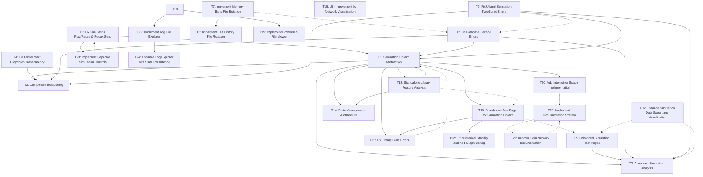

# Task: T4
*Created: *
*Last Updated: 2025-04-22 00:16:04*

## Task Information
**Title:** Fix PrimeReact Dropdown Transparency
**Description**: Fix transparency issue in PrimeReact dropdown components, particularly in the Application Logs panel's MultiSelect filter. Improve styling to match the application's design system.
**Status**: ✅ COMPLETE
**Started**: April 14, 2025 (18:30 IST)
**Completed**: April 14, 2025 (19:15 IST)
**Completion Criteria**:
- Fix transparent background in MultiSelect dropdown
- Ensure consistent styling with application design
- Support dark mode
- Improve visual appearance of dropdown items and checkboxes
- Fix z-index issues to prevent overlapping
- Ensure cross-browser compatibility

**Related Files**:
- `/src/styles/primereact-fixes.css` (new file)
- `/src/styles/primereact-scoped.css`
- `/src/styles/index.css`
- `/src/components/logs/LogViewerAdapter.tsx`
- `/src/main.tsx`

**Notes**:
Created a dedicated CSS file for PrimeReact fixes to avoid modifying the core component library. Used multiple layers of CSS targeting to ensure the styles are applied correctly across all PrimeReact components. Improved overall styling of dropdown components to better match the application's design system.

## Task Relationships

**Status:** ✅
**Priority:** COMPLETED
**Created:** 
**Started:** 
**Completed:** 2025-04-14

## Description
Fix transparency issue in PrimeReact dropdown components, particularly in the Application Logs panel's MultiSelect filter. Improve styling to match the application's design system.

## Acceptance Criteria
- [ ] [Criterion 1]
- [ ] [Criterion 2]
- [ ] [Criterion 3]

## Implementation Details
[Technical details, approach, and important considerations]

## Related Files
- `[file path]`: [Brief description of relevance]
- `[file path]`: [Brief description of relevance]

## Dependencies
- **Depends On:** [Task IDs this task depends on]
- **Blocks:** [Task IDs blocked by this task]

## Progress Tracking
- 2025-04-22: Created individual task file
- 2025-04-22: Created individual task file

## Issues and Blockers
- [Issue description] - [Status/Resolution]
- [Blocker description] - [Status/Resolution]

## Notes
- [Important note about the task]
- [Key insight or decision made]

## Related Resources
- [Link to relevant documentation]
- [Reference to related external resources]