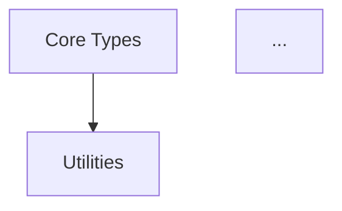

# Component Index Documentation Instructions
*Last Updated: 2025-05-23*

## Purpose

This document provides instructions for creating and maintaining component index documentation for software projects. The component index serves as a comprehensive reference that:

1. Documents the structure and organization of a software package
2. Catalogs components by their dependencies and functionality
3. Provides implementation details, API stability information, and usage guidance
4. Serves as a reference for both maintainers and users of the package

## When to Create/Update a Component Index

Create or update a component index when:

1. Creating a new package or module
2. Making significant architectural changes
3. Adding new components or features
4. Changing API stability status
5. Improving performance characteristics
6. Updating error handling strategies
7. Documenting complex dependencies

## How to Use the Template

The component index template (`component-index-template.md`) provides a general structure that can be adapted to any software project. Follow these steps to customize it:

1. Copy the template to your target location
2. Replace placeholders (text in brackets `[]`) with actual content
3. Adjust section headers to match your project's terminology
4. Add or remove sections as needed for your specific domain
5. Organize components in a hierarchical manner based on dependencies

## Sections Explained

### 1. Header and Table of Contents

```markdown
# [Package/Module] Component Index
*Last Updated: [YYYY-MM-DD]*

# Table of Contents
...
```

- Replace `[Package/Module]` with your package name
- Update the date whenever you modify the document
- The table of contents should link to all major sections

### 2. Overview

```markdown
## Overview
This index provides a hierarchical view of the [package/module] components, ordered by their dependencies. Components at each level may depend on components from previous levels but not on components from later levels.
```

- Provide a concise introduction to the package
- Explain the hierarchical organization principle
- Mention any domain-specific concepts necessary for understanding

### 3. Component Sections

For each component level section:

```markdown
## [Level X: Component Category]
Location: `src/path/to/components/`

### [Component1] (`filename1.ts`)
[Brief description]:

**Types:**
- `[Type1]`: [Description]

**Core Functions:**
- `[function1](param1: Type, param2: Type)`: [Description]
```

- Organize components into logical groups
- List components in dependency order (foundational → advanced)
- Include file paths relative to the package root
- Document public API elements with brief descriptions
- For classes, include methods and properties
- For functions, include parameters and return values
- Note any special behavior or edge cases

### 4. Dependency Graph

```markdown
## Dependency Graph


- Create a visual representation of component dependencies
- Use mermaid syntax for graph generation
- Keep the graph simple and focused on high-level dependencies
- Arrow direction should indicate dependency flow

### 5. API Status and Stability

```markdown
## API Status and Stability

### Stable APIs (v1.0+)
...

### Beta APIs (v0.x)
...

### Experimental APIs
...
```

- Clearly indicate which APIs are stable vs experimental
- Group by stability level rather than by component
- Include version numbers when relevant
- Explain the compatibility guarantees for each level

### 6. Performance, Implementation, Error Handling

These sections should provide practical information for users:

- **Performance Considerations**: Document computational complexity, memory usage, and optimization tips
- **Implementation Index**: Provide a guide to the codebase organization
- **Error Handling**: Document common errors and recovery strategies
- **Testing and Validation**: Explain how to verify correct implementation

## Best Practices

1. **Be Comprehensive**: Include all public API elements
2. **Be Concise**: Use brief descriptions that focus on functionality
3. **Use Hierarchy**: Organize components by dependency level
4. **Include Examples**: Provide usage examples for complex components
5. **Document Stability**: Clearly indicate API stability status
6. **Update Regularly**: Keep the document in sync with code changes
7. **Include Diagrams**: Use visual aids to explain complex relationships
8. **Link to Code**: Include file paths to help navigate the codebase
9. **Document Limitations**: Be honest about current limitations or TODOs
10. **Consider Readability**: Format the document for easy scanning and reference

## Adaptation for Different Project Types

### Library/Framework Projects
- Focus on API stability and backward compatibility
- Document extension points and plugin mechanisms
- Include comprehensive usage examples

### Application Projects
- Focus on component interactions and data flow
- Document integration points with external systems
- Include environment configuration details

### Domain-Specific Projects
- Include domain terminology explanations
- Document mathematical or theoretical foundations
- Provide references to relevant academic papers or standards

## Maintenance Guidelines

1. Update the component index when making significant code changes
2. Review the entire document quarterly to ensure accuracy
3. Add newly implemented features promptly
4. Mark deprecated features clearly
5. Include "Last Updated" date at the top of the document
6. Archive old versions when making major revisions

## Example Adaptation Process

To adapt this template for a specific project:

1. Identify the main component categories in your project
2. List all public API elements by category
3. Determine the dependency relationships between components
4. Document each component's purpose, API, and behavior
5. Create a dependency graph
6. Document API stability, performance, and error handling
7. Add project-specific sections as needed

By following these instructions, you can create and maintain comprehensive component documentation that serves as a valuable reference for both developers and users of your software.
