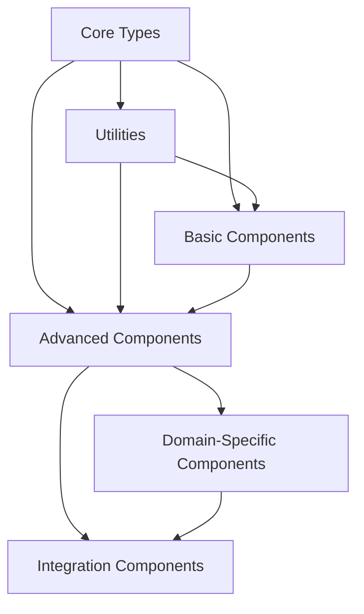

# [Package/Module] Component Index
*Last Updated: [YYYY-MM-DD]*

# Table of Contents

1. [Overview](#overview)
2. [Core Types and Interfaces](#core-types-and-interfaces)
3. [Utilities and Foundational Components](#utilities-and-foundational-components)
4. [Basic Components](#basic-components)
5. [Advanced Components](#advanced-components)
6. [Domain-Specific Components](#domain-specific-components)
7. [Integration Components](#integration-components)
8. [Dependency Graph](#dependency-graph)
9. [Usage Example Dependencies](#usage-example-dependencies)
10. [API Status and Stability](#api-status-and-stability)
11. [Performance Considerations](#performance-considerations)
12. [Implementation Index](#implementation-index)
13. [Error Handling](#error-handling)
14. [Testing and Validation](#testing-and-validation)

## Overview
This index provides a hierarchical view of the [package/module] components, ordered by their dependencies. Components at each level may depend on components from previous levels but not on components from later levels.

## Core Types and Interfaces
Location: `src/core/types.ts` (or equivalent)
- `[Interface1]` - [Brief description]
  - Core operations: [operation1], [operation2]
  - Additional operations: [operation3], [operation4]
  - Utility methods: [method1], [method2]
- `[Interface2]` - [Brief description]
  - Core operations: [operation1], [operation2]
  - Advanced operations: [operation3], [operation4]
- `[Type1]` - [Brief description and purpose]
- `[Type2]` - [Brief description and purpose]

## Utilities and Foundational Components
Location: `src/utils/` (or equivalent)

### [Component1] (`filename1.ts`)
[Brief description of component purpose]:

**Types:**
- `[Type1]`: [Description]
- `[Type2]`: [Description]

**Core Functions:**
- `[function1](param1: Type, param2: Type)`: [Description of what it does]
- `[function2](param1: Type, param2: Type)`: [Description of what it does]

**Validation Functions:**
- `[validationFunction1](param: Type)`: [Description]
- `[validationFunction2](param: Type)`: [Description]

**Utility Functions:**
- `[utilityFunction1](param: Type)`: [Description]
- `[utilityFunction2](param: Type)`: [Description]

### [Component2] (`filename2.ts`)
[Brief description of component purpose]:

**Core Function:**
- `[mainFunction](param1: Type, param2: Type)`: [Description]

**Implemented Functions:**
- `[function1](param: Type)`: [Description]
- `[function2](param: Type)`: [Description]

**Note:** [Any important implementation notes or limitations]

## Basic Components
Location: `src/[appropriate directory]/`

### [Component1] (`filename1.ts`)
[Brief description]:

**Main Class: `[ClassName] implements [Interface]`**

**Core Methods:**
- `[method1](param: Type)`: [Description]
- `[method2](param: Type)`: [Description]
- `[method3](param: Type)`: [Description]

**Static Factory Methods:**
- `[factoryMethod1](param: Type)`: [Description]
- `[factoryMethod2](param: Type)`: [Description]

### [Component2] (`filename2.ts`)
[Brief description]:

**Main Class: `[ClassName] implements [Interface]`**

**Core Methods:**
- `[method1](param: Type)`: [Description]
- `[method2](param: Type)`: [Description]

**Static Factory Methods:**
- `[factoryMethod1](param: Type)`: [Description]
- `[factoryMethod2](param: Type)`: [Description]

### [Subcomponent Group] (`filename3.ts`)
[Brief description]:

**Core Functions:**
- `[function1](param: Type)`: [Description]
- `[function2](param: Type)`: [Description]

## Advanced Components
Location: `src/[appropriate directory]/`

### [Component1] (`filename1.ts`)
[Brief description]:

**Main Class: `[ClassName] extends [BaseClass]`**

**Types:**
- `[Type1]`: [Description]
- `[Type2]`: [Description]

**Core Methods:**
- `[method1](param: Type)`: [Description]
- `[method2](param: Type)`: [Description]

**Static Factory Methods:**
- `[factoryMethod1](param: Type)`: [Description]
- `[factoryMethod2](param: Type)`: [Description]

**Features:**
- [Feature1]: [Description]
- [Feature2]: [Description]

### [Component2] (`filename2.ts`)
[Brief description]:

**Classes:**
`[ClassName] implements [Interface]`
- [Brief description]
- [Key functionality]

**Core Functions:**
- `[function1](param: Type)`: [Description]
- `[function2](param: Type)`: [Description]

**Note:** [Any implementation notes or future plans]

## Domain-Specific Components
Location: `src/[domain-specific directory]/`

### Core (`core.ts`)
[Brief description]:

**State Functions:**
- `[function1](param: Type)`: [Description]
- `[function2](param: Type)`: [Description]

**Operation Functions:**
- `[function1](param: Type)`: [Description]
- `[function2](param: Type)`: [Description]

**Utility Functions:**
- `[function1](param: Type)`: [Description]
- `[function2](param: Type)`: [Description]

**Features:**
- [Feature1]: [Description]
- [Feature2]: [Description]

### [Subcomponent1] (`filename1.ts`)
[Brief description]:
- [Feature1]
- [Feature2]
- [Feature3]

### [Subcomponent2] (`filename2.ts`)
[Brief description]:
- [Feature1]
- [Feature2]
- [Feature3]

## Integration Components
Location: `src/[appropriate directory]/`

**Status: [Implementation Status]**

[Brief description of purpose and scope]:
- [Feature1]
- [Feature2]
- [Feature3]

## Dependency Graph


## Usage Example Dependencies
- Basic usage: Level 0-1
- Standard usage: Level 0-3
- Advanced usage: Level 0-4
- Full-featured usage: All levels

## API Status and Stability

### Stable APIs (v1.0+)
Core functionality guaranteed to maintain backward compatibility:
- [Component1]
  - [Feature1]
  - [Feature2]
- [Component2]
  - [Feature1]
  - [Feature2]

### Beta APIs (v0.x)
APIs that may undergo minor changes:
- [Component1]
  - [Feature1]
  - [Feature2]
- [Component2]
  - [Feature1]
  - [Feature2]

### Experimental APIs
Subject to major changes:
- [Component1]
- [Component2]
- [Feature1]

## Performance Considerations

### Computational Complexity
- [Operation1]: O([complexity]) for [context]
- [Operation2]: O([complexity]) for [context]
- [Operation3]: O([complexity]) for [context]

### Memory Usage
- [Component1]: O([complexity]) for [context]
- [Component2]: O([complexity]) for [context]
- [Component3]: O([complexity]) for [context]

### Optimization Tips
1. [Tip1]
2. [Tip2]
3. [Tip3]
4. [Tip4]

## Implementation Index
For each component listed above:
1. Imports required
2. Main functionalities provided
3. Examples of typical usage
4. Common patterns and idioms

## Error Handling

### Common Error Types
1. **[Error Category 1]**
   - [Specific error scenario]
   - [Specific error scenario]
   - [Specific error scenario]

2. **[Error Category 2]**
   - [Specific error scenario]
   - [Specific error scenario]
   - [Specific error scenario]

3. **[Error Category 3]**
   - [Specific error scenario]
   - [Specific error scenario]
   - [Specific error scenario]

### Error Recovery Strategies
1. [Strategy1]
2. [Strategy2]
3. [Strategy3]
4. [Strategy4]

## Testing and Validation

### Key Invariants
1. [Invariant1]
2. [Invariant2]
3. [Invariant3]
4. [Invariant4]

### Validation Tolerances
- [Validation1]: [Tolerance]
- [Validation2]: [Tolerance]
- [Validation3]: [Tolerance]

### Validation Examples
```typescript
// [Description of validation example]
const [example code]

// [Description of another validation example]
const [example code]
```
