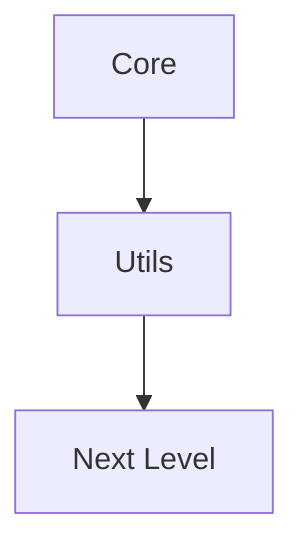

# Component Index Template
*Last Updated: [DATE]*

# Table of Contents

[AUTO-GENERATED TOC WILL GO HERE]

## Overview
This index provides a hierarchical view of the [MODULE_NAME] components, ordered by their dependencies. Components at each level may depend on components from previous levels but not on components from later levels.

## Level 0: Core Types and Interfaces
Location: `src/core/types.ts`

[List core types and interfaces with their methods]

## Level 1: Utilities and Basic Operations
Location: `src/utils/`

### [Utility Module 1] (`filename.ts`)
[Description]

**Types:**
- Type definitions

**Core Functions:**
- Function listings with signatures and brief descriptions

**Validation Functions:** (if applicable)
- Validation function listings

**Utility Functions:**
- Utility function listings

## Level 2: [Main Functionality Classes]
Location: `src/[directory]/`

### [Component 1] (`filename.ts`)
[Description]

**Main Class: `[ClassName] implements [Interface]`**

**Core Methods:**
- Method listings with signatures

**Static Factory Methods:**
- Factory method listings

**Features:**
- Key features and capabilities

[Additional sections as needed]

## Dependency Graph

## Usage Examples
1. Basic operations: Level requirements
2. [Additional use cases with level requirements]

## Implementation Notes
1. Required imports
2. Main functionalities
3. Common patterns
4. Implementation considerations

## Maintenance Instructions
1. Update this index when:
   - New components are added
   - Existing components are modified
   - Dependencies change
   - API changes occur
2. Keep dependency graph in sync with code
3. Verify all listed methods and classes exist
4. Update examples when patterns change

## Status Indicators
- ✅ Fully Implemented
- 🔄 In Progress
- ⚠️ Needs Review
- ❌ Deprecated
- 🚧 Planned

## API Status and Stability
### Stable APIs (v1.0+)
[List APIs guaranteed to maintain backward compatibility]

### Beta APIs (v0.x)
[List APIs that may undergo minor changes]

### Experimental APIs
[List APIs subject to major changes]

## Performance Considerations
### Computational Complexity
[List big-O complexity for key operations]

### Memory Usage
[List memory requirements for key data structures]

### Optimization Tips
[List optimization strategies and best practices]

## Error Handling
### Common Error Types
[List common error categories and causes]

### Error Recovery Strategies
[List recommended error handling approaches]

## Testing and Validation
### Key Invariants
[List mathematical and physical invariants to maintain]

### Numerical Tolerances
[List precision requirements and thresholds]

### Validation Examples
[Provide code examples for common validation tasks]
