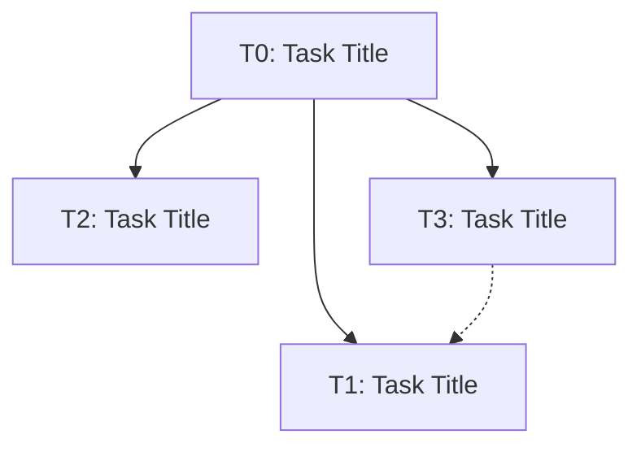

# Task Registry
*Last Updated: [TIMESTAMP]*

## Active Tasks
| ID | Title | Status | Priority | Started | Dependencies | Owner |
|----|-------|--------|----------|---------|--------------|-------|
| T1 | [TASK TITLE] | 🔄 IN PROGRESS | [PRIORITY] | [DATE] | - | [OWNER] |
| T2 | [TASK TITLE] | 🔄 IN PROGRESS | [PRIORITY] | [DATE] | - | [OWNER] |
| T3 | [TASK TITLE] | ⏸️ PAUSED | [PRIORITY] | [DATE] | [DEPENDENCIES] | [OWNER] |

## Task Details

### T1: [TASK TITLE]
**Description**: [DETAILED DESCRIPTION]
**Status**: 🔄 IN PROGRESS
**Last Active**: [TIMESTAMP]
**Completion Criteria**:
- [CRITERION 1]
- [CRITERION 2]
- [CRITERION 3]

**Related Files**:
- `[FILE1]`
- `[FILE2]`
- `[FILE3]`

**Notes**:
[IMPORTANT DECISIONS OR CONTEXT]

### T2: [TASK TITLE]
**Description**: [DETAILED DESCRIPTION]
**Status**: 🔄 IN PROGRESS
**Last Active**: [TIMESTAMP]
**Completion Criteria**:
- [CRITERION 1]
- [CRITERION 2]
- [CRITERION 3]

**Related Files**:
- `[FILE1]`
- `[FILE2]`
- `[FILE3]`

**Notes**:
[IMPORTANT DECISIONS OR CONTEXT]

### T3: [TASK TITLE]
**Description**: [DETAILED DESCRIPTION]
**Status**: ⏸️ PAUSED
**Last Active**: [TIMESTAMP]
**Paused On**: [TIMESTAMP]
**Reason**: [REASON FOR PAUSING]
**Completion Criteria**:
- [CRITERION 1]
- [CRITERION 2]
- [CRITERION 3]

**Related Files**:
- `[FILE1]`
- `[FILE2]`
- `[FILE3]`

**Notes**:
[IMPORTANT DECISIONS OR CONTEXT]

## Completed Tasks
| ID | Title | Completed | Related Tasks |
|----|-------|-----------|---------------|
| T0 | [COMPLETED TASK] | [DATE] | - |

## Task Relationships

