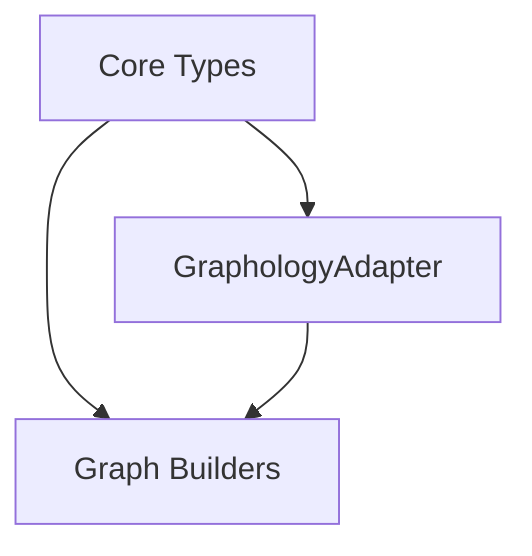

# @spin-network/graph-core Component Index

*Created: 2025-05-29 02:42 IST*

> Recent Updates:
> - Added 10 graph builder functions
> - Enhanced type safety in GraphologyAdapter
> - Added comprehensive interface hierarchy

## Table of Contents
1. [Overview](#overview)
2. [Core Types and Interfaces](#core-types-and-interfaces)
3. [Graph Adapter](#graph-adapter)
4. [Graph Builders](#graph-builders)
5. [Dependency Graph](#dependency-graph)
6. [API Status](#api-status)

## Overview
The @spin-network/graph-core package provides a type-safe, flexible foundation for graph operations with multiple graph types and builders.

## Core Types and Interfaces
Location: `src/core/types.ts`

### Base Interfaces
- `IGraphElement` - Base interface for nodes and edges
- `IGraphNode` - Node interface with attributes
- `IGraphEdge` - Edge interface with attributes
- `IGraph` - Core graph interface

### Specialized Interfaces
- `ITypedGraph` - Support for typed nodes/edges
- `IOrderedGraph` - Ordered edge traversal
- `ISimplicialGraph` - Simplicial complex support
- `IRewriteableGraph` - Graph rewriting operations

## Graph Adapter
Location: `src/core/GraphologyAdapter.ts`

### GraphologyAdapter
Type-safe adapter implementing IGraph interface.

**Methods:**
- `addNode` - Add node with attributes
- `removeNode` - Remove node and its edges
- `addEdge` - Add edge between nodes
- `removeEdge` - Remove specific edge
- `getNodeAttributes` - Get node attributes
- `setNodeAttributes` - Update node attributes
- `getEdgeAttributes` - Get edge attributes
- `setEdgeAttributes` - Update edge attributes
- `setGraph` - Set entire graph state

## Graph Builders
Location: `src/core/builders.ts`

### Builder Functions
- `createEmptyGraph` - Create empty graph
- `createCompleteGraph` - Create fully connected graph
- `createPathGraph` - Create linear path graph
- `createRandomGraph` - Create random graph
- `createRandomSparseGraph` - Create sparse random graph
- `createLattice1D` - Create 1D lattice
- `createLattice2D` - Create 2D lattice
- `createLattice1DPeriodic` - Create periodic 1D lattice
- `createLattice2DPeriodic` - Create periodic 2D lattice
- `createTriangularLattice` - Create triangular lattice

## Dependency Graph

## API Status

### Stable (Production Ready)
- Core Types and Interfaces
- Basic GraphologyAdapter operations
- Standard graph builders (empty, complete, path)

### Beta (Testing)
- Advanced graph builders (lattices)
- Graph state management
- Type safety improvements

### Breaking Changes
- GraphologyAdapter now requires type parameters
- Node/Edge attributes are strictly typed
- Builder options use consistent interface