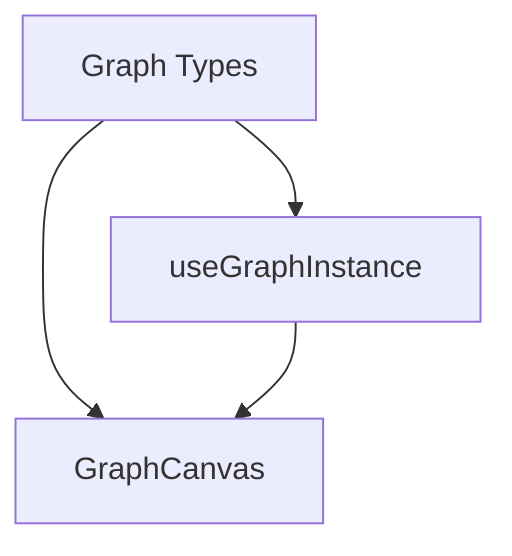

# @spin-network/graph-ui Component Index

*Created: 2025-05-29 02:42 IST*

> Recent Updates:
> - Created initial package structure
> - Migrated GraphCanvas component
> - Added useGraphInstance hook

## Table of Contents
1. [Overview](#overview)
2. [Components](#components)
3. [Hooks](#hooks)
4. [Types](#types)
5. [Dependency Graph](#dependency-graph)
6. [API Status](#api-status)

## Overview
The @spin-network/graph-ui package provides React components and hooks for graph visualization and interaction.

## Components
Location: `src/components/`

### GraphCanvas
Location: `src/components/canvas/GraphCanvas.tsx`

React component for graph visualization using Sigma.js.

**Props:**
- `graph` - IGraph instance to render
- `settings` - Sigma visualization settings
- `style` - Canvas style overrides
- `onNodeClick` - Node click handler
- `onEdgeClick` - Edge click handler

**Features:**
- Automatic layout positioning
- Zoom and pan controls
- Node/edge hover effects
- Custom styling support

## Hooks
Location: `src/hooks/`

### useGraphInstance
Location: `src/hooks/useGraphInstance.ts`

Hook for managing graph instance lifecycle.

**Parameters:**
- `initialGraph` - Optional initial graph state
- `options` - Graph instance options

**Returns:**
- `graph` - Current graph instance
- `setGraph` - Update graph state
- `reset` - Reset to initial state
- `clear` - Clear graph state

## Types
Location: `src/types/`

### Graph Types
Location: `src/types/graph.ts`

- `GraphCanvasProps` - Props for GraphCanvas
- `GraphInstanceOptions` - Options for useGraphInstance
- `GraphEventHandlers` - Event handler types

## Dependency Graph

## API Status

### Stable (Production Ready)
- GraphCanvas core functionality
- useGraphInstance hook
- Basic event handling

### Beta (Testing)
- Advanced interaction features
- Custom controls
- Layout algorithms

### Planned
- ZoomControls component
- GraphBuilderControls
- Advanced event system

### Dependencies
- @spin-network/graph-core
- sigma.js
- react