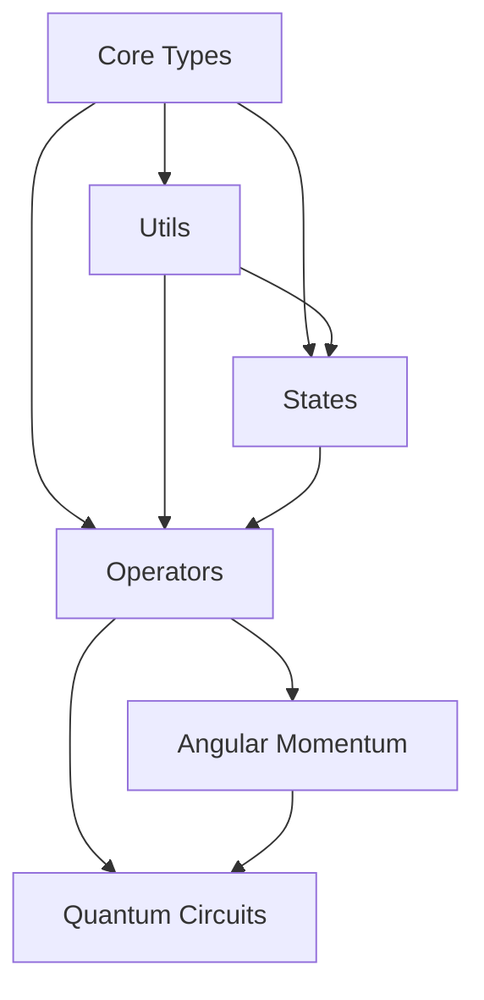

*Last Updated: May 14, 2025*

# Table of Contents

1. [Overview](#overview)
2. [Core Types and Interfaces](#level-0-core-types-and-interfaces)
3. [Utilities and Basic Operations](#level-1-utilities-and-basic-operations)
   - [Matrix Operations](#matrix-operations-matrixoperationsts)
   - [Matrix Functions](#matrix-functions-matrixfunctionsts)
4. [Quantum States](#level-2-quantum-states)
   - [State Vector](#state-vector-statevectorts)
   - [Density Matrix](#density-matrix-densitymatrixts)
   - [Composite States](#composite-states-composites)
   - [Basic States](#basic-states-statests)
5. [Quantum Operators](#level-3-quantum-operators)
   - [Basic Operators](#basic-operators-operatorts)
   - [Quantum Gates](#quantum-gates-gatests)
   - [Operator Algebra](#operator-algebra-algebrats)
   - [Measurement](#measurement-measurementts)
   - [Hamiltonian](#hamiltonian-hamiltoniant)
6. [Angular Momentum](#level-4-angular-momentum)
   - [Operators](#operators-operatorts)
   - [States](#states-statests)
   - [Composition](#composition-compositionts)
   - [Wigner Symbols](#wigner-symbols-wignersymbolsts)
7. [Quantum Circuits](#level-5-quantum-circuits-planned)
8. [Dependency Graph](#dependency-graph)
9. [Usage Example Dependencies](#usage-example-dependencies)
10. [API Status and Stability](#api-status-and-stability)
11. [Performance Considerations](#performance-considerations)
12. [Implementation Index](#implementation-index)
13. [Error Handling](#error-handling)
14. [Testing and Validation](#testing-and-validation)

## Overview
This index provides a hierarchical view of the quantum package components, ordered by their dependencies. Components at each level may depend on components from previous levels but not on components from later levels.

## Level 0: Core Types and Interfaces
Location: `src/core/types.ts`
- `Complex` (from mathjs) - Complex number representation
- `IStateVector` - Interface for quantum state vectors
  - Core operations: setState, getState
  - Quantum operations: innerProduct, norm, normalize, tensorProduct
  - Utility methods: isZero, toArray, toString
- `IOperator` - Base interface for quantum operators
  - Core operations: apply, compose, adjoint, toMatrix
  - Advanced operations: tensorProduct, partialTrace, scale, add, eigenDecompose
- `IMeasurementOutcome` - Type for measurement results
- `IDensityMatrix` - Interface extending IOperator for density matrices
- `IQuantumChannel` - Interface for quantum channel operations

## Level 1: Utilities and Basic Operations
Location: `src/utils/`

### Matrix Operations (`matrixOperations.ts`)
Foundation for quantum computations with complex matrices:

**Types:**
- `ComplexMatrix = Complex[][]`: Matrix of complex numbers
- `IMatrixDimensions`: Interface for matrix dimensions
- `IValidationResult`: Interface for validation results

**Core Functions:**
- `multiplyMatrices(a: ComplexMatrix, b: ComplexMatrix)`: Matrix multiplication
- `adjoint(matrix: ComplexMatrix)`: Compute conjugate transpose
- `tensorProduct(a: ComplexMatrix, b: ComplexMatrix)`: Compute Kronecker product
- `matrixExponential(matrix: ComplexMatrix)`: Compute matrix exponential
- `eigenDecomposition(matrix: ComplexMatrix, options?)`: Compute eigenvalues/vectors
- `addMatrices(a: ComplexMatrix, b: ComplexMatrix)`: Matrix addition
- `scaleMatrix(matrix: ComplexMatrix, scalar: Complex)`: Scale matrix by complex number

**Validation Functions:**
- `isHermitian(matrix: ComplexMatrix, tolerance?)`: Check if matrix is Hermitian
- `isUnitary(matrix: ComplexMatrix, tolerance?)`: Check if matrix is unitary
- `validateMatrix(matrix: ComplexMatrix)`: Validate matrix structure
- `validateMultiplicationDimensions(a: ComplexMatrix, b: ComplexMatrix)`
- `validateSquareMatrix(matrix: ComplexMatrix)`

**Utility Functions:**
- `cleanupNumericalNoise(value: number, precision?)`: Clean numerical artifacts
- `toMathMatrix(matrix: ComplexMatrix)`: Convert to math.js matrix
- `fromMathMatrix(matrix: math.Matrix)`: Convert from math.js matrix

### Matrix Functions (`matrixFunctions.ts`)
Advanced matrix mathematical functions:

**Core Function:**
- `matrixFunction(matrix: Complex[][], func: (x: Complex) => Complex)`: Apply arbitrary function to matrix using eigendecomposition

**Implemented Functions:**
- `matrixLogarithm(matrix: Complex[][])`: Calculate matrix logarithm
- `matrixSquareRoot(matrix: ComplexMatrix)`: Calculate matrix square root
- `matrixPower(matrix: Complex[][], power: number)`: Calculate matrix power
- `matrixSin(matrix: Complex[][])`: Calculate matrix sine
- `matrixCos(matrix: Complex[][])`: Calculate matrix cosine

**Note:** All functions currently support only Hermitian matrices, with non-Hermitian case pending implementation.

## Level 2: Quantum States
Location: `src/states/`

### State Vector (`stateVector.ts`)
Implementation of quantum state vectors:

**Main Class: `StateVector implements IStateVector`**

**Core Methods:**
- `setState(index: number, value: Complex)`: Set amplitude at index
- `getState(index: number): Complex`: Get amplitude at index
- `innerProduct(other: StateVector): Complex`: Calculate ⟨ψ|φ⟩
- `norm(): number`: Calculate state vector norm
- `normalize(): StateVector`: Return normalized state
- `tensorProduct(other: StateVector): StateVector`: Compute tensor product
- `isZero(tolerance?: number): boolean`: Check if zero state
- `toArray(): Complex[]`: Get amplitude array
- `toString(): string`: String representation

**Static Factory Methods:**
- `computationalBasis(dimension: number, index: number)`: Create |i⟩ basis state
- `computationalBasisStates(dimension: number)`: Get all basis states
- `superposition(coefficients: Complex[])`: Create normalized superposition
- `equalSuperposition(dimension: number)`: Create equal superposition |+⟩

### Density Matrix (`densityMatrix.ts`)
Mixed quantum states and quantum channels:

**Main Class: `DensityMatrixOperator implements IDensityMatrix`**

**Core Methods:**
- `trace(): Complex`: Calculate trace
- `purity(): number`: Calculate Tr(ρ²)
- `vonNeumannEntropy(): number`: Calculate -Tr(ρ ln ρ)
- `partialTrace(subsystemDimensions: number[])`: Trace out subsystems
- Inherits all IOperator methods (apply, compose, adjoint, etc.)

**Static Factory Methods:**
- `fromPureState(state: IStateVector)`: Create from pure state
- `mixedState(states: IStateVector[], probabilities: number[])`: Create mixed state

**Quantum Channels**
Class: `KrausChannel implements IQuantumChannel`
- Implements quantum operations using Kraus operators
- Validates completeness relation

**Channel Factory Functions:**
- `createDepolarizingChannel(dimension: number, p: number)`
- `createAmplitudeDampingChannel(gamma: number)`
- `createPhaseDampingChannel(gamma: number)`
- `createBitFlipChannel(p: number)`
- `createPhaseFlipChannel(p: number)`

Note: Some channel implementations are currently placeholders (TODO)

### Composite States (`composite.ts`)
Multi-particle quantum state operations:

**Core Functions:**
- `composeSpaces(spaces: HilbertSpace[])`: Tensor product of Hilbert spaces
- `composeStates(states: IStateVector[])`: Tensor product of state vectors
- `composeOperators(operators: IOperator[])`: Tensor product of operators
- `bipartiteSplit(space: HilbertSpace, firstDimension: number)`: Split space into two parts
- `partialTrace(operator: IOperator, dims: number[], traceOutIndices: number[])`: Trace out subsystems

### Basic States (`states.ts`)
Common quantum state implementations:

**Multi-Qubit States:**
- `computationalBasis(numQubits: number)`: Create all basis states
- `createBasisState(dimension: number, index: number)`: Create specific basis state
- `createBellState(type: 'Phi+' | 'Phi-' | 'Psi+' | 'Psi-')`: Create Bell states
- `createGHZState(numQubits: number)`: Create GHZ state
- `createWState(numQubits: number)`: Create W state

**Single-Qubit States:**
- `createPlusState()`: Create |+⟩ state
- `createMinusState()`: Create |-⟩ state

## Level 3: Quantum Operators
Location: `src/operators/`

### Basic Operators (`operator.ts`)
Implementation of quantum operators using matrix representation:

**Main Class: `MatrixOperator implements IOperator`**

**Core Methods:**
- `apply(state: IStateVector): IStateVector`: Apply operator to state
- `compose(other: IOperator): IOperator`: Compose operators
- `adjoint(): IOperator`: Get Hermitian conjugate
- `toMatrix(): ComplexMatrix`: Get matrix representation
- `tensorProduct(other: IOperator): IOperator`: Compute tensor product
- `scale(scalar: Complex): MatrixOperator`: Scale operator
- `add(other: IOperator): MatrixOperator`: Add operators
- `partialTrace(dims: number[], traceOutIndices: number[])`: Partial trace
- `eigenDecompose()`: Get eigenvalues and eigenvectors
- `projectOntoEigenspace(eigenvalue: Complex)`: Project onto eigenspace

**Static Factory Methods:**
- `identity(dimension: number)`: Create identity operator
- `zero(dimension: number)`: Create zero operator

**Operator Types:**
- 'unitary': Unitary operators (U†U = I)
- 'hermitian': Hermitian operators (A† = A)
- 'projection': Projection operators (P² = P)
- 'general': General operators

### Quantum Gates (`gates.ts`)
Standard quantum gate implementations:

**Single-Qubit Gates:**
- `PauliX`: Bit flip gate (σₓ)
- `PauliY`: Y-rotation gate (σᵧ)
- `PauliZ`: Phase flip gate (σz)
- `Hadamard`: Hadamard gate (H)

**Multi-Qubit Gates:**
- `CNOT`: Controlled-NOT gate

All gates implemented as unitary `MatrixOperator` instances

### Operator Algebra (`algebra.ts`)
Quantum operator algebraic operations:

**Basic Operations:**
- `addOperators(a: IOperator, b: IOperator)`: Add operators
- `subtractOperators(a: IOperator, b: IOperator)`: Subtract operators
- `operatorsCommute(A: IOperator, B: IOperator)`: Check if operators commute

**Commutators and Advanced Structures:**
- `commutator(A: IOperator, B: IOperator)`: Calculate [A,B]
- `antiCommutator(A: IOperator, B: IOperator)`: Calculate {A,B}
- `nestedCommutator(ops: IOperator[], indices: number[][])`: Calculate nested structures
- `lieDerivative(A: IOperator, B: IOperator)`: Calculate Lie derivative
- `BCHFormula(A: IOperator, B: IOperator, order: number)`: Baker-Campbell-Hausdorff formula

**Quantum Mechanical Applications:**
- `commutatorExpectation(state, A, B)`: Calculate ⟨[A,B]⟩
- `uncertaintyProduct(state, A, B)`: Calculate ΔA·ΔB
- `isNormalOperator(A: IOperator)`: Check if AA† = A†A
- `operatorFromGenerator(generator: IOperator)`: Create exp(iG)
- `projectionOperator(state: IStateVector)`: Create |ψ⟩⟨ψ|# Quantum Package Component Index

### Measurement (`measurement.ts`)
Quantum measurement implementations:

**Classes:**
`ProjectionOperator implements IOperator`
- Creates projection operator for quantum measurements
- Implements |ψ⟩⟨ψ| projection

**Core Functions:**
- `expectationValue(state: StateVector, operator: IOperator)`: Calculate ⟨ψ|A|ψ⟩
- `measureState(state: StateVector, operator: IOperator)`: Perform measurement
- `createMeasurementOperator(observable: IOperator, eigenvalue: number)`: Create measurement operator (TODO)

Note: General measurement operators beyond projective measurements are planned for future implementation.

### Hamiltonian (`hamiltonian.ts`)
Implementation of quantum system energy operators:

**Main Class: `Hamiltonian extends MatrixOperator`**

**Types:**
- `HamiltonianType`: 'free' | 'harmonic' | 'spin' | 'interaction' | 'custom'
- `IHamiltonianTerm`: Interface for Hamiltonian expansion terms

**Core Methods:**
- `getEvolutionOperator(time: number)`: Generate U(t) = exp(-iHt/ħ)
- `evolveState(state: StateVector, time: number)`: Time evolution
- `expectationValue(state: StateVector)`: Calculate ⟨ψ|H|ψ⟩

**Static Factory Methods:**
- `createSpinHamiltonian([Bx,By,Bz])`: Create spin-1/2 in magnetic field
- `createHeisenbergHamiltonian(numSpins, coupling)`: Create spin chain

**Features:**
- Time-dependent and time-independent Hamiltonians
- Hermiticity validation
- Unitary time evolution
- Common physical systems (spin, Heisenberg model)

## Level 4: Angular Momentum
Location: `src/angularMomentum/`

### Core (`core.ts`)
Angular momentum implementation:

**State Functions:**
- `createState(j: number, m: number)`: Creates basis state |j,m⟩
- `createCoherentState(j: number, theta: number, phi: number)`: Creates coherent state

**Operator Functions:**
- `createJplus(j: number)`: Creates raising operator J₊
- `createJminus(j: number)`: Creates lowering operator J₋
- `createJz(j: number)`: Creates z-component Jz
- `createJx(j: number)`: Creates x-component Jx
- `createJy(j: number)`: Creates y-component Jy
- `createJ2(j: number)`: Creates total angular momentum J²
- `createJ2FromComponents(j: number)`: Alternative J² construction
- `createRotationOperator(j, α, β, γ)`: Creates Wigner rotation operator D(α,β,γ)

**Utility Functions:**
- `getValidM(j: number)`: Gets valid m values for given j
- `isValidM(j: number, m: number)`: Checks if m is valid
- `jmExpectationValue(operator, j, m)`: Calculates ⟨j,m|O|j,m⟩

**Features:**
- Full angular momentum algebra implementation
- Cartesian and spherical basis support
- Rotation operator using Euler angles
- Coherent state construction
- Numerical stability for high j values

### Composition (`composition.ts`)
Angular momentum addition:
- Clebsch-Gordan coefficients
- Angular momentum coupling
- Tensor product states

### Wigner Symbols (`wignerSymbols.ts`)
Wigner symbol calculations:
- 3j symbols
- 6j symbols
- 9j symbols
- Rotation matrices

## Level 5: Quantum Circuits (Planned)
Location: `src/operators/circuit.ts`

**Status: Implementation Pending (Task T61)**

Planned features for high-level quantum computation:
- Circuit construction
- Gate sequencing
- Circuit optimization
- Measurement protocols

## Dependency Graph


## Usage Example Dependencies
- Basic state manipulation: Level 0-1
- Single qubit operations: Level 0-3
- Multi-qubit operations: Level 0-3
- Angular momentum calculations: Level 0-4
- Quantum circuits: All levels

## API Status and Stability

### Stable APIs (v1.0+)
Core functionality guaranteed to maintain backward compatibility:
- Core Types (`types.ts`)
  - `IStateVector`
  - `IOperator`
- Matrix Operations (`matrixOperations.ts`)
  - All public functions
- State Vector (`stateVector.ts`)
  - `StateVector` class and methods
- Basic Operators (`operator.ts`)
  - `MatrixOperator` class and methods

### Beta APIs (v0.x)
APIs that may undergo minor changes:
- Angular Momentum Module
  - All public functions and classes
- Hamiltonian Module
  - `Hamiltonian` class and methods
- Quantum Gates
  - Current gate implementations

### Experimental APIs
Subject to major changes:
- Quantum Channels (in `densityMatrix.ts`)
- Circuit Module (planned)
- Advanced measurement operators (planned)

## Performance Considerations

### Computational Complexity
- Matrix operations: O(n³) for n×n matrices
- Tensor products: O(d1×d2) for dimensions d1, d2
- Eigendecomposition: O(n³) typical case
- Partial trace: O(d1×d2) for bipartite system

### Memory Usage
- StateVector: O(2ⁿ) for n qubits
- DensityMatrix: O(4ⁿ) for n qubits
- Angular momentum: O(2j+1) for spin j

### Optimization Tips
1. Use sparse representations for large systems
2. Cache frequently used operators
3. Prefer direct construction over tensor products when possible
4. Use analytical solutions where available

## Implementation Index
For each component listed above:
1. Imports required from within the package
2. Main functionalities provided
3. Examples of typical usage
4. Common patterns and idioms

## Error Handling

### Common Error Types
1. **Dimension Mismatch**
   - State-operator dimension mismatch
   - Tensor product dimension mismatch
   - Partial trace subsystem mismatch

2. **Numerical Errors**
   - Complex number overflow
   - Eigenvalue computation instability
   - Normalization issues

3. **Invalid Operations**
   - Non-unitary evolution
   - Invalid quantum numbers
   - Improper operator composition

### Error Recovery Strategies
1. State normalization after operations
2. Numerical cleanup for small imaginary components
3. Eigenvalue regularization
4. Dimension validation before operations

## Testing and Validation

### Key Invariants
1. State normalization: ⟨ψ|ψ⟩ = 1
2. Operator properties:
   - Unitarity: U†U = I
   - Hermiticity: A† = A
3. Commutation relations
4. Angular momentum algebra

### Numerical Tolerances
- Default precision: 1e-10
- Normalization tolerance: 1e-10
- Unitarity check tolerance: 1e-10
- Zero comparison threshold: 1e-10

### Validation Examples
```typescript
// State normalization check
const isNormalized = Math.abs(state.norm() - 1) < 1e-10;

// Unitarity check
const isUnitary = U.compose(U.adjoint()).isCloseTo(MatrixOperator.identity(dim));

// Hermiticity check
const isHermitian = A.isCloseTo(A.adjoint());
```

