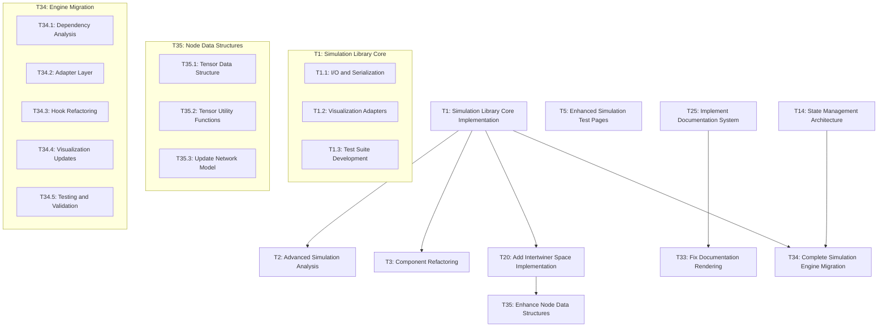

# Task Registry
*Last Updated: April 21, 2025 (23:55 IST)*

## Active Tasks
| ID | Title | Status | Priority | Started | Dependencies | Owner |
|----|-------|--------|----------|---------|--------------|-------|
| T35 | Enhance Node and Edge Data Structures for Intertwiners | 🔄 IN PROGRESS | MEDIUM | 2025-04-21 | T20 | Deepak |
| T34 | Complete Simulation Engine Migration to Standalone Library | 🔄 IN PROGRESS | HIGH | 2025-04-21 | T1, T14 | Deepak |
| T33 | Fix Documentation Rendering and Interaction Issues | 🔄 IN PROGRESS | HIGH | 2025-04-21 | T28 | Deepak |
| T25 | Implement Documentation System | 🔄 IN PROGRESS | MEDIUM | 2025-04-19 | - | Deepak |
| T20 | Add Intertwiner Space Implementation | 🔄 IN PROGRESS | MEDIUM | 2025-04-18 | T1 | Deepak |
| T1 | Simulation Library Core Implementation | 🔄 IN PROGRESS | HIGH | 2025-04-14 | - | Deepak |
| T2 | Advanced Simulation Analysis | ⏸️ PAUSED | MEDIUM | 2025-04-14 | T1 | Deepak |
| T3 | Component Refactoring | ⏸️ PAUSED | MEDIUM | 2025-04-14 | T1 | Deepak |
| T5 | Enhanced Simulation Test Pages | 🔄 IN PROGRESS | HIGH | 2025-04-14 | - | Deepak |

## Task Details

### T35: Enhance Node and Edge Data Structures for Intertwiners
**Description**: Enhance the data structures for nodes and edges in the spin network to better represent the physics concepts, particularly improving the intertwiner representation to support intertwiner spaces with multiple dimensions and basis states.
**Status**: 🔄 IN PROGRESS
**Last Active**: April 21, 2025 (23:55 IST)
**Completion Criteria**:
- ✅ Define enhanced `IntertwinerData` interface to replace the simple numerical representation
- ✅ Create comprehensive implementation plan for tensor representation
- ⬜ Create new interfaces for tensor data structure (IntertwinerTensorData, SparseIntertwinerElement, Complex)
- ⬜ Update `NetworkNode` interface to use the enhanced `IntertwinerData` interface
- ⬜ Implement utility functions for tensor operations (creation, access, contraction)
- ⬜ Create factory functions for generating standard intertwiner tensors
- ⬜ Implement validation function to ensure tensor values are consistent with adjacent edge spins
- ⬜ Update `networkToCytoscape` function to handle the tensor representation
- ⬜ Add quantum state calculation functions for graph states
- ⬜ Implement tensor visualization helpers

**Subtasks**:
- T35.1: Create Tensor Data Structure Interfaces - 🔄 IN PROGRESS
- T35.2: Implement Tensor Utility Functions - ⬜ NOT STARTED
- T35.3: Update Network Model with Enhanced Interfaces - ⬜ NOT STARTED

**Related Files**:
- `src/models/types.ts`
- `src/models/networkModel.ts`
- `src/components/workspace/CytoscapeManager/CytoscapeManager.tsx`
- `memory-bank/implementation-details/tensor-plan.md`
- `src/utils/intertwinerTensorUtils.ts` (to be created)
- `src/utils/intertwinerTensorFactory.ts` (to be created)

**Notes**:
This task builds upon the mathematical foundation established in T20 (Intertwiner Space Implementation) to enhance the practical representation of physics concepts in the application. The goal is to move from a simple numerical representation of intertwiners to a more comprehensive object structure that can capture the full richness of intertwiner spaces, while maintaining backward compatibility with existing code.

### T1: Simulation Library Core Implementation
**Description**: Create a standalone simulation library that can be used independent of the React UI. Implement core simulation functionality as a framework-agnostic library with clean interfaces.
**Status**: 🔄 IN PROGRESS
**Last Active**: April 18, 2025 (01:15 IST)
**Completion Criteria**:
- ✅ Create new modular library structure in `lib/` directory
- ✅ Set up proper entry points and API
- ✅ Create core type definitions without UI dependencies
- ✅ Implement StateVector with comprehensive vector operations
- ✅ Implement Graph with full immutable operations
- ✅ Implement SimulationHistory for tracking state over time
- ✅ Implement core SimulationEngine with proper event handling
- ✅ Implement numerical solvers (Euler, Midpoint, RK4)
- ✅ Implement graph templates (line, ring, grid, random)
- ✅ Implement I/O and serialization
- ⬜ Implement visualization adapters
- ⬜ Add comprehensive documentation
- ⬜ Test library functionality independently

**Subtasks**:
- T1.1: I/O and Serialization Implementation - ✅ COMPLETE
- T1.2: Visualization Adapters - 🔄 IN PROGRESS
- T1.3: Test Suite Development - ⬜ NOT STARTED

**Related Files**:
- `lib/index.ts`
- `lib/core/types.ts`
- `lib/core/stateVector.ts`
- `lib/core/graph.ts`
- `lib/core/engineImplementation.ts`
- `lib/io/index.ts`
- `lib/io/serialization.ts`
- `lib/io/storageAdapters.ts`
- `lib/templates/index.ts`

**Notes**:
This task is the foundation for separating the simulation logic from the UI components, making it possible to use the simulation engine in different contexts and with different frontend frameworks. The library is designed to be framework-agnostic, with clean interfaces and comprehensive documentation. The I/O and serialization implementation (T1.1) has been completed, providing robust functionality for saving and loading simulation data in various formats.

### T34: Complete Simulation Engine Migration to Standalone Library
**Description**: Fully migrate all simulation engine dependencies from the React app to the standalone library, eliminating duplicate implementations.
**Status**: 🔄 IN PROGRESS
**Last Active**: April 21, 2025 (22:30 IST)
**Dependencies**: T1, T14
**Completion Criteria**:
- ✅ Create comprehensive migration plan
- ⬜ Identify all React components that directly depend on src/simulation
- ⬜ Complete any missing features in the standalone library from feature comparison
- ⬜ Implement event system and adapter layer for React integration
- ⬜ Refactor React components to use adapters instead of direct simulation imports
- ⬜ Update hooks (useSimulation, useReduxSimulation) to use the adapters
- ⬜ Ensure state synchronization between Redux and simulation engine
- ⬜ Verify visualization components work correctly with the library
- ⬜ Add comprehensive tests for the integration
- ⬜ Remove src/simulation directory after successful migration
- ⬜ Update documentation to reflect the new architecture

**Subtasks**:
- T34.1: Component Dependency Analysis - 🔄 IN PROGRESS
- T34.2: Adapter Layer Implementation - ⬜ NOT STARTED
- T34.3: Hook Refactoring - ⬜ NOT STARTED
- T34.4: Visualization Component Updates - ⬜ NOT STARTED
- T34.5: Testing and Validation - ⬜ NOT STARTED

**Related Files**:
- `memory-bank/implementation-details/standalone-lib/standalone-migration-plan.md`
- `memory-bank/implementation-details/standalone-lib/state-management-implementation.ts`
- `lib/core/engineImplementation.ts`
- `lib/core/types.ts`
- `src/simulation/` (entire directory to be migrated)
- `src/hooks/useSimulation.ts`
- `src/hooks/useReduxSimulation.ts`
- `src/components/simulation/` (components to be updated)
- `src/store/slices/simulationSlice.ts`

**Notes**:
This task represents the integration phase of the simulation library abstraction project, focusing on connecting the standalone library back to the React app through a well-designed adapter layer that translates between the library's event-based architecture and the app's Redux-based state management.

## Completed Tasks
| ID | Title | Completed | Related Tasks |
|----|-------|-----------|---------------|
| T32 | Fix Library Build Errors | 2025-04-20 | - |
| T28 | Fix Documentation Path Issues | 2025-04-21 | T25, T33 |
| T27 | Fix Node/Edge Property Updates | 2025-04-20 | - |
| T26 | Fix BrowserFS in Vercel Deployment | 2025-04-20 | - |
| T24 | Enhance Log Explorer with State Persistence and Sorting | 2025-04-20 | T22 |
| T23 | Implement Separate Simulation Controls | 2025-04-19 | - |
| T22 | Implement Log File Explorer | 2025-04-18 | - |
| T21 | Improve Spin Network Documentation | 2025-04-19 | - |
| T19 | Implement BrowserFS File Viewer | 2025-04-19 | T18 |
| T18 | Fix Logging File Paths and Structure | 2025-04-18 | - |
| T15 | UI Improvement for Network Visualization and Creation | 2025-04-17 | - |
| T13 | Standalone Library Feature Analysis | 2025-04-16 | T1 |
| T11 | Fix Library Build Errors | 2025-04-16 | T10 |

## Task Relationships

